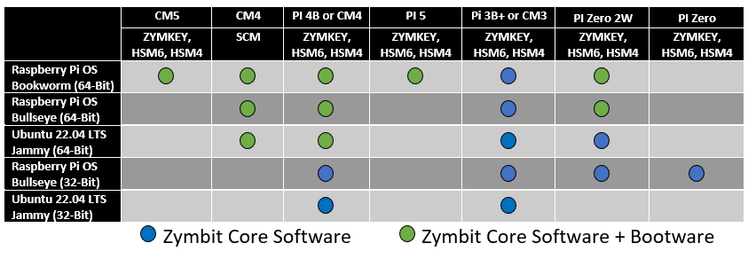

Welcome to Zymbit’s Documentation Site! Here, you will find all the resources you need to learn about and to use all Zymbit products.


#### Latest Platform and OS Support


<br>

-----
#### December 2024
-----
Bootware® 1.2.2 Release (1.2.2-01):
- Adds ZYMKEY support for CM5.
- Adds certificate based authentication (dot1x) for ethernet and wifi. Includes method to import wpa_supplicant.conf formatted file.
- Adds support for URLs that include additional parameters after a question mark, such as those used with Azure SAS.
- Allows either HTTPS or HTTP as valid endpoints.
- Supports self-signed HTTPS endpoints.
- Adds new feature to change hostname and specified user password on `zbcli update` post-install.
- Adds new feature in recovery to override recovery mechanisms and "boot up anyway"; clears counters and attempts to boot.
- Adds `-y` option to `zbcli rollback-swap` for non-interactive rollback.
- Adds specifying platform as Pi4 or Pi5 to bootstrap install for DevOps systems that are not running on a real Pi. Allows non-interactive bootstrap of Bootware tools.

#### September 2024
-----

Bootware® 1.2.0 Release (1.2.0-28):
- Adds support for Pi 5B
- Adds all new rust-based user interface
- Adds support for HSM4 and HSM6
- u-boot updated to linux 6.6 kernel
- Bug fixes. See [Bootware](./bootware) for details.

#### June 2024
-----

Bootware 1.1 General Platform Support - Along with the SCM-based products, Bootware 1.1 includes cross-platform support for ZYMKEY on CM4 and RPi4.

The Zymbit Products also include Bookworm 64-bit support.

#### Other significant enhancements in Bootware 1.1:

**Issue #142** - FIXED. OS updates that change boot.scr can prevent future boot. Affects Ubuntu. Although the PI version of Ubuntu does not use U-Boot, Ubuntu's dpkg kernel update re-writes the file /boot/firmware/boot.scr. boot.scr was used by Bootware 1.0, and a re-write of the file could leave the system unable to boot. Bootware 1.1 no longer relies on the file.

**Enhancement** - The common data partition is now encrypted and the LUKS key is locked by the Zymbit HSM.

---

<br>

#### April 2024
-----
Bootware 1.0 is now released for General Availability. Along with Bootware 1.0 GA, The SCM/SEN product line now officially supports both Bullseye 64-bit and Ubuntu 22.04 64-bit.


#### March 2024
-----
Raspberry PI OS updated kernels to 6.6.y on March 12th. The kernel no longer overrides an upstream kernel decision to force the base number of the main GPIO controller to be global GPIO 0. If the ZYMKEY4 WAKE_PIN number is not set, the ZYMKEY will not bind. The install_zk_sw.sh script has been updated to set the WAKE_PIN number for you if it detects a kernel version of 6.6.x or later. If you update the kernel on an existing installation without making the change below, you will see 5 flashes per second continuously.

For RPI4, RPI5, and CM4 platforms, you will need to set the WAKE_PIN in the following manner:

Determine the numbering for GPIO4 by examining /sys/kernel/debug/gpio for the number associated with GPIO4, then set an environment variable in the Zymbit environment variable file:

```bash
sudo su
wake_pin=`grep GPIO4 /sys/kernel/debug/gpio | sed -r 's/[^0-9]*([0-9]*).*/\1/'`
echo "wake_pin=$wake_pin"   # sanity check value is set
echo "ZK_GPIO_WAKE_PIN=$wake_pin" > /var/lib/zymbit/zkenv.conf
systemctl restart zkifc
```

The kernel version can be retrieved with `uname -r`. As of version 6.6.20, the numbering is: RPI4=516 RPI5=575 CM4=516

You do not need to do anything for new installations as the install_zk_sw.sh will take care of things for you.


#### December 2023
-----
We have added support for Bookworm (64-bit) on the Pi5, PI4 and CM4 for the ZYMKEY, HSM4, and HSM6. Follow the Getting Started guides to install and encrypt.

#### October 2023
-----
Secure Compute Module moved from Revision A to Revision B. The Zymbit Software did not change. The root filesystem partitioning changed from 100% of the eMMC to 50% of the eMMC (encrypted). This was done to accommodate future support for Bootware, which is available in a Preview mode. A utility is included to repartition to 100% (encrypted) if required.

See the [Troubleshooting/FAQ](troubleshooting/scm) for more information on the changes from Rev A to Rev B of the SCM itself.
<br>
<br>

