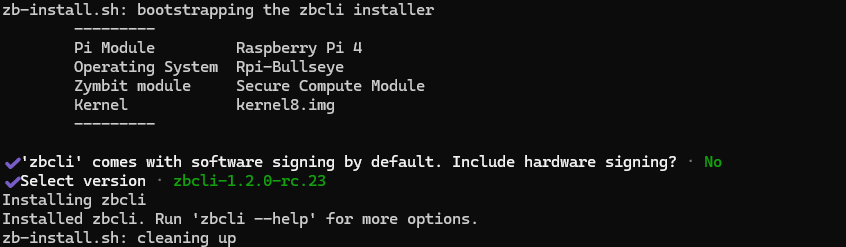
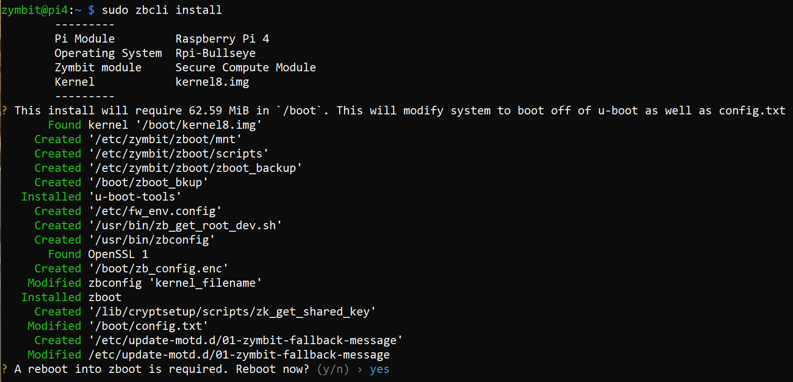

-----

## Quickstart - Download and Install Bootware Software

In this Getting Started guide we describe how to bring up a common use case for Bootware - A/B partitioning for fallback and recovery.

The default SCM/SEN as shipped has Zymbit software pre-installed. For setups using the ZYMKEY4 or other Zymbit HSMs, the installation is up to the user. The Zymbit product should be up and running with the blue LED flashing once every three seconds before installing Bootware. All of the default Zymbit images (zi) will have a hostname of zymbit-dev and a login of zymbit/zymbit. Change the hostname and login during your development.

An HDMI console is highly recommended for setting up your unit with Bootware. The process of repartitioning and loading takes time and the console is handy for monitoring progress.

Bootware 1.2 includes a new, consolidated User Interface. The process of installation and configuration has changed since 1.1.

Details of the commands in this Quickstart are linked in line.
See the [Features](../features) section for more information on how to use Bootware.

### Overview of steps to get up and running

1. Download the Bootware 1.2 executable, `zbcli`. 
2. Run `zbcli install` to install the Bootware tools and artifacts
3. Run `zbcli imager` to create and sign a Zymbit image file (zi image) of your current root file system as a backup. 
4. Run `zbcli update-config` to configure Partitions and Recovery strategy. For this Quickstart, we will setup A/B partitions.
5. Run `zbcli update` to load a known good example zi image into the Backup (B) partition; set B to as the Active partition.
6. Run `zbcli rollback-swap` to force a Rollback to your original partition to verify your A/B setup is working.

### 1. Download Bootware

Download the Bootware 1.2 executable. A boostrap utility to get the Bootware executable can be downloaded with curl:

```
curl --proto '=https' --tlsv1.2 -sSf https://raw.githubusercontent.com/zymbit-applications/zb-bin/main/install.sh | sudo bash
```

The install will identify your PI and OS and then prompt you to select a version of the `zbcli` from the last three versions to install. In most cases, you will want to select the latest version. Use the up and down arrows to select the version. You can use ctrl-c to exit at any time.




### 2. Run `zbcli install`




After installing the zboot tools and artifacts, you will need to reboot into zboot. You will be prompted for confirmation to reboot.

Reboot to complete the installation process and to boot into zboot. Once completed, all necessary files required for loading new images via Bootware will be installed. The install process will change the boot sequence to use u-boot and Zymbit's zboot but does not alter your filesystem.

### 3. Run `zbcli imager` to create Bootware-ready Zymbit Image backup (zi image)

Bootware requires images in a secure, signed format for loading with zboot. We refer to these images as `zi` images. An image conversion tool, [`zbcli imager`](../zbcli/imager), creates the zi image. `zbcli imager` can take a snapshot of your running system or input can be tarballs of your /boot and /rootfs partitions. Images can also be partial file additions and deletions called [Overlay images](../features/overlays).

> If you are Developing on a CM4 directly and need to transition to the SCM, See [Developing on the CM4](../features/development) for instructions on how to create an image from your CM4 to load onto the SCM.


#### Create a zi image backup from your current running root file system

Use `zbcli imager` to create a Zymbit Image (zi) backup of your current running system. Once created, the zi image can be propagated to other disk partitions securely. A Private/Public key pair will be used for signing the zi image at time of creation and verifying at time of loading onto a new partition. Key pairs can either be created in software or using the Zymbit HSM hardware. For this Quickstart, we will use software keys. Details on signing and verifying can be found [here](../features/signing).


In this guide, we will output the image directly to a USB stick. Mount the USB stick for access,

```
sudo mount /dev/sda1 /mnt
```

Start the imager module of zbcli. We will run interactively. You can also run non-interactively by supplying all necessary parameters on the command line. See [zbcli imager](../zbcli/imager) for details.


All necessary information will be prompted for starting with the output directory and the name of the image file. The output directory will be excluded from the image. A zi extension will be added to the image name provided.

```
$ sudo zbcli imager
   Validated bootware installation
        ---------
        Pi Module         Raspberry Pi 4
        Operating System  Rpi-Bookworm
        Zymbit module     Secure Compute Module
        Kernel            kernel8.img
        ---------
     Cleaned '/etc/zymbit/zboot/update_artifacts/tmp'
✔ Enter output directory · /mnt
✔ Enter image name · my_image
```

Next, you will be prompted for what type of image to make: A full image of the live system or a an Overlay image from files added with `zbcli manifest`. An Overlay image can be used to add, replace, or delete a select group of files for updates, patches, etc. Select the Full Image option.

```
? Select image type ›
❯ Full image of live system
  Overlay image from files added with zbcli manifest
```

You can Optionally provide an image version. This is for your use in helping to identify the image later. It is not used in the process. 

Next, you will be prompted for Signing Keys. Keys can be Software or Hardware based. Software keys are supported on all products. Hardware keys are supported with Secure Compute Module (SCM) or HSM6 products. You can use an existing key or the script will create keys for you. For this Quickstart, we will use a Software key and generate a new Software key. Select `Create new software key slot`

```
$ sudo zbcli imager
   Validated bootware installation
        ---------
        Pi Module         Raspberry Pi 4
        Operating System  Rpi-Bookworm
        Zymbit module     Secure Compute Module
        Kernel            kernel8.img
        ---------
     Cleaned '/etc/zymbit/zboot/update_artifacts/tmp'
✔ Enter output directory · /mnt
✔ Enter image name · my_image
✔ Select image type · Full image of live system
✔ (Optional) enter image version ·
? Select key slot ›
❯ Create new software key slot
  Use pre-existing software key slot
```

The `zbcli imager` script will now build your zi image. Progress will be shown on the screen.

```
$ sudo zbcli imager
   Validated bootware installation
        ---------
        Pi Module         Raspberry Pi 4
        Operating System  Rpi-Bookworm
        Zymbit module     Secure Compute Module
        Kernel            kernel8.img
        ---------
     Cleaned '/etc/zymbit/zboot/update_artifacts/tmp'
✔ Enter output directory · /mnt
✔ Enter image name · my_image
✔ Select image type · Full image of live system
✔ (Optional) enter image version ·
✔ Select key slot · Create new software key slot
     Created signing key
    Verified path unmounted '/etc/zymbit/zboot/mnt'
     Cleaned '/etc/zymbit/zboot/mnt'
    Verified disk size (required: 3.97 GiB, free: 8.31 GiB)
     Created initramfs
     Running [====>                                   ] 1/10 (00:04:47): taking snapshot of boot             
```

The imager takes 20 minutes or longer depending on the size of your file system. Once completed, the zi image and Private/Public key will be saved to your specified output directory (/mnt). Keep your private key private. The zi image can be used from the local storage device or a remote server accessible via HTTPS. The public key file will be needed to load the zi image. 

When complete, you should see complete status of the process. There will be three files in your output folder: the Public key, the Private key, and the zi image.

```
     ...

     Created signing key
    Verified path unmounted '/etc/zymbit/zboot/mnt'
     Cleaned '/etc/zymbit/zboot/mnt'
    Verified disk size (required: 3.97 GiB, free: 8.31 GiB)
     Created initramfs
     Created snapshot of boot (/etc/zymbit/zboot/update_artifacts/tmp/.tmpiWfhYd/my_image_boot.tar)
     Created snapshot of root (/etc/zymbit/zboot/update_artifacts/tmp/.tmpiWfhYd/my_image_rfs.tar)
    Verified boot tarball (/etc/zymbit/zboot/update_artifacts/tmp/.tmpiWfhYd/my_image_boot.tar)
    Verified zymbit and zboot tool installation
     Created staging directory (/etc/zymbit/zboot/update_artifacts/tmp/.tmpbQEvzN)
     Created '/etc/zymbit/zboot/update_artifacts/tmp/.tmpbQEvzN/header.txt'
     Created tarball (/etc/zymbit/zboot/update_artifacts/tmp/.tmpbQEvzN/update_artifact.tar)
     Created header signature
     Created update artifact signature
     Created file manifest signature
     Created file deletions signature
     Created '/etc/zymbit/zboot/update_artifacts/tmp/.tmpbQEvzN/signatures'
     Created signatures (/etc/zymbit/zboot/update_artifacts/tmp/.tmpbQEvzN/signatures)
      Copied file (/etc/zymbit/zboot/update_artifacts/file_manifest) to (/etc/zymbit/zboot/update_artifacts/tmp/.tmpbQEvzN/file_manifest)
      Copied file (/etc/zymbit/zboot/update_artifacts/file_deletions) to (/etc/zymbit/zboot/update_artifacts/tmp/.tmpbQEvzN/file_deletions)
     Created tarball (/mnt/my_image.zi)
     Created '/mnt/my_image_private_key.pem'
       Saved private key '/mnt/my_image_private_key.pem'
     Created '/mnt/my_image_pub_key.pem'
       Saved public key '/mnt/my_image_pub_key.pem'
       Saved image '/mnt/my_image.zi' (3.97 GiB)
    Finished in 1048s

$ ls /mnt
my_image_private_key.pem  my_image_pub_key.pem  my_image.zi
```

Additional examples of `zbcli imager` usage can be found here: [zbcli imager usage](../zbcli/imager)


### 4. Run `zbcli update-config` to configure the Partitioning and Image loading

For this quickstart, we will use a known good zi image. We've converted the pre-installed base image on the SCM to the zi format. 
We will configure the zi image to be accessed remotely via HTTPS.

If you wish to run from a local source such as a USB stick, our example images can be downloaded from the links that follow. You can also use the zi image you created in the previous step.

For bookworm,
```
curl https:///bootware.s3.amazonaws.com/zymbit_bookworm64_1.2.zi --output zymbit_bookworm64_1.2.zi
```

For bullseye,
```
curl https:///bootware.s3.amazonaws.com/zymbit_bullseye64_1.2.zi --output zymbit_bullseye64_1.2.zi
```

For ubuntu,
```
curl https:///bootware.s3.amazonaws.com/zymbit_ubuntu64_22.04_1.2.zi --output zymbit_ubuntu64_22.04_1.2.zi
```

You will need the corresponding public key in order to verify the downloaded image. The public key in PEM format for the example images can be downloaded here:

```
curl https:///bootware.s3.amazonaws.com/pub_key_1.1.pem --output pub_key_1.2.pem
```

#### Use the Bootware `zbcli update-config` to Configure your System

Bootware includes a tool to help configure your system called `zbcli update-config`. `zbcli update-config` is meant to setup your device environment to load a zi image from a configured endpoint and the update policies for how to apply those updates. More information on `zbcli update-config` can be found [here](../zbcli/update-config). Navigate through the menus with up and down arrows. Use ENTER to make a choice. Each Configure option will display the available options with explanations.

We are going to configure with A/B partitioning and UPDATE the BACKUP, leaving the A partition as the stable partition for fallback.

```
$ sudo zbcli update-config
   Validated bootware installation
        ---------
        Pi Module         Raspberry Pi 4
        Operating System  Rpi-Bookworm
        Zymbit module     Secure Compute Module
        Kernel            kernel8.img
        ---------
❯ Configure partition layout
  Configure update policy
  Configure update endpoint
  Configure wireless network
  Revert to default configuration
  Save and exit
```

Choose your settings as described below.

**Configure partition layout** – Specifies the device partition layout after an update. The root file system will be re-partitioned with your chosen configuration. Filesystem sizes estimates are based off of 32GB CM4s. Choose the [RECOMMENDED] A/B option.

**Configure update policy** – The update policy defines if image updates are applied to the Backup, Active, or Both partitions. Choose the [RECOMMENDED] BACKUP:** This way you know you have a good Active partition for fallback.

**Configure update endpoint** – The configured endpoint with  image. The endpoint can be either an HTTPS URL or a local external mass storage device like a USB stick or nVME drive. We are going to use the URL of our known good example image:

For bookworm,
```
https:///bootware.s3.amazonaws.com/zymbit_bookworm64_1.2
```

For bullseye,
```
https:///bootware.s3.amazonaws.com/zymbit_bullseye64_1.2
```

For ubuntu,
```
https:///bootware.s3.amazonaws.com/zymbit_ubuntu64_22.04_1.2
```

If you opted to download one of the zi images to a local device, enter the device endpoint name instead.

```
/dev/sda1
```

`zbcli update-config` will attempt to verify the zi image name if the endpoint is reachable.

**Configure wireless network** – Bootware supports pulling updates via Wifi or LAN connections. Wifi credentials need to be provided in order for bootware to access the wifi during updates. If no wireless credentials are provided, the wireless interface is disabled in zboot.

**Save** and **exit** to save and exit `zbcli update-config`. You also have the choice to **Revert to default configuration**. This choice will reset your update configs to the default settings.


### 5. Run `zbcli update` to create the Backup partition and load the zi image.

Once you have completed using the Wizard to configure your Bootware, run `zbcli update` to complete the process of repartitioning and loading your image.

```
$ sudo zbcli update
   Validated bootware installation
        ---------
        Pi Module         Raspberry Pi 4
        Operating System  Rpi-Bookworm
        Zymbit module     Secure Compute Module
        Kernel            kernel8.img
        ---------
     Cleaned '/etc/zymbit/zboot/update_artifacts/tmp'
       Found update configs
? Proceed with current configs? These can be modified through 'sudo zbcli update-config'
        ---------
        Update endpoint   https:///bootware.s3.amazonaws.com/zymbit_bookworm64_1.2
        Update name       zymbit_bookworm64_1.2
        Endpoint type     HTTPS
        Partition layout  A/B
        Update policy     UPDATE_BACKUP
        ---------
 (y/n) › yes
```

The script will show your configuration for review and confirmation and give you the option to change the configuration. If not correct, enter `no` to exit and re-run `zbcli update-config` to correct the configuration. If the configuration is not valid, `zbcli update` will exit.

Next, you need to enter the path to your Public Key file (in PEM format). If using one of our example images, this would be the Public key you downloaded earlier. 

```
✔ Enter public key file (Pem format) · ./pub_key_1.2.pem
```

If verification with the Public Key succeeds, `zbcli update` will continue with progress information, then prompt for a reboot to complete the process. 

#### zboot Boot Process

The Bootware boot process will now take place. zboot will boot your system. Upon reboot, an encrypted B partition will be created and the zi image will be loaded onto B. The A partition will remain untouched.

The initial configuration process can take up to an hour to complete depending on the size of the image. The process can be completed via ssh, but an HDMI console is helpful to follow the progress. During the process, the blue LED will be OFF.

On the console, you will see:

* “Loading: Encrypted zboot please wait…” message, which takes around 4-5min.
* The B partitions will be configured and setup for LUKS encryption protected by the Zymbit SCM
* It will then take a few minutes to get/unpack tarballs from the image, and verify the signature
* It will take some time to unpack the image into the B root partition, depending on the size of the image.
* Once it's done unpacking the image to the B partition, it will boot into the B partition as the ACTIVE partition. You can use `lsblk` to examine the partitions.

### 4. Quickcheck - Force Failover (Change Active/Backup partitions)

To verify you now have your A partition intact, force a failover from Active to Backup with `zbcli rollback-swap`

```
sudo zbcli rollback-swap
```

You should now have Active and Backup partitions with working images ready for your development.

### Additional Information and Support
    
[Contact Support](mailto:support@zymbit.com)

