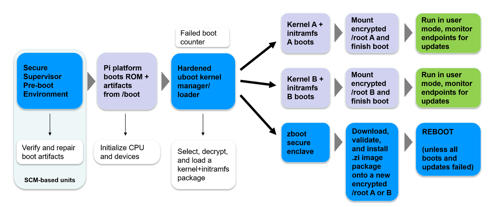

-----
## Bootware 2.0 Beta (February 2026)
-----

Bootware 2.0 Beta is supported on the Pi5 only. Feature, limitations, and bug fixes are listed below.

#### Bootware 2.0 Beta Platform Support

|                                   |   Pi5             |
|:----------------------------------|:-----------------:|
|                  **Zymbit HSMs:** | **Zymkey**        |
| Raspberry Pi OS Bookworm (64-bit) |  |
| Ubuntu 24.04.3 LTS Noble (64-bit) |  |

- Features
  - Signed Boot Images: Provide known-good boot.img support for use with Bootware on Raspberry Pi devices to control the boot artifacts. Controlling boot artifacts by implementing the above will allow secure update paths for OS changes, kernel changes, overlay changes, eliminating the chance of Bootware no longer functioning after update. Images securely signed with Bootware.
  - Secure Boot: Seamless integration of Raspberry Pi's Secure Boot process into Bootware, ensuring only trusted software can run on the device. All  except SCM.

- Limitations
  - Platform support limited to Pi5.
  - Operating Systems NOT fully supported : Trixie, Bullseye, Jammy (Ubuntu 22)
  - Requires a clean Bootware install of Beta 2.0.0 - cannot upgrade from an existing Bootware 1.3.2.

- Bug fixes
  - #208: zbcli update-config doesn't allow you to clear wifi SSID and Passphrase, takes "" as valid characters.
  - #207: Bootware: replace ext2 with ext4; add fsck whenever booting through zboot.
  - #205: zbcli update-config cli errors off with `Invalid Parameter: user`. Workaround is to provide one option at a time.
  - #200: zbcli update confirmation screen indicates password has been set to change when it hasn't


Bootware 2.0 Beta is not intended for use in production environments. It is meant for Beta testing preliminary support for Pi native secure boot. The latest stable release is [1.3.2-3](../1.3.2).


-----



#### If you want to jump right in, [Click here to Get Started!](getting-started)

-----

## What is Bootware 2.0 Beta?

Bootware is a secure integrated tool for managing Linux OS installations for edge / embedded Linux machines. Bootware supports various Raspberry Pi computers and requires a Zymbit HSM or SCM to run. Bootware takes advantage of security features of various Zymbit products and protects credentials via the HSM. 

### New Bootware 2.0 Beta Image & Signature Behavior 

Bootware manages signed boot images across the user OS, A/B partitions, and secure recovery to ensure reliable updates and deterministic recovery.

- Boot images bundle known-good boot artifacts to ensure consistent, validated boot behavior.

- All boot images are signed and verified before use.

- Supports A/B partition updates (active, backup, or both).

- Uses tryboot to safely test new boot images.

- Automatically falls back to:

  - The backup partition on failure

  - zboot secure recovery if tryboot repeatedly fails

  - Missing tryboot artifacts are automatically recreated or re-signed.

In short: Bootware 2.0 Beta guarantees secure installs, controlled updates, and automatic recovery at every stage of the boot process.

### Bootware 2.0 Beta seemlessly provides integration with Raspberry Pi secure boot.

There are three stages for complete Secure Boot integration:

- Stage 1: Automatic incorporation of signed boot.img containers for A/B partitions as well as zboot that bundle all necessary boot artifacts. The [Getting Started](getting-started) guide completes this step.

- Stage 2: Enabled enforcement of verification of the signed boot.img and EEPROM image. See [Bootware and Secure Boot](secure-boot)

- Stage 3: Permanent Secure boot enforcement of the signing of boot.img and EEPROM image. See [Bootware and Secure Boot](secure-boot)

- Bootware 2.0 Beta includes support for Pi Secure Boot and signed boot image capability.

> Bootware 2.0 Beta is **not** backwards compatible with 1.3.2 and earlier versions of Bootware. You must start fresh since boot.img support is necessary from a first install.

- Bootware is a full-featured native OS switcher/manager with first rate support for encrypted root and data partitions. Bootware is not a hypervisor.

- Bootware supports both manual and automatic rollback between A and B installations. If rollback fails, Bootware is able to enter recovery to reload one of the installations from either a local image or a remote secure endpoint.

- Bootware works with 64-bit versions of Raspberry Pi OS and Ubuntu on Raspberry Pi 4 and 5 and the various compute module variants.

- Bootware is not an OS, therefore custom OS builds are generally supported. For larger orders, Zymbit is able to offer device programming and image validation services of custom user OS builds.

- Bootware is not an IoT cloud stack, and interoperates well with most popular stacks. Bootware manages the relationship between bare metal and OS installations as simply, securely, and robustly as possible.

- Bootware correctly handles potentially conflicting sets of kernels and boot artifacts, allowing for major kernel upgrades to occur without undue distress.

- Bootware fully isolates bootable root partitions with separate sets of LUKS credentials, which are securely injected into user s OS initramfs images. Bootware supports a shared data partition, for which the credentials are distributed to new installations. Each new installation gets a clean new set of keys and one root partition cannot access the other.

- New installations are deployed from within Bootware's secure enclave, zboot, which boots straight via secure boot. zboot is able to download, validate, and deploy updates without relying on a potentially compromised OS installation to install the next new clean image.

- Bootware has a robust workflow for update signing, which may use either hardware or software key options. Update signing occurs on a dedicated publishing node.

- Bootware uses full image forklift updates for major OS installations. Partial overlay updates are also supported, and may be installed directly from user mode.

- Bootware runs of top of Zymbit's security services package, which is required to use Zymbit security hardware.

- Bootware has additional integrations with Zymbit Secure Edge Nodes, which may be purchased to development and production use, or may be used as reference designs for custom hardware. 

#### Bootware installation locations:

- Bootware secure uboot and the secure enclave, zboot, along with encrypted configurations files are installed in into /boot/firmware.

- Bootware uses Zymbit LUKS initramfs unlock code already present in standard Zymbit driver package, but will inject credentials before encrypting the initramfs together with the kernel and boot artifacts into an immutable boot image for secure uboot.

- Bootware installs `zbcli` and Bootware scripts into user OS. User must ensure that these packages are present in user images to be deployed using Bootware. User mode tools manage Bootware settings and check for updates on USB drives or on remote endpoints. `zbcli` also allows user to trigger manual rollback and update installations. Once a suitable update is located, Bootware reboots into zboot to install.

#### Bootware 2.0 boot sequence:

- Pre-boot environment validates signed boot.img, RAM copy of /boot/firmware partition.

- Pi ROM code boots and loads standard Pi artifacts.

- Zymbit uboot loads

- If user boot is to proceed normally:

  * Uboot loads, decrypts, and validates boot package for the active boot partition. The package includes everything required to boot that installation inclusive of kernel, initramfs, args, device tree objects, etc.

  * Boot counter is incremented and control is passed to the kernel.

  * Once in initramfs, zkunlock is invoked to connect to the HSM and to decrypt LUKS credentials that have been previously injected into initramfs. /root is mounted.

  * Once boot is complete, boot counter is reset. If the boot fails, and the system reboots for whichever reason, the process repeats with boot counter incrementing.

- If the boot counter has exceeded the threshold, rollback occurs:

  * Uboot loads zboot to switch to the backup partition

  * System reboots

  * Uboot attempts to boot the backup boot partition in the same way it boots the active partition.

  * Once boot is complete, boot counter is reset. If the boot fails, and the system reboots for whichever reason, the process repeats with boot counter incrementing.

- If the boot counter for the backup partition also exceeds the threshold without a successful boot, the system enters recovery mode:

  * Uboot loads zboot.

  * Zboot attempts to locate an image to install from either a local USB drive or from a known remote endpoint.

  * If the image is found, it is installed, and then the system is rebooted into it. All images are checked for correct signatures before applying them to the system.

  * If the image is not found, zboot enters console interactive mode and asks for endpoint information. Any image to be installed must have a proper signature.

Bootware is designed with the singular goal to ensure that properly validated and installed image is booted successfully on user's machine. 

-----

#### Additional Resources

[Register for Bootware Technical Updates](https://www.zymbit.com/get-bootware/)

[More information on Bootware on zymbit.com](https://www.zymbit.com/bootware/)

[Bootware Community](https://community.zymbit.com/c/bootware)

-----

#### Links to Bootware Documentation Sections

