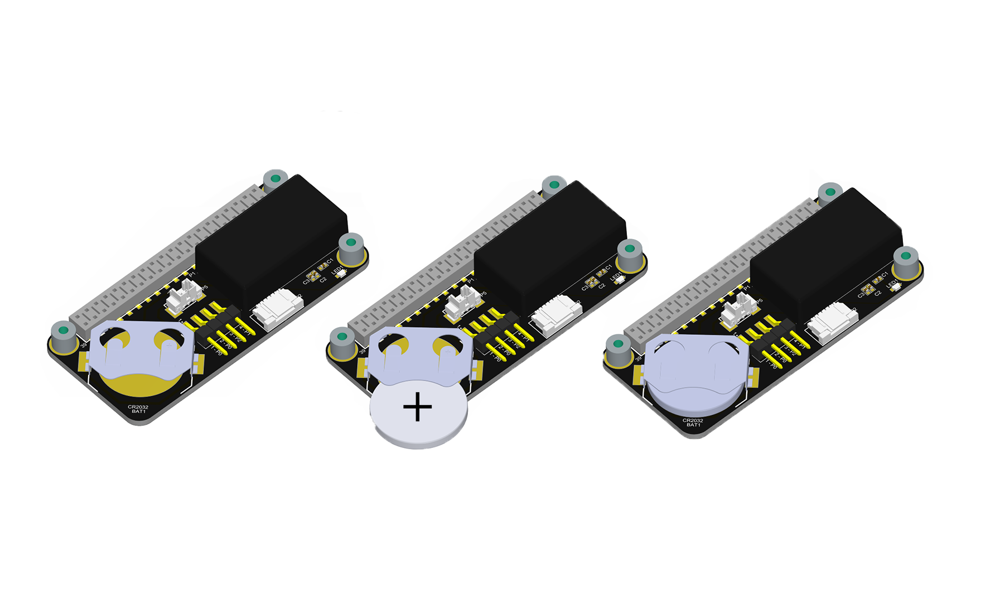
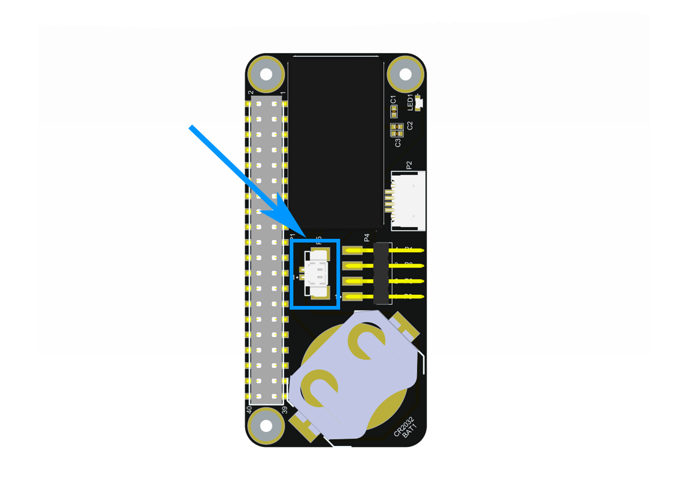
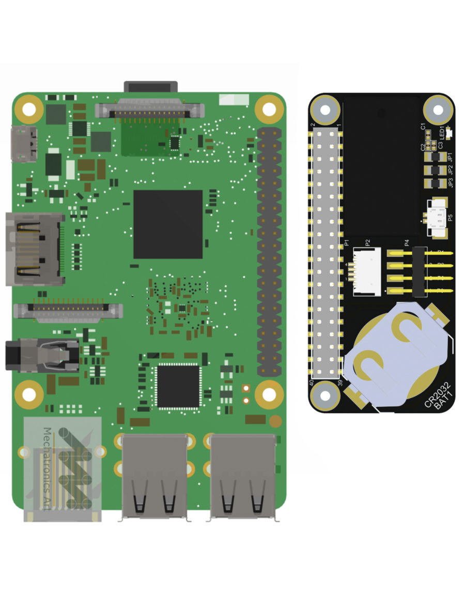
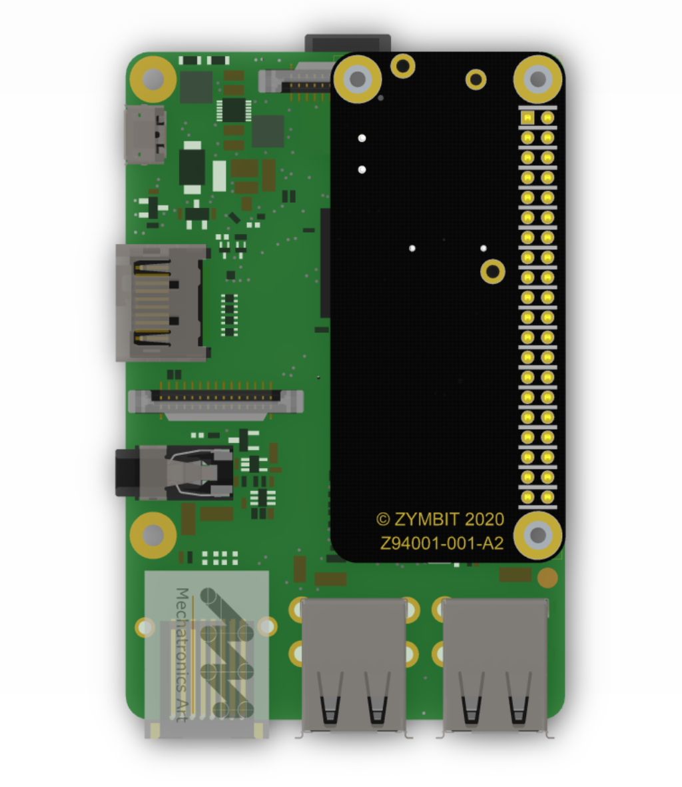

The HSM6 is a ‘snap in’ security module designed for easy integration within a secure manufacturing environment. All connections are through a single, 30 pin connector that is hidden underneath the module. It is designed specifically to work with Raspberry Pi embedded applications. A PiZero HAT (Hardware Attached on Top) adapter is available for easy integration to the standard GPIO pins of the Pi.

In this Getting Started guide we describe how to install your HSM to a Raspberry Pi running Raspbian or Ubuntu. The installation process is the same for both of these Linux distributions.







### Summary of Setup Steps

Installing the Hardware
:   Install the HSM on the PiZero HAT. Install the battery on the HAT. Connect the HAT to the host single-board computer.

Establish an  connection
:   Enable the  bus on the host device in order to be able to communicate with the HSM.

Install the client software
:   These utilities provided by Zymbit are necessary to interact with the hardware module.

Test the installation
:   Your HSM is now temporarily bound to your SBC and ready for use in developer mode.

## Installing the hardware

### HSM to PiZero HAT

Fit your HSM onto the PiZero HAT (Hardware Attached on Top). The connector plugs into the pins on the board.

### Battery Installation


Battery installation is not required for the HSM to function, but it is highly recommended if your device is vulnerable to physical access!


To maintain the real-time clock (RTC) and tamper detection features in the event of power loss, your PiZero HAT can be fitted with a **3V CR2032  coincell**. This battery should last 3-5 years. We recommend using a high quality one like [this](https://www.amazon.com/Batteries-Panasonic-Lithium-Battery-Blister/dp/B002U00ZNK/ref=sr_1_5?crid=1YG7IIRUM96SP&dchild=1&keywords=panasonic+cr2032+3v+battery&qid=1602709891&sprefix=panasonic%2Caps%2C180&sr=8-5).

##### **Primary Battery Holder (Recommended)**

**IMPORTANT:** Note the correct polarity with **+ve  facing upwards !!**

##### **Optional Battery Connector (Alternative)**
**Caution**: Ensure you select the right connector type-- Molex 51021-0200-B (1.25mm Pitch). You can purchase the battery [here](https://www.amazon.com/CR2032-Battery-51021-0200-B-1-25mm-Connector/dp/B07TS54R42/ref=b2b_nav_d_bia_2/133-6806428-1529144?_encoding=UTF8&pd_rd_i=B07TS54R42&pd_rd_r=d30b0d19-eeab-4b5c-a2ee-0ceef542a1a2&pd_rd_w=ZXBat&pd_rd_wg=U87Gu&pf_rd_p=4a93c781-cfc8-46bb-85fa-dc304a3c96a9&pf_rd_r=91SXE6T1J2V2ZYD7C6FD&psc=1&refRID=91SXE6T1J2V2ZYD7C6FD).

Battery should look like this:

Mating component specifications:

Plug wired CR2032 battery into optional battery connector, located below.

----------

### Install Pi HAT with HSM (and battery)


Installing your hardware correctly is important to avoid destroying your SBC or PiHAT. Be sure to follow the instructions below carefully. In particular:

* Pay close attention to the images below to ensure the SBC's GPIO pins are **properly aligned** with the HAT's header.
* Ensure that your **Raspberry Pi is powered down** before proceeding.
* Ensure that the coincell battery (if installed) is installed with the positive side (marked with `+`) facing upward.


#### Before installing

Power off your Raspberry Pi to ensure that neither the SBC or the PiHAT are damaged.

#### Attach hardware

Follow the below pictures to position the PiHAT onto your SBC. The HSM and battery should be facing the Raspberry Pi and concealed from view.

Be sure all the GPIO pins are aligned and have a respective slot. If misaligned, this could cause damage to the HSM, PiHAT, and/or your host device. Once aligned properly, press firmly down onto the header. Your PiHAT should fit relatively snug.


The default configuration uses GPIO4. This can be reconfigured to use another GPIO of your choice.


#### Power on and confirm operation

Power up the Pi and you will see a blue LED blinking rapidly and consistently (5 blinks per second). This indicates the HSM is operational but not configured.

If the blue LED blinks erratically, or not at all, then there is an installation error and you should check your connections.


Power quality matters to the reliable and secure operation of your system and Zymkey.


## Establish an I2C connection

For Raspian-based operating systems, you must configure the state of the .

1. Log in to your Raspberry Pi and run `sudo raspi-config`.
1. Navigate to Interfacing Options -> I2C -> Would you like the ARM I2C interface to be enabled?
1. Select yes, and confirm this choice.

Your  bus is now configured and ready to talk to the HSM. The default  address for the HSM is 0x30.

 The default I2C address for HSM is 0x30. If this conflicts with another device in your system, you can reconfigure the HSM6 to use another address of your choice. 

Your I2C bus is now on and ready to talk to the HSM.

## Install the client software

Login to your host device and follow these steps to install the HSM's client software.

The HSM will require a number of packages to be installed from the Raspbian and Zymbit `apt` repositories. The following setup script will be install a number of files and software packages on your system, including:

* Zymbit `.service` files located in the `/etc/systemd/system` directory
* `pip`

Ensure that `curl` is installed on your host:

`sudo apt install curl`

Download and install the necessary Zymbit services onto your device.

`curl -G https://s3.amazonaws.com/zk-sw-repo/install_zk_sw.sh | sudo bash`

## Test the installation

When the software installation has completed, the script will automatically reboot your device. After the reboot has completed, the Pi will perform an operation that will temporarily bind the HSM to your SBC. Once the HSM is bound to the SBC, the HSM's blue LED should blink slowly--once every 3 seconds--to indicate that the binding is complete.


In production mode, HSM generates a unique Device ID by measuring certain attributes of the specific host and the HSM itself to permanently associate the two.


The quickest way to get started is to see the HSM's various features at work by running these test scripts that were installed with the client software:

`python3 /usr/local/share/zymkey/examples/zk_app_utils_test.py`

`python3 /usr/local/share/zymkey/examples/zk_crypto_test.py`

The example scripts are missing in focal and bullseye distributions. You can get the example scripts from here:

[Download example files](https://community.zymbit.com/t/installation-missing-files/1331/2?u=bob_of_zymbit)

Now you're ready to start developing with HSM and Raspberry Pi. When it's time to deploy your project, read our guide on enabling Production Mode:


To permanently bind the HSM to a host board, generates a unique Device ID by measuring certain attributes of the host and the HSM itself to associate the two devices.


