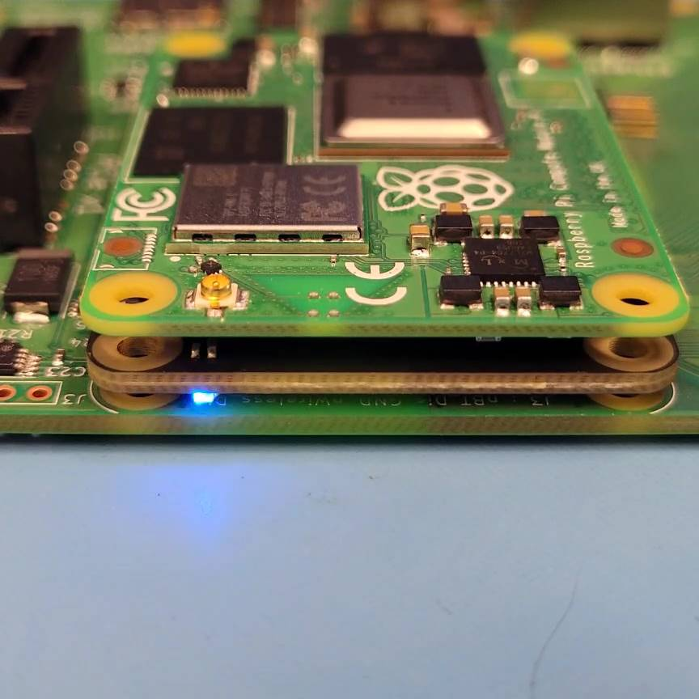

-----
## Updated release 1/13/2023 (RC-23.01)

We've updated the SCM release to support the A1 release of the SCM hardware. Summary of changes:

### Pre-loaded OS options
* Raspberry PI OS Lite 64-bit (Bullseye)
* Raspberry PI OS Lite 32-bit (Bullseye)

### Modifications from previous beta
* Now allow initial SSH via password (use zymbit/zymbit). Please change once logged in.
* No longer providing SSH key on USB stick; as noted above, you can use password.
* No longer necessary to register product; no SSH key necessary so no need for key passphrase.
* sudo for user zymbit with password in standard PI OS manner allowed; no need to supply password every time.

### Changes
* FW 01.00.00 - Supports A1 revision of SCM
* FW 01.00.00 - Fixed:  #117 Stored tamper event on shutdown has incorrect timestamp
* zkifc 1.2-36 - Fixed: #120 get_public_key() with a very large number crashes zkifc
* zkpkcs 11 1.0-3 - Fixed: #123 zk_pkcs11: Doesn't work with 64-bit OS

**Getting Support**

[Contact Support](mailto:support@zymbit.com)

-----
### **Overview**

The SCM Deveoper's kit provides all the hardware and software components required to evaluate the Zymbit Secure Compute Module. For up to date information on known issues, please refer to [SCM Beta Release Notes](../../../troubleshooting/scm/).

{}
All necessary Zymbit software has been pre-installed. No further installation is necessary. The pre-installed image is encrypted and cannot be replaced via `rpiboot` in the field. Please contact support@zymbit.com for assistance.
{}

### **Contents of Kit**
 
 * Zymbit Secure Compute Module including Pi CM4
 * Zymbit Secure Compute I/O Motherboard
 * (optional) Raspberry Pi CM4 I/O board[ (Datasheet)](https://datasheets.raspberrypi.com/cm4io/cm4io-datasheet.pdf)
 * Zymbit Perimeter Detect Cable for Channel 2
 * Zymbit External Battery
 * 12V Power Supply
 * USB drive with SSH keys necessary for SSH login


{}

{}


##### Secure Compute Module

The Zymbit Secure Compute Module comprises a Zymbit Security Module + Hardware Wallet + Raspberry Pi CM4 integrated into a secure encapsulated module.


{}

{}



{}

{}

    
##### Highlights
* 100% pin compatible with RPi CM4, all configurations.
* 100% code compatible with RPi
* Easy to Scale
* Pre-fuzzed, pre-encrypted file system
{}
The pre-installed image is encrypted and cannot be replaced via `rpiboot` in the field. Please contact support@zymbit.com for assistance.
{}
* Pre-loaded Linux kernel (bullseye 32-bit)
* Pre-load with customer software
* Pre-defined file manifest & policies
* Custom MAC OUID blocks available
* Embedded hardware wallet with SLIP39-Shamir's Secret Sharing

##### Layers of Security
* Supervised boot
* Fully encapsulated
* Last gasp power defenses
* Tamper sense and response
* File system encryption
* Measured system identity & authentication
* Data encryption & signing

##### Compute Options
* Broadcom BCM2711, Quad core Cortex-A72 (ARM v8) 64-bit SoC @ 1.5GHz
* LPDDR4 RAM: 1G to 8G, eMMC: 0G to 32G
* 2.4/5.0GHz Wi-Fi & Bluetooth

### **Configure and Setup your SCM**

##### Power On, Bootup, and SSH in
 * Connect up the ethernet and 12V power. The unit is designed to run headless. You do not need a monitor, keyboard, or mouse. As shipped, the hostname is `zymbit-dev` and a user named `zymbit` can be used for SSH login. The default password for SSH is zymbit. Please change your password once you login. Console login has been disabled.
 
 {}
 

The total boot time as configured should take approximately 90 seconds from power on.

{}
 * Monitor the Blue LED on the Zymbit SCM module. It will go through the following stages:
    - one slow blink:    *initializing the SCM*
    - one -> two -> three -> four blinks:   *Supervised Boot is verifying the signed file information*
    - rapid blinking:   *Supervised Boot successfully completed, booting underway*
    - blinking stops:   *USB bus enumeration found SCM; may stay off for seconds*
    - one blink every 3 seconds:   *zkifc has loaded and the system is ready to go*

##### Example of Successful Supervised Boot LED Sequence (Click image for video)

#### Using SCM: API and Examples
    
 * [See API Documentation](../../../api/)   
 * [Working with Supervised Boot](../../../tutorials/supervised-boot/)
 * [Securing the SCM further with the example Sanitization Script](https://github.com/zymbit-applications/zk-scripts)
 * [Working with the HD Wallet](../../../tutorials/digital-wallet/)
 * [Setting up Tamper Detect](../../../tutorials/perimeter-detect/)
    
#### Support
    
 * [Release Notes](../../../troubleshooting/scm/)
 * [Contact Support](mailto:support@zymbit.com)

