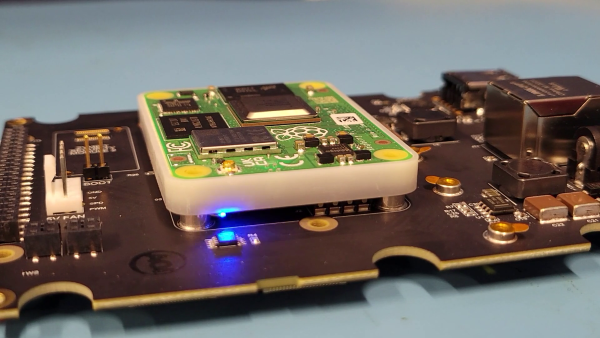

-----
### **Overview**

The Zymbit Secure Compute Module (SCM) is an all-in-one Linux compute module - secured and ready to deploy into your IoT and edge applications : a Zymbit Security Module + Hardware Wallet + Raspberry Pi CM4 integrated into a secure encapsulated module. 


{}

{}


-----
## **Configure and Setup your SCM**

#### Power On, Bootup, and SSH in
 * Connect up the ethernet and 12V power. The unit is designed to run headless. You do not need a monitor, keyboard, or mouse. As shipped, the hostname is `zymbit-dev` and a user named `zymbit` can be used for SSH login. The default password for SSH is zymbit. Please change your password once you login. Console login has been disabled.
 
{}
All necessary Zymbit software has been pre-installed. No further installation is necessary. The pre-installed image is encrypted and cannot be replaced via `rpiboot` in the field. Please contact support@zymbit.com for assistance.
{}

 * Monitor the Blue LED on the Zymbit SCM module. The total boot time as configured should take approximately 90 seconds from power on. It will go through the following stages:
    - one slow blink:    *initializing the SCM*
    - one -> two -> three -> four blinks:   *Supervised Boot is verifying the signed file information*
    - rapid blinking:   *Supervised Boot successfully completed, booting underway*
    - blinking stops:   *USB bus enumeration found SCM; may stay off for seconds*
    - one blink every 3 seconds:   *zkifc has loaded and the system is ready to go*

##### Example of Successful Supervised Boot LED Sequence (Click image for video)

#### Pre-loaded OS options
* Raspberry PI OS Lite 64-bit (Bullseye) - DEFAULT
* Ubuntu Server 22.04 64-bit LTS (jammy) 

#### Modifications from beta
* Now allow initial SSH via password (use zymbit/zymbit). Please change once logged in.
* No longer providing SSH key on USB stick; as noted above, you can use password.
* No longer necessary to register product; no SSH key necessary so no need for key passphrase.
* sudo for user zymbit with password in standard PI OS manner allowed; no need to supply password every time.

#### Changes
* FW 01.03.00 - April 2024. Update bootcode.bin to 1/11/2023 version. You can verify with `vcgencmd bootloader_version`. Should say 1/11/2023. Necessary to support Ubuntu 22.04.
* FW 01.03.00 - Supports B1 revision of SCM
* FW 01.00.00 - Supports A1 revision of SCM
* FW 01.00.00 - Fixed:  #117 Stored tamper event on shutdown has incorrect timestamp
* zkifc 1.2-36 - Fixed: #120 get_public_key() with a very large number crashes zkifc
* zkpkcs 11 1.0-3 - Fixed: #123 zk_pkcs11: Doesn't work with 64-bit OS

## Secure Compute Module


{}

{}

    
##### Highlights
* 100% pin compatible with RPi CM4, all configurations.
* 100% code compatible with RPi
* Easy to Scale
* Pre-encrypted file system
{}
The pre-installed image is encrypted and cannot be replaced via `rpiboot` in the field. Bootware 1.0 can be used to replace Bullseye or Ubuntu 22.04 based Operating System images. See [Bootware](../../../bootware-one-zero) for details.
{}
* Pre-loaded Linux kernel (bullseye 64-bit or Ubuntu 22.04 64-bit)
* Optionally Pre-load with customer software
* Pre-defined file manifest & policies
* Custom MAC OUID blocks available
* Embedded hardware wallet with SLIP39-Shamir's Secret Sharing

##### Layers of Security
* Supervised boot
* Fully encapsulated
* Last gasp power defenses
* Tamper sense and response
* File system encryption
* Measured system identity & authentication
* Data encryption & signing

##### Compute Options
* Broadcom BCM2711, Quad core Cortex-A72 (ARM v8) 64-bit SoC @ 1.5GHz
* LPDDR4 RAM: 1G to 8G, eMMC: 0G to 32G
* 2.4/5.0GHz Wi-Fi & Bluetooth

### Zymbit Platform Reference
 * [Zymbit Secure Edge Node](../../sen/)
 * [Zymbit Developer Kit 2](../../scm-dev-kit2/)

### Using SCM: API and Examples
    
 * [See API Documentation](../../../api/)   
 * [Working with Supervised Boot](../../../tutorials/supervised-boot/)
 * [Securing the SCM further with the example Sanitization Script](https://github.com/zymbit-applications/zk-scripts)
 * [Working with the HD Wallet](../../../tutorials/digital-wallet/)
 * [Setting up Tamper Detect](../../../tutorials/perimeter-detect/)
    
### Support
    
 * [Release Notes](../../../troubleshooting/scm/)
 * [Contact Support](mailto:support@zymbit.com)

