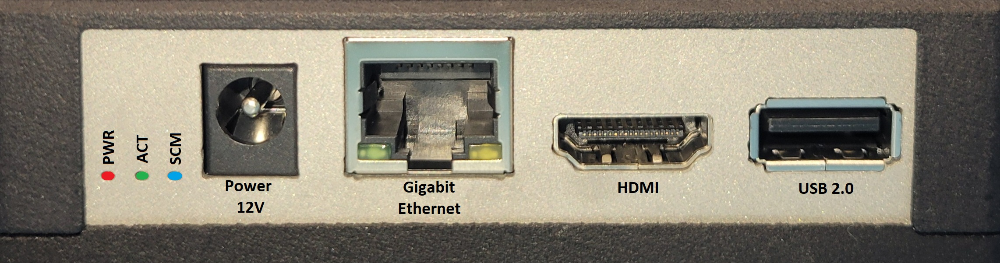
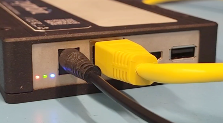


{}

{}

-----
### **Overview**

Secure Edge Node - Zymbit offers a standard baseline enclosure that accommodates Zymbit’s secure motherboard, Secure Compute Module (SCM) and a choice of accessories.  
| Feature | Description |
| ------- | ----------- |
| Enclosure | Standard Type D35 Enclosure. Fits into standard 3.5″ drive bay caddy |
| Dimensions | 1.04 x 3.95 x 5.80 inches,  26 x 100 x 148mm |
| Power | 12V Barrel Style (standard) |
|       | PoE PD (optional) |
|       | SATA (optional) |
| LEDs  | CM4 PWR (red), CM4 Activity (green), SCM Status (blue) |
| Front I/O | 1x 1GbE LAN |
|           | 1x HDMI |
|           | 1x USB-A 2.0 |
| Onboard Headers | 1x AUX USB 2.0 |
|                 | 2x CSI Camera |
|                 | 1x DSI Display |
|                 | 1x M.2 B-Key |
|                 | 1x 40-pin GPIO header |
|                 | 1x Micro SIM port. For use with compatible M.2 modules. Push-push type connector |
|                 | 1x Battery connector Molex 51021-0200-B (1.25mm Pitch) |
|                 | 1x Zymbit Security Module for HSM4/HSM6 |
|                 | 1x 5V Fan |
| Tamper Circuits | 4x Switches complete Channel 1 tamper circuit |
|                 | Header pins for Channel 1 and Channel 2 tamper circuits |
| Pre-installed OS | Raspberry PI Bullseye Lite 64-bit (optional 32-bit) |
| Operational Environment | Temperature: 0-60 degrees C |

### **Configure and Setup your Secure Edge Node**

##### Power On
 * Connect the included 12V Power Supply up to the front panel 12V barrel connector. Optionally, supply power via PoE to the ethernet connector, or via the SATA edge connector. Connect an ethernet cable to the front panel gigabit ethernet port. The unit is designed to run headless. You do not need a monitor, keyboard, or mouse. Tje only access is via SSH.

 

 

{}
The Secure Edge Node includes pre-installed Raspberry PI Bullseye Lite 64-bit (or optionally 32-bit) and all necessary Zymbit software. No further installation is necessary. The pre-installed image is encrypted and cannot be replaced via `rpiboot` in the field. Please contact support@zymbit.com for assistance.
{}

Monitor the Blue LED on the Zymbit SCM module. The total boot time as configured should take approximately 90 seconds from power on. It will go through the following stages:

- one slow blink:    *initializing the SCM*
- one -> two -> three -> four blinks:   *Supervised Boot is verifying the signed file information*
- rapid blinking:   *Supervised Boot successfully completed, booting underway*
- blinking stops:   *USB bus enumeration found SCM; may stay off for seconds*
- one blink every 3 seconds:   *zkifc has loaded and the system is ready to go*

##### Example of Successful Supervised Boot LED Sequence (Click image for video)

 

##### Login via SSH

Once the boot sequence completes and the Blue LED is blinking once every three seconds, login remotely via SSH. As shipped, the hostname is `zymbit-dev` and a user named `zymbit` can be used for SSH login. The default password for SSH is zymbit. Please change your password once you login. Console login has been disabled.

##### Run example code

The quickest way to get started is to see the Secure Edge Node's various features at work is by running these test scripts. You can get the example scripts from here:

[Download example files](https://community.zymbit.com/t/installation-missing-files/1331/2?u=bob_of_zymbit)

`python3 /usr/local/share/zymkey/examples/zk_app_utils_test.py`  
`python3 /usr/local/share/zymkey/examples/zk_crypto_test.py`

Now you're ready to start developing with the Zymbit Secure Compute Module. 

##### Secure Compute Module

Inside the Secure Edge Node is the [Secure Compute Module](/getting-started/scm/quickstart/): a Zymbit Security Module + Hardware Wallet + Raspberry Pi CM4 integrated into a secure, encapsulated module. Details of the SCM itself including any other Zymbit specific cofigurations can be found [here](/getting-started/scm/quickstart/):
    

#### Using Secure Edge Node/SCM: API and Examples
    
 * [See API Documentation](../../../api/)   
 * [Working with Supervised Boot](../../../tutorials/supervised-boot/)
 * [Securing the SCM further with the example Sanitization Script](https://github.com/zymbit-applications/zk-scripts)
 * [Working with the HD Wallet](../../../tutorials/digital-wallet/)
 * [Setting up Tamper Detect](../../../tutorials/perimeter-detect/)
    
#### Support
    
 * [Release Notes](../../../troubleshooting/scm/)
 * [Contact Support](mailto:support@zymbit.com)

