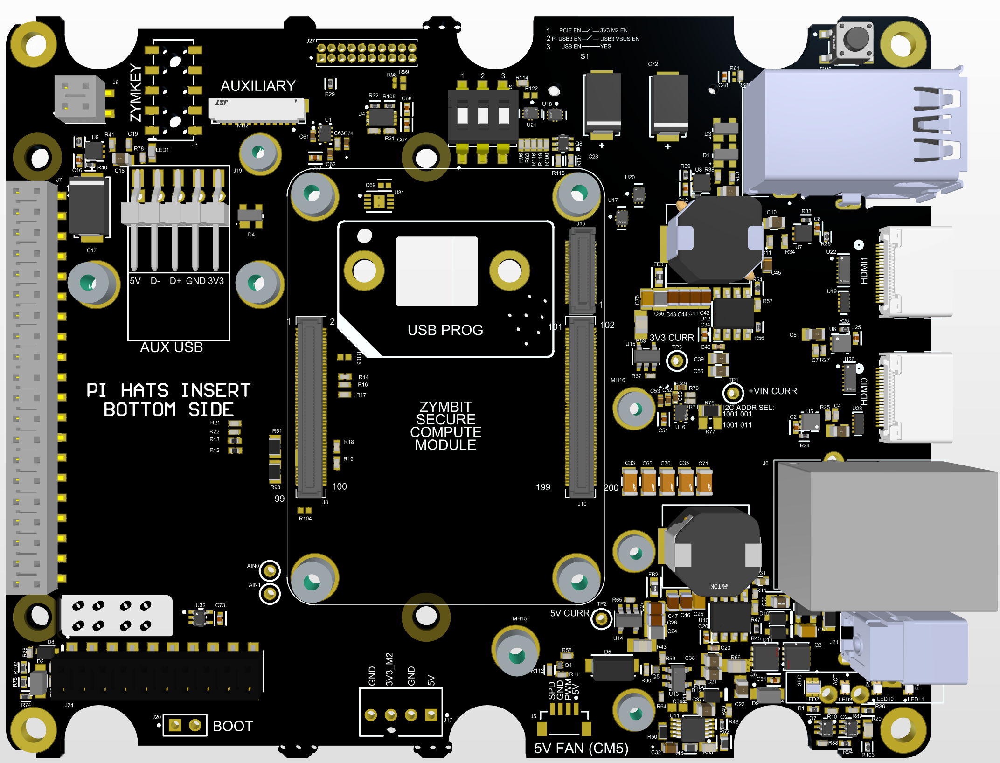
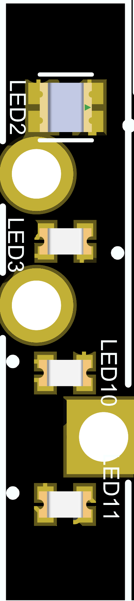
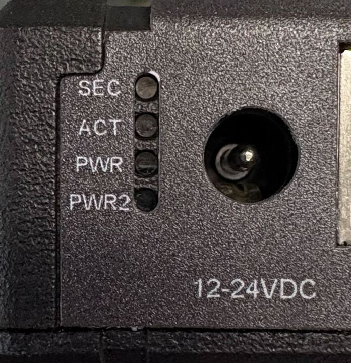
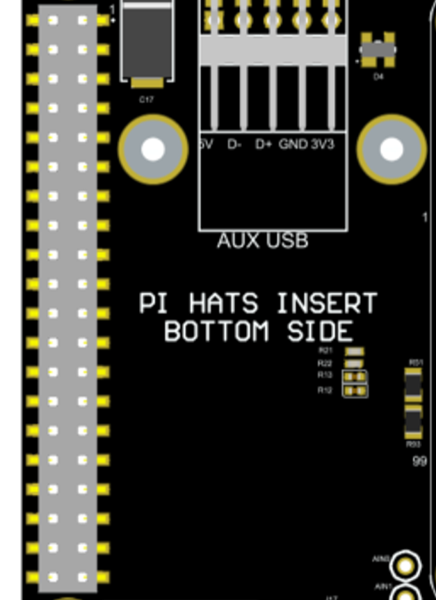
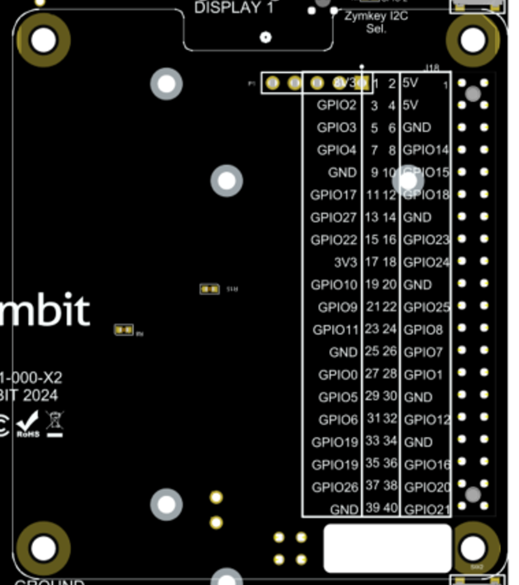
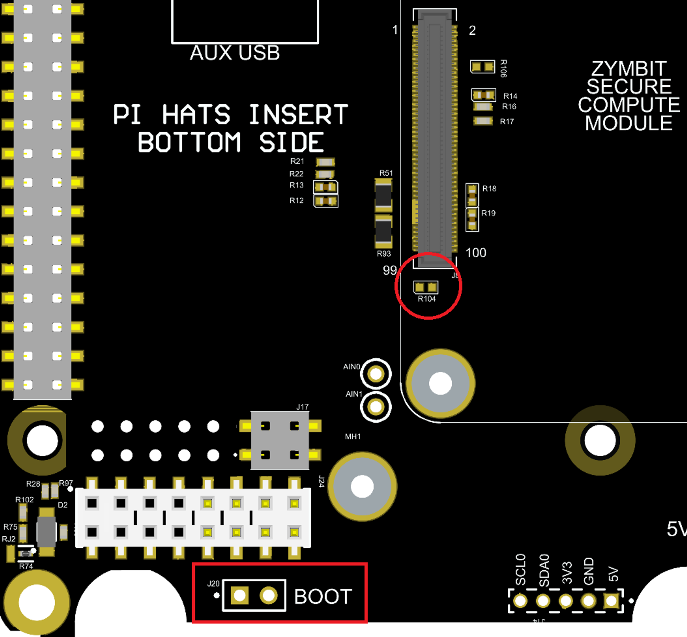

# Zymbit Secure Base Board 500 Rev X4: An application board for the Zymbit Secure Compute Module

**Last updated**: August 12, 2025 

**Document Revision**: 1

**Applies to Board Revisions**:

- Z801-01-000-X4

---

**Table Of Contents**

---

| Revision | Note | Date |
| --- | --- | --- |
| 0.1 | Draft release X3→ X4 | 6/11/25 |
| 1 | Initial Release | 8/12/25 |

# 1. Introduction



Figure 1: Zymbit Secure Base Board 500 top side


Figure 2: Zymbit Secure Base Board 500 bottom side

The Zymbit Secure Base Board 500 (SBB500) is designed for products that make use of the Zymbit Secure Compute Module, and Zymibt Interposer based HSMs.  The Zymbit Secure Base Board contains many of the interfaces that the Raspberry Pi Model 4B, Raspberry Pi Model 5, Raspberry Pi Compute Module 4 IO Board, and Raspberry Pi Compute Module 5 IO Board have, with the addition of interfaces and features that take advantage of Zymbit’s security hardware and software offerings.  The SBB500 has is available as both a reference design for the Zymbit SCM and as a product in the Secure Edge Node product lines with the possible addition of PCIe Cards Pi HATs, auxiliary, or expansion boards.

## 1.1 Related Documentation

- [Zymbit Documentation](https://docs.zymbit.com/)
- [Raspberry Pi Compute Module 4 IO Board Datasheet](https://datasheets.raspberrypi.com/cm4io/cm4io-datasheet.pdf)
- [Raspberry Pi CM4 Datasheet](https://datasheets.raspberrypi.com/cm4/cm4-datasheet.pdf)
- [Raspberry Pi Compute Module 5 IO Board Datasheet](https://datasheets.raspberrypi.com/cm5/cm5io-datasheet.pdf)
- [Raspberry Pi CM5 Datasheet](https://datasheets.raspberrypi.com/cm5/cm5-datasheet.pdf)

## 1.2 Definitions

- [SCM](https://www.zymbit.com/scm/):  Zymbit Secure Compute Module Product
- Security Supervisor:  Zymbit security hardware inside of the SCM

---

# 2. Features

## 2.1 Configuration Options

The SBB500 is designed to accommodate several configurations depending on use case and security needs.  Depending on the configuration, some features may not be available or limited.  The following table details the different configurations and limitations, if any.

| **Compute**  | Security Module | **Security Level**** | **Notes** |
| --- | --- | --- | --- |
| Zymbit SCM4 | Integrated | S3 | USB2 |
| RPI CM4  | ZYMKEY | S1 | USB2 |
| RPI CM4  | None | S0 | USB2 |
| CM5 + Interposer | Interposer | S1 | USB3 |
| CM5 (only)* | None | S0 | USB3 |

**Zymbit Security Levels
**S0     No Security Hardware**

**S1      Secure** hardware and cryptographic engine.

**S2     S1** + **Supervised** filesystem and boot chain.

**S3     S2 + Safe** recovery to trusted state.

Limitation details are described in the relevant sections.

---

## 2.2 Status LED Indicators






*View from [Zymbit SEN 400](https://www.zymbit.com/secure-edge-node-400/) enclosure*

| Designator | Lightpipe Order | Purpose | Legend | Type | Off | Green or Blue | Red | Yellow or purple |
| --- | --- | --- | --- | --- | --- | --- | --- | --- |
| LED2 | Top | Security | SEC | Blue/Red | Not Secure | Blinking Zymbit Blue LED | Critical security fault | (Purple) Noncritical Security fault/incident |
| LED3 | 3 | Activity | ACT | Green/Red | No Activity | eMMC or PCIE activity | Pi power error | Pi Power error but still operational |
| LED10 | 2 | Primary power | PWR | Green/Red | No primary power | Full primary power | Primary power error | Sleep/low power |
| LED11 | Bottom | Secondary power | PWR2 | Green/Red | No secondary power | Full secondary power | Secondary power error | Secondary power is limited |
- **Security LED**

The security LED is Zymbit’s security status LED.  When being used with the SCM4 or CM5 + Interposer, this will blink a pattern to give its status (see [SCM LED Reference](https://docs.zymbit.com/troubleshooting/scm/#led-reference) for details).  When being used with a CM4 only, CM5 only, CM4 + Zymkey, or CM5 + Zymkey this LED will not be illuminated.  If using a Zymkey refer to the LED on the Zymkey itself for the blue flashing LED, it is the same indication.

If the LED is illuminated red, that indicates a critical security fault and the system is not operational anymore.  If the LED is illuminated purple or blinking red-purple, this indicates a noncritical security fault/incident, and the system is still operational.

- **Activity LED**

The activity green LED has several purposes.  It replicates the green LED on the Raspberry Pi 4 Model B or Raspberry Pi 5 (signifying eMMC access, or signifying error during boot with a [flash code](https://www.raspberrypi.com/documentation/computers/configuration.html#led-warning-flash-codes)), and it indicates activity on an M.2 drive if one is in use.

If it is red, this indicates the Pi power status.  *NOTE: THIS IS THE OPPOSITE OF THE RASPBERRY PI MODEL 4B RED LED.*  If the light is OFF, it indicates that the device is getting enough power and should be performing correctly.  If it is blinking, the red light indicates the Pi is not being supplied enough power. If the red light is continuously on, this means there is inadequate power, and the Pi is keeping itself off to prevent damage.

- **Primary Power LED**

This LED indicates the primary system power status.  If it is off, it indicates no power; green indicates full primary power, and red indicates primary power error.  A primary power error can occur if the E-fuse on the primary power supply has a fault or if the onboard primary power supply is disabled by the Zymbit SCM. 

A yellow indication means low power or sleep mode.$^1$

- **Secondary Power LED**

This LED indicates the secondary power status if one is present.  If this LED is off, it indicates that no secondary power is available.  If it is green, it indicates full secondary power.  If it indicates red there is a secondary power error (or it is not being used), and yellow indicates limited secondary power.  

Examples of limited or error secondary power indications could include a PoE injector that is not a valid PD class for full power, or any power at all.

**NOTES:**

1. Not yet available as of firmware version below, and due to sleep mode not supported on CM5 yet, as of the time of writing of this document. 

```jsx
"fw_version": "01.05.02release", "ss_version": "01.31.04release"
```

---

## 2.3 Power System

The SBB500 contains a PSU with multiple key features, such as a wide input voltage range, various forms of input protection, onboard voltage/current monitoring, and redundant power supply capabilities.  These features and different power subsystems are described below.

### 2.3.1 Input Power

- Input range (absolute maximums): +9V-30V; above or below these values E-fuse protection cuts power to the system
- Input range (recommended): +12V-24V
- Input barrel jack connector J21 (2.0 x 6.0 mm) or through auxiliary bard connector J24

### 2.3.2 Input Power Protection

There are 2 stages of input power protection on the SBB500.  The first is ESD, EMI, and reverse current protection to safeguard against dangerous voltage spikes.  The second is an E-fuse used to limit the input voltage to a specified range.

The E-fuse protection stage uses the [TI LM5060](https://www.ti.com/lit/ds/symlink/lm5060.pdf?HQS=dis-dk-null-digikeymode-dsf-pf-null-wwe&ts=1701286676297&ref_url=https%253A%252F%252Fwww.ti.com%252Fgeneral%252Fdocs%252Fsuppproductinfo.tsp%253FdistId%253D10%2526gotoUrl%253Dhttps%253A%252F%252Fwww.ti.com%252Flit%252Fgpn%252Flm5060) designed to limit the input power range to +9V-30V.  Above 30V, the over-voltage protection lockout occurs, and the system has to be reset in order to turn on.  Under +9V, the under-voltage lockout protection is triggered to protect the system from “brownout” and possible low-power attacks.  The system should recover automatically once power is restored to above the undervoltage lockout (UVLO) threshold.  The E-fuse has an active low ‘power good’ indicator that can be monitored by the system.

<aside>
💡 *Note: If using this design as a reference design for your own board, read the datasheet of the LM5060 carefully and select components that meet your design specifications.  Some considerations to pay attention to are the voltage divider circuit to set your voltage range, the timer capacitor to ensure your system has enough time to fully power up before a fault is detected (high capacitance systems could require a larger capacitor to provide adequate startup time), and the gate capacitance of the switching transistors to facilitate the desired ‘soft start’.*

</aside>

### 2.3.3 Subsystem Power

The SBB500 has 3 different power supplies on board to serve different subsystems.  

The first power supply provides 5V, 5A to the system.  This supply is what powers the host device (SCM, CM4, etc.), GPIOs, and auxiliary devices.  

The second power supply is a 3.3V, 5A supply designed specifically to power devices plugged into the PCIe M.2 slot (like NVMe drives).  This is to ensure that potentially power-intensive devices do not affect the main system power.

Both of these power supplies have individually controlled enable lines that can be controlled through the Zymbit SCM via its software API.$^1$

The third subsystem supply is a 3.3V, 300mA LDO designed as a standby voltage supply for key subsystems such as status LEDs and standby voltage for SCM security features.

### 2.3.4 Voltage/Current Monitoring

The SBB500 can monitor several system voltage/current values using current sense monitors via ADCs that are accessible via I2C from the host device. (These are approximate readings and are subject to noise and error, both designed and unintended)

<aside>
💡 *NOTE: If using as a reference design, be sure to read the current sensor ([ZXCT1110](https://www.diodes.com/assets/Datasheets/ZXCT1107-10Q.pdf)) datasheet and select the sense and gain resistor appropriately for your use case*

</aside>

The ADCs are accessible via the I2C bus 0 and have addresses 100 1000 (72) and 100 1001 (73).

The values that are monitored are as follows:

- ADC0 (status monitor) addr: 72
    - Channel 0:  VEXT_MON (external voltage monitor)
    - Channel 1: E-fuse *nPOWER_GOOD* voltage
    - Channel 2: Ambient temperature
    - Channel 3: POE_PSTAT voltage
- ADC1 (power monitor) addr: 73
    - Channel 0: System input voltage (+VIN)
    - Channel 1: System current
    - Channel 2: Current draw on 5V supply
    - Channel 3: Current draw on 3.3V M.2 supply

**Note: ambient temperature sensor readings**:

The ambient temperature sensor ([TMP235A4DCKR](https://www.ti.com/product/TMP235/part-details/TMP235A4DCKR)) is designed to read the ambient temperature inside the SEN enclosure.  However readings may seem higher than expected if not using the device for more intensive operation because it is picking up the heat from the physical PCB.  This levels out over time and should be fairly accurate to the internal temperature after stabilization.

**Note: POE_PSTAT voltage:**

The POE_PSTAT voltage is a combination of 2 POE status lines.  See the table below for reference (Measured voltages might differ but general buckets are accurate):

| **P1** | **P2** | **POE_PSTAT (V)** |
| --- | --- | --- |
| 1 | 1 | 3.26 |
| 1 | 0 | 1.31 |
| 0 | 1 | 2.61 |
| 0 | 0 | 0.65 |

**Reading from ADCs Example:**

<aside>
💡

*NOTE for CM4: you have to specifically enable I2C0 in /boot/config.txt*

</aside>

```
dtparam=i2c_vc=on
```

<aside>
💡

*NOTE for CM5: you have to specifically enable I2C0 in /boot/firmware/config.txt*

</aside>

```
dtparam=i2c_csi_dsi0=on
```

Example python program to read values:

```python
#!/usr/bin/env python

import logging
import sys
import busio
from adafruit_tla202x import TLA2024
from adafruit_extended_bus import ExtendedI2C
import time
import os

logging.basicConfig(
    level=logging.INFO,
    format="%(asctime)s %(levelname)-8s %(message)s",
    datefmt="%a, %d %b %Y %H:%M:%S",
)

def get_raspberry_pi_model() -> str:
    """
    Get the raspberry pi model so that we can set the I2C bus appropriately

    Returns:
        The model string from /proc/cpuinfo
    """
    try:
        with open("/proc/cpuinfo", "r") as f:
            for line in f:
                if "model" in line.lower():
                    revision = line.split(":")[-1].strip()
                    return f"Model: {revision}"
    except FileNotFoundError:
        return "Not running on a Raspberry Pi."
    return "Unable to determine the model."

# Initialize the TLA2024 ADC
def initialize_adc() -> list[TLA2024, TLA2024]:
    """
    Initialize the I2C bus and the ADC objects

    Returns:
        The ADC objects
    """
    try:
        model = get_raspberry_pi_model()
        if "5" in model:
            i2c = ExtendedI2C(10)
        else:
            i2c = busio.I2C(45, 44)
        tla = TLA2024(i2c, 72)  # STATUS LINES ADC
        tla2 = TLA2024(i2c, 73)  # PWR ADC
    except ValueError as e:
        logging.error("FAILED")
        logging.error(e)
        sys.exit(1)
    except Exception as e:
        logging.error("FAILED")
        logging.error(f"Unexpected error: {e}")
        sys.exit(1)
    return [tla, tla2]

def calc_vin(vout: float) -> float:
    """
    Calculate the voltage to the input of the voltage divider going into channel 0 of the ADC
    Args:
        vout (float): The voltage read in by the ADC which is the output of the voltage divider on channel 0

    Returns:
        The input voltage to the voltage divider which is the designated signal to be monitored
    """
    r1 = 510000
    r2 = 41200

    # voltage divider equatio n
    # vout = (r2 / (r1 + r2)) * vin
    vin = vout / (r2 / (r1 + r2))
    return vin

def calc_current(vout: float) -> float:
    """
    Calculate the current given the output voltage of the current sense monitors.  See ZXCT1110 for more details.
    Args:
        vout (float): The voltage read in by the ADC which is the output of current sense monitors

    Returns:
        The value of the current read by the current monitors
    """
    r_sense = .005  # sense resistor in ohms
    r_gain = 25500  # gain resistor in ohms

    # Formula from datasheet
    i_load = vout / (r_sense * .004 * r_gain)
    return i_load

def c_to_f(celsius):
    fahrenheit = (celsius * 9/5) + 32
    return fahrenheit

def calc_temp(vout: float) -> float:
    # Values come from datasheet
    Voff = 500 #mV
    Tc = 10
    Tinfl = 0

    Vout_mv = vout * 1000 #convert to mV
    print(Vout_mv)
    Ta = (Vout_mv - Voff)/(Tc-Tinfl)

    Ta_f = c_to_f(Ta)

    return Ta, Ta_f

def calc_vext(vin: float) -> float:
    """
    Calculate the voltage of the external header where POE module goes
    Args:
        vin (float): The voltage calculated above using vout and a voltage divider

    Returns:
        The what Vext should be if wire is connected externally
    """
    r1 = 100_000
    r2 = 4400

    vext = (vin * r2) / (r1 + r2)
    return vext

def main():

    tla, tla2 = initialize_adc()
    print("Status Readings tla2")
    tla2.input_channel = 0
    vin = calc_vin(tla2.voltage)
    print("Channel 0 (Vin): %f V" % (vin))
    for channel in range(1, 3):
            tla2.input_channel = channel
            current = calc_current(tla2.voltage)
            print("Channel %d: %f A" % (channel, current))

    print("\nStatus Readings tla")
    tla.input_channel = 0
    print("Channel 0 Vext mon: %f V" % (tla.voltage)) # 0 if nothing is connected externally

    tla.input_channel = 1
    print("Channel 1 EFUSE nPG: %2f V" % (tla.voltage)) # aroud .8 Vs
    
    tla.input_channel = 2
    c, f = calc_temp(tla.voltage)
    print("Channel 2 Temp: %2f C, %2f F" % (c,f)) # ~ Board Temp
   
    tla.input_channel = 3
    print("Channel 3 Pstats: %2f V" % (tla.voltage)) # Around 3.3V 

if __name__ == "__main__":
    main()
```

### 2.3.5 Power Button

The SBB500 has a button on board designed as a power button (SW5).  This mirrors the functionality of the Pi 5 power button but will also have additional security functionality.  For CM5 based devices, currently it will power down and put the device to sleep but does not turn the unit back on(will be added in later firmware release)$^1$.

---

## 2.4 General IO

### 2.4.1 USB (J18 & J19)

<aside>
💡

TO ENABLE EXTERNAL USB: POSITION 3 OF SW1 MUST BE CLOSED (DEFAULT IS ENABLED). 

If SW1 if off, both USB power to the external USB connectors will be cut and the data lines will be disconnected. Externally powered USB devices can’t be forced to connect.


</aside>

The SBB500 has a total of 3 USB ports available.  2 ports are externally exposed via a dual stack USB connector (J18), and there is 1 internal ‘AUX USB’ exposed through a 5-pin connector (J19).  Each USB port has its own current limiting switch set to 1.2A with the capability to enable/disable (EN) programmatically and detect over current faults (OC).$^1$ 

Depending on your configuration option (see section 2.1), some USB ports/features may be enabled or disabled.  This is a result of being able to support multiple host platforms.  Reference designs should be reviewed carefully when deciding which USB functionality is required for the design configuration requirements.  The following table summarizes the configurations.

| USB Port\Configuration | SCM4 | CM4 | CM5 |
| --- | --- | --- | --- |
| Top Port | USB2, EN, OC | Optional, OEM only | USB3, shared EN, OC |
| Bottom Port | USB2, EN, OC | Optional, OEM only | USB3, shared EN, OC |
| Auxiliary Port (internal) | USB2, EN, OC | USB2, no EN or OC | USB2, no EN or OC |

<aside>
💡

NOTE: CM5 and USB3 EN

When using a CM5 as the host platform, USB3 is used and enabled by default with a weak pullup to signal that the USB3 ports should be powered.  If you would like to have the CM5 control USB3 enable, close position 2 on SW1 (not connected by default) (do NOT close position 2 with CM4):


</aside>

### 2.4.2 Dual Mini HDMI 2.0 Connectors (J25 & J26)

The host device (SCM4, CM4, etc.)  does most of the interfacing required for the HDMI interface so that most signals are directly connected to the host. HDMI connectors require a +5V supply, which is provided on the SBB500 via current-limited switches.

There is also added ESD protection for each port.

### 2.4.3 Gigabit Ethernet RJ45 (J6)

The SBB500 uses a standard 1:1 Ethernet MagJack, which supports PoE as well.  Additional ESD protection is provided on the SBB500, as it is typically needed in PoE applications. The PoE signals from the RJ45 connector are connected to J9.  To use PoE, a separate Zymbit PoE expansion board is required.

### 2.4.4 M.2 Type M Connector (J12)

The M.2 connector is an M key slot that connects to the PCIe bus of the host.  It has a dedicated 15W (3.3V, 5A) power supply.  This is to support PCIe-enabled devices like NVMe drives. 1x PCIe bus is routed from the computer module slot. The speed of the bus depends on the compute module used.

### 2.4.5 Camera/DSI Display Connector (J11)

When using a CM4, J11 is a single (4-channel) CSI-2 interface run to a 22-pin 0.5mm pitch FFC connector.

When using a CM5, J11 is a bidirectional MIPI interface that can be used as a camera or display.

### 2.4.6 Camera/DSI Display Connector (J13)

When using a CM4, J13 is a single (4-channel) DSI interface run to a 22-pin 0.5mm pitch FFC connector.

When using a CM5, J13 is a bidirectional MIPI interface that can be used as a camera or display.  To enable this functionality, please refer to the Raspberry Pi documentation for enabling the correct overlay for I2C0 to be used. The CM5 expects I2C1 to be used as this is a change from the CM4 to CM5 IO board.  This issue will be addressed in the next revision, and it will automatically select the correct I2C bus.

### 2.4.7 Fan Header (J5)

J5 is a header for a standard 5V PWM fan.  This part is not populated on standard products but is meant to use Molex 47054-1000 or similar as the mating connector.  

<aside>
💡 *NOTE: There is no onboard fan controller; for products utilizing a CM4-based host, there is a separate header (J4) that can connect to an external I2C fan controller.  If using a CM5-based host, it has a built-in fan controller.*

</aside>

### 2.4.8 Raspberry Pi HAT Connector (40 Pin Connector)

The SBB500 has a standard Raspberry Pi 40-way HAT connector. Mounting holes are also provided so that standard HATs may be used.  

<aside>
💡 NOTE: THIS CONNECTOR IS DESIGNED TO HAVE HATS INSERTED ON THE BOTTOM SIDE AS INDICATED BY THE HAT OUTLINE AND NOTE ON THE TOP SIDE

</aside>



Figure 3: Top side note that HATs go on other side



Figure 4: Bottom side Pi HAT outline where Pi HATs go

---

## 2.5  Zymbit IO

The SBB500 provides general expansion capability for Raspberry Pi Compute Module Based products similar to the Raspberry Pi Compute Module 4 IO Board.  It also has added features that can be utilized when using a Zymbit Secure Compute Module Product.  

### 2.5.1 Battery Connector (J1)

The battery connector is a 1.00mm Pitch, 2-pin, JST PCB header that mates with housings with [SHR-02V-S-B](https://www.digikey.com/en/products/detail/jst-sales-america-inc/SHR-02V-S-B/759866?s=N4IgTCBcDaIMoAkBKBaADGAaiuKBCIAugL5A) or similar headers.  It takes 3.3V batteries and is used to power the RTC on the ZYMBIT SCM as well as power the security supervisor on the SCM in a low-power state when there is no primary power.  See API documentation for uses.  

The J14 PI BATT is a separate battery connector for powering the CM5 RTC.  Please see the CM5 section for more detail.

### 2.5.2 Tamper Detection (J2)

The SBB500 includes two tamper detection circuits that help safeguard the system from physical tampering. These circuits can function independently or together, depending on how the board is configured.

The first circuit, **Perimeter Loop 1**, comprises four small red switches (SW1–SW4) located on the bottom side of the board. When all switches are closed or pressed down, the circuit loop is completed. If any of the switches are opened — for example, when someone removes or opens an enclosure — the loop is broken, and a tamper event is triggered. Tamper events from this loop can then be detected using the Zymbit API. This type of setup is ideal for detecting unauthorized access to an enclosure, and is used in the [Zymbit SEN 400](https://www.zymbit.com/secure-edge-node-400/), which leverages onboard tamper detection for secure embedded deployments.

The second circuit, **Perimeter Loop 2**, is accessible through the connector labeled “Auxiliary” (J2) on the top side of the board. This connector is a 12 pin JST SURS connector ([SM12B-SURS-TF(LF)(SN)](https://www.digikey.com/en/products/detail/jst-sales-america-inc/SM12B-SURS-TF/9920600?s=N4IgTCBcDaIMoFkCMYBCBaOBVASndAKgGIAUAMkQJQlwBylIAugL5A)) and mates with [12SUR-32S](https://www.digikey.com/en/products/detail/jst-sales-america-inc/12SUR-32S/1300329) ([premade cable harnesses](https://www.digikey.com/en/products/filter/rectangular-cable-assemblies/450?s=N4IgTCBcDaIMoFUBKIA0ICMZEoLoF8g)).  By default, this loop is closed using a built-in break-off tab (Tab 1 in the picture below), and it is used to detect when the SCM module is removed from the baseboard. To enable the use of an external tamper circuit, such as a tamper mesh, Tab 1 must be cut. Cutting the tab breaks the internal loop and allows the board to detect events from an external setup. The external circuit will NOT work unless the tab is cut.

**Using Tamper on auxiliary connector J2:**

The pinout for J2:


To close a tamper loop, PERIM0 is the TX and PERIM1/PERIM2 are the RX.  So connecting PERIM0 to either of the RX lines completes the tamper for the associated loop.  This is not simply a constant voltage, it is a pseudo random encoded sequence.

Perimeter 1:  To use perimeter loop 1 (connected to internal tamper switches) on the auxiliary connector, solder bridge the pads R120 where is reads PERIM1 CONNECT on the BOTTOM side of the board.  Because it is still connected to the tamper switches, to see a tamper event on this channel in this case, the tamper switches must be opened AND the auxiliary connection must also be broken.

If you do not plan to use PERIM1 on the external connector, consider cutting the tab with R120 off to prevent malicious access to the PERIM1 loop.


Perimeter 2:  To use perimeter loop 2 on the auxiliary connector, cut he tab in the picture below.  This breaks the internal connection and exposes it to the auxiliary connector.  Then connecting P3 and P5 on J2 closes the loop.


Perimeter 0 is the transmit, and the associated perimeters 1 and 2 are the receive loops.

### 2.5.3 Auxiliary Connector (J2)


- For tamper detection pins (pins 1, 3, 5) please see the previous section
- ZIO pins (pins 4, 6) these are general purpose auxiliary pins passed through from the Zymbit HSM.  These pins are currently reserved for future use
- 3V3 power (pin 8): This is the 3.3V power output that comes from the Raspberry Pi Compute Module
- Security indicator signals (pins 9, 10): These are the signals used to drive the LEDs on the front panel.  Please see LED indicator section for details.  Example use to drive LEDs:
    
    
    
- Power button input:  This pin connects to the Power button pin on the compute module after going through the HSM.  Pull this pin low to activate.  Please see the power button section for functionality.
    
    
    

---

## 2.6 Other Features

### 2.6.1 Mass Storage Mount (MSD) and RPI Boot

The SBB500 has the ability to mass storage mount a plain CM4 in order to use the RPI Boot tools to flash an image.  Because this can be a security vulnerability, several measures have to be taken to enable this functionality, and boards with this functionality enabled should only be used for development purposes and not be used in production environments.

First, the SCM or CM4 must be removed, and R104 pads on the top side of the board must be shorted.  This can be accomplished by soldering a 0 ohm resistor or shorting the pads together with a solder blob or wire.

Second, the header labeled “BOOT”, J20, must have a jumper installed across it.

<aside>
💡 NOTE: J20 should not be permanently installed as this prevents the compute module from booting off the eMMC and puts it in the MSD mode

</aside>



Figure 6: Resistor pads to short, and jumper to install to enable MSD mode and flash a CM4

Last, because this operation is only available with a CM4 (not an SCM), the CM4 configuration limitations apply.  This means that the external USB ports are not available, and only the internal auxiliary USB is available.  To utilize this port, a USB-to-header pin cable is required, like [this](https://www.digikey.com/en/products/detail/adafruit-industries-llc/4449/11569127?utm_adgroup=&utm_source=google&utm_medium=cpc&utm_campaign=Pmax_Shopping_Product_Silicon%20Valley%20Category%20Awareness&utm_term=&utm_content=&utm_id=go_cmp-20773039395_adg-_ad-__dev-c_ext-_prd-11569127_sig-Cj0KCQjwlZixBhCoARIsAIC745CVoxIJEkOxfl64AdEkO4MartfLlQLmlU0pFNn-h9G3GV1_c1Y-bJ8aAl0XEALw_wcB&gad_source=1&gclid=Cj0KCQjwlZixBhCoARIsAIC745CVoxIJEkOxfl64AdEkO4MartfLlQLmlU0pFNn-h9G3GV1_c1Y-bJ8aAl0XEALw_wcB) or similar.

---

## 2.7 Use with CM5

The associated HSM being used detects where the host is CM5 or CM4 and outputs a signal to the SBB500.

### 2.7.1 CM5 RTC Battery (J14)

The CM5 has a built-in RTC that can be powered by an external battery.  There will be a constant load on the battery of a few micro amps even if the CM5 is powered.  The battery connector is a 1.00mm Pitch, 2-pin, JST PCB header that mates with housings with [SHR-02V-S-B](https://www.digikey.com/en/products/detail/jst-sales-america-inc/SHR-02V-S-B/759866?s=N4IgTCBcDaIMoAkBKBaADGAaiuKBCIAugL5A) or similar headers.  It takes 3.3V batteries ([like the Pi5 battery](https://www.digikey.com/en/products/detail/raspberry-pi/SC1163/21658274?gclsrc=aw.ds&gad_source=1&gad_campaignid=20228387720&gbraid=0AAAAADrbLlhDWbqKh4-P4EF0aSO6unV-A&gclid=Cj0KCQjwqebEBhD9ARIsAFZMbfxdwRKiRkUYcolECpajh4qdoJvdAUH6vsefttLv7gQ-ObwtNwXfgVEaArlbEALw_wcB)) and is used to power the RTC on the CM5.

On a CM4 or SCM4, this pin is designated as Reserved and therefore a battery should not be used in J14 or be connected to the Zymbit battery via R121.

Advanced:  It is possible to connect the Zymbit RTC battery to the Pi RTC battery input and have both of them run at the same time.  If you would like to power the CM5 RTC as well as the Zymbit HSM and RTC from the same battery, bridge the R121 pads together and install the battery to the Zymbit battery connector J14.  Note that this will affect battery lifetime as the combined load from the CM5 and Zymbit HSM (although a few micro amps) :


### 2.7.2 CM5 Features DIP Switch

The CM5 introduces new features not on the CM4, and the DIP switch (S1) on the top side of the board allows users to take advantage of these features.  


Position 1: The CM5 has a dedicated PCIe power enable pin.  Enabling this switch connects this signal to the enable the pin of the dedicated 3.3V supply for the M.2 PCIe connector.  On a CM4 or SCM4, this pin is designated as Reserved and therefore should not be enabled on the DIP switch, which leaves it unconnected.

Position 2: The CM5 has a pin for controlling whether or not the ports for USB3 are powered.  It is ACTIVE HIGH.  By default this switch is not connected and the SBB500 pulls the signal HGIH with a weak pull up meaning the USB3 ports will always be powered.  If you would like the CM5 to control whether or not the USB3 ports are powered, close this switch.  The CM5 will be able to then pull this line low.

Position 3: This is a hardware USB enable/disable switch.  When the switch is open the external USB ports are disabled.  Close the switch to enable the USB ports (default enabled).

---

## 2.8 External Power, Auxiliary, and Expansion Boards

The SBB500 is designed to support expansion boards to offer additional functionality not natively integrated.  These connections come through connector J24.


| Signal Description | Signal Name | Pin Number | Pin Number | Signal Name | Signal Description |
| --- | --- | --- | --- | --- | --- |
| Tamper perimeter loop 1 receive signal | PERIM_1 | 20 | 19 | PERIM0 | Tamper perimeter loops transmit signal |
| Tamper perimeter loop 2 receive signal | PERIM_2 | 18 | 17 | GND | Ground |
| System power tie in (full protection with monitoring) | +VJACK | 16 | 15 | +VJACK | Barrel jack tie in (has full input power protection) |
| Ground | GND | 14 | 13 | GND | Ground |
| System power tie in (no protection with monitoring) | +VIN_PRE | 12 | 11 | +VIN_PRE | System power tie in (no protection with monitoring) |
| General status line 2 | nPSTAT2 | 10 | 9 | nPSTAT1 | General status line 1 |
| Input to power button | PWR_BTN_IN | 8 | 7 | 3V3_STBY | 3.3V standby voltage output |
| System power tie in (no protection, no monitoring) | +VIN | 6 | 5 | SM2_SCL | Security supervisor I2C clock |
| Ground | GND | 4 | 3 | SM2_SDA | Security supervisor I2C data |
| Voltage monitor by security super visor.  Goes through voltage divider ratio: 0.042
(4.4k/104.4k) | POE_VEXT_MON | 2 | 1 | SM2_nIRQ_IN | Security supervisor I2C interrupt line |

---

## 2.9 Use with a Zymkey

The SBB500 supports use with a [Zymbit Zymkey](https://www.zymbit.com/zymkey/).  To use a Zymkey, a bare CM4 or CM5 is required as the host device, not an SCM.  A Zymkey and SCM can not be used together.  A 10-pin double sided male header is needed to connect the Zymkey to J3 on the SBB500.  This is so there are not exposed pins when a Zymkey is not in use, which could be a security vulnerability.

If the user has other IO on the normal I2C lines (GPIO2 and GPIO3) of the 40-pin header, alternative I2C GPIO pins can be used for the Zymkey.  To use alternative pins, remove resistors R4 and R5 on the bottom side of the board designated as “Zymkey I2C Sel” and fir resistors R6 and R7.  This makes the Zymkey use GPIO 22 and GPIO 27 for the I2C communication.  This change must also be made in the Zymbit software.  See the Zymbit Zymkey documentation for changing I2C pins.

# 3. Connector Function & Mating

1. Insert a table of all connector references, type, function, and mating connector. 

| Connector Ref | Type | Function | Mating Connector / Cable |
| --- | --- | --- | --- |
| J18 | USB Dual Stack (Type-A) | External USB 2.0 Host Ports (with EN/OC protection) | Standard USB-A male |
| J19 | AUX USB (5-pin header) | Internal USB Port for auxiliary device connection | 5-pin USB cable or custom harness: [Ex1](https://www.walmart.com/ip/FOR-Usb-a-Male-with-5-Pin-Connector-Ph-5-pin-to-UsB2-0-Plug-Cable-Custom-Service-Black-Gold-plated-Standard/5928064733?wmlspartner=wlpa&selectedSellerId=101629949&gQT=1), [Ex2](https://www.amazon.com/Duttek-2-Pack-Female-Dupont-Motherboard/dp/B06Y5KZC9W/ref=pd_bxgy_d_sccl_1/134-2338990-2640025?pd_rd_w=wPClG&content-id=amzn1.sym.de9a1315-b9df-4c24-863c-7afcb2e4cc0a&pf_rd_p=de9a1315-b9df-4c24-863c-7afcb2e4cc0a&pf_rd_r=HB5BHBX6H329W06204FW&pd_rd_wg=hiUto&pd_rd_r=a39331b7-0107-4370-801d-ffe420a3d556&pd_rd_i=B06Y5KZC9W&psc=1) |
| J25, J26 | Mini HDMI 2.0 | Video Output (via CM4/CM5), 5V powered with ESD protection | Mini HDMI to HDMI cable |
| J6 | RJ45 Ethernet (MagJack) | 10/100/1000 Mbps LAN with PoE support and ESD protection | Standard Ethernet cable (RJ45) |
| J9 | 4-pin POE Power Header | PoE pass-through to optional Zymbit PoE expansion board | Zymbit PoE Expansion Connector |
| J12 | M.2 M-Key | PCIe-connected NVMe or expansion device (15W power budget) | M-Key NVMe or compatible PCIe device |
| J11 | 22-pin FFC (0.5mm pitch) | CSI-2 Camera or MIPI (camera/display) interface depending on host (CM4/CM5) | 22-pin 0.5mm pitch FFC cable |
| J13 | 22-pin FFC (0.5mm pitch) | DSI Display or MIPI (camera/display) interface depending on host (CM4/CM5) | 22-pin 0.5mm pitch FFC cable |
| J5 | 4-pin Fan Header
(same as Pi 5) | 5V PWM fan (not populated by default) with CM4 PWM control is not available.   | JST SHR-04V-S-B  |
| J7 | 40-pin Raspberry Pi HAT | Standard GPIO interface for Pi-compatible HAT modules | HAT modules Raspberry Pi HAT or custom 40-pin header |
| J1, J14 | 2-pin JST SRSS
(same as Pi 5) | 3.3V Battery for RTC and secure standby power (SCM) |  [SHR-02V-S-B](https://www.digikey.com/en/products/detail/jst-sales-america-inc/SHR-02V-S-B/759866?s=N4IgTCBcDaIMoAkBKBaADGAaiuKBCIAugL5A) ( |
| J3 | 10-pin Header | [Zymkey](https://www.zymbit.com/zymkey/) connection (requires CM4, not SCM) | 10-pin double-sided male header (mandatory for secure install) |
| J2 | 12-pin JST SURS | Auxiliary connections interface |  [12SUR-32S](https://www.digikey.com/en/products/detail/jst-sales-america-inc/12SUR-32S/1300329) ([premade cable harnesses](https://www.digikey.com/en/products/filter/rectangular-cable-assemblies/450?s=N4IgTCBcDaIMoFUBKIA0ICMZEoLoF8g)) |


