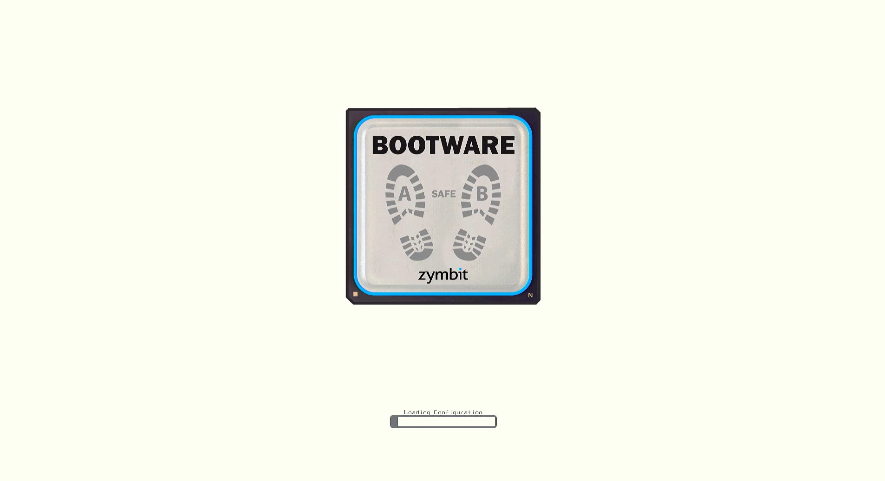

## Quickstart - Download, Install, and Configure Bootware

In this Getting Started guide we describe how to bring up a common use case for Bootware - A/B partitioning for fallback and recovery.


Step-by-step videos of this Getting-Started are also available. 


#### [Register for Bootware Technical Updates](https://www.zymbit.com/get-bootware/)

#### Supported Platforms and Operating Systems


<br>

> It is highly recommended to use a Pi with at least 4GB of RAM. Bootware requires approximately 700MB of RAM overhead for image verification and encryption. For HTTPS endpoints, the image must be 700MB smaller than your total RAM.

-----


The default SCM/SEN as shipped has Zymbit Driver Package pre-installed. For setups using the ZYMKEY4 or other Zymbit HSMs, the installation is up to the user. The Zymbit product should be up and running with the blue LED flashing once every three seconds before installing Bootware. We recommend partitioning your /boot partition with a size of 512MB (default for Bookworm). The standard Zymbit encrytion process is not necessary as Bootware will do this for you. 

A free ZYMKEY is available when you sign up for a Bootware trial. See [Get Bootware](https://www.zymbit.com/get-bootware)

An HDMI console is highly recommended for setting up your unit with Bootware. The process of repartitioning and loading takes time and the console is handy for monitoring progress.

Bootware 1.3 includes the same, consolidated user interface introduced in 1.2. The process of installation and configuration has changed since 1.1.

Details of the commands in this Quickstart are linked in-line.
See the [Features](../features) section for more information on how to use Bootware.

### Overview of steps to get up and running

> You must have the Zymbit SCM/HSM and libraries successfully installed before installing Bootware. The blue LED should blink once every three seconds.

1. Download the Bootware management tool, `zbcli`. 
2. Run [`zbcli install`](../zbcli/install) to install Bootware.
3. Run [`zbcli imager`](../zbcli/imager) to create and sign a Zymbit image file (zi image) of your current root file system as a backup. 
4. Run [`zbcli update-config`](../zbcli/update-config) to configure Partitions and Recovery strategy. For this Quickstart, we will setup A/B partitions.
5. Run [`zbcli update`](../zbcli/update) to load a known-good example zi image into the Backup (B) partition; set B to the Active partition.
6. Run [`zbcli rollback-swap`](../zbcli/rollback-swap) to force a Rollback to your original partition to verify your A/B setup is working.

### 1. Download Bootware

A bootstrap utility to detect and load the correct build of Bootware can be downloaded with curl:

```bash
curl -sSf https://raw.githubusercontent.com/zymbit-applications/zb-bin/main/install.sh | sudo bash
```

The install will identify your Pi and OS and then prompt you if you'd like to include hardware signing. The SCM and HSM6 support hardware signing. All Zymbit products support software signing. For the purpose of this tutorial, we will use software signing. Use the arrow keys to move the selection to `> No`.

```
zb-install.sh: bootstrapping the zbcli installer
        ---------
        Pi Module:         Raspberry Pi 4/Compute Module 4
        Operating System:  Rpi-Bookworm
        Zymbit module:     Secure Compute Module
        Kernel:            kernel8.img
        ---------

? 'zbcli' comes with software signing by default. Include hardware signing? ›
  Yes
❯ No
```

Next, you will be asked to select a version of the `zbcli` from a list of recent versions to install. In most cases, you will want to select the latest version. 

Use the up and down arrows to select the version. You can use Ctrl-C to exit at any time.

```
? Select version ›
  zbcli-1.3.0-1
  zbcli-1.2.0-30
  zbcli-1.2.0-29
```

### 2. Run [`zbcli install`](../zbcli/install)

Install Bootware. Answer `yes` when prompted to complete the installation.

```bash
sudo zbcli install
```

After installing the Bootware tools and artifacts, you will need to reboot into zboot. You will be prompted for confirmation to reboot.

```
? Bootware installation will require 62.59 MiB in `/boot/firmware` and will modify config.txt and rc.local. The system will be configured to boot from U-Boot. No system data will be lost.
       Found kernel '/boot/firmware/kernel8.img'
     Created '/etc/zymbit/zboot/mnt'
     Created '/etc/zymbit/zboot/scripts'
     Created '/etc/zymbit/zboot/scripts/post_install'
     Created '/etc/zymbit/zboot/zboot_backup'
     Created '/boot/firmware/zboot_bkup'
   Installed 'u-boot-tools'
     Created '/etc/fw_env.config'
     Created '/usr/bin/zbconfig'
       Found OpenSSL 3
     Created '/boot/firmware/zb_config.enc'
    Modified zbconfig 'kernel_filename'
   Installed zboot
    Modified '/etc/rc.local'
     Created '/lib/cryptsetup/scripts/zk_get_shared_key'
     Created '/etc/zymbit/zboot/scripts/create-initramfs.sh'
     Created '/etc/systemd/system/bootwarestartup.service'
     Created '/etc/zymbit/zboot/scripts/bootware_startup.sh'
    Modified '/boot/firmware/config.txt'
     Created '/etc/update-motd.d/01-zymbit-fallback-message'
    Modified /etc/update-motd.d/01-zymbit-fallback-message
   Installed bash completions to /usr/share/bash-completion/completions/zbcli.bash
? A reboot into zboot is required. Reboot now? (y/n) › yes     
```

Reboot to complete the installation process and to boot through zboot. Once completed, all necessary files required for loading new images via Bootware will be installed.

### 3. Run [`zbcli imager`](../zbcli/imager) to create a Bootware-ready Zymbit Image backup (zi image)

Bootware requires images in a secure, signed format for loading with zboot. We refer to these images as "zi images." An image conversion tool, [`zbcli imager`](../zbcli/imager), creates the zi image. `zbcli imager` can take a snapshot of your running system or read from tarballs of your bootfs and rootfs partitions. Images can also be partial file additions and deletions called [Overlay images](../features/overlays).

> If you are Developing on a CM4 directly and need to transition to an SCM, See [Developing on the CM4](../features/development) for instructions on how to create an image from your CM4 to load onto the SCM.


#### Create a zi image backup from your current running root file system

Use [`zbcli imager`](../zbcli/imager) to create a zi image backup of your current system. Once created, the zi image can be propagated to other disk partitions securely. A private/public key pair will be used for signing the zi image at time of creation and verifying during the update process. Key pairs can either be created in software or using the Zymbit HSM hardware. For this Quickstart, we will use software keys. Details on signing and verifying can be found [here](../features/signing).


In this guide, we will output the image directly to a USB stick. Mount the USB stick for access,

```bash
sudo mount /dev/sda1 /mnt
```

Start the imager module of zbcli. We will run interactively. You can also run non-interactively by supplying all necessary parameters on the command line. See [zbcli imager](../zbcli/imager) for details.


All necessary information will be prompted for starting with the output directory and the name of the image file. The output directory will be excluded from the image. A `.zi` extension will be added to the image name provided.

```bash
sudo zbcli imager
```

```
   Validated bootware installation
        ---------
        Pi Module         Raspberry Pi 4
        Operating System  Rpi-Bookworm
        Zymbit module     Secure Compute Module
        Kernel            kernel8.img
        ---------
     Cleaned '/etc/zymbit/zboot/update_artifacts/tmp'
✔ Enter output directory · /mnt
✔ Enter image name · my_image
```

Next, you will be prompted for what type of image to make: A full image of the live system or an Overlay image from files added with `zbcli manifest`. An Overlay image can be used to add, replace, or delete a select group of files for updates, patches, etc. For this example, we will create a complete image from the running system. Select the Full Image option. 

```
? Select image type ›
❯ Full image of live system
  Overlay image from files added with zbcli manifest
```

You can optionally provide an image version. This is for your use in helping to identify the image later. It is not used in the process. 

Next, you will be prompted for signing keys. Keys can be software or hardware based and are used for signing and verification of images. Software keys are supported on all Zymbit products. Hardware keys are supported with Secure Compute Module (SCM) or HSM6 products. Had we chosen earlier to include hardware key support, we would be asked to choose either hardware or software key support. We chose earlier to not include hardware key support. You can use an existing key or instruct the imager to create new ones for you. For this Quickstart, we will generate a new software key. Select `Create new software key`

```
? Select key ›
❯ Create new software key
  Use pre-existing software key
```

The imager will now build your zi image. Progress will be shown on the screen.

```
   Validated bootware installation
        ---------
        Pi Module         Raspberry Pi 4
        Operating System  Rpi-Bookworm
        Zymbit module     Secure Compute Module
        Kernel            kernel8.img
        ---------
     Cleaned '/etc/zymbit/zboot/update_artifacts/tmp'
✔ Enter output directory · /mnt
✔ Enter image name · my_image
✔ Select image type · Full image of live system
✔ (Optional) enter image version ·
✔ Select key · Create new software key 
     Created signing key
    Modified /etc/initramfs-tools/initramfs.conf to use most modules.
     Created '/etc/zymbit/zboot/update_artifacts/file_manifest'
     Created '/etc/zymbit/zboot/update_artifacts/file_deletions'
    Verified path unmounted '/etc/zymbit/zboot/mnt'
     Cleaned '/etc/zymbit/zboot/mnt'
     Deleted '/etc/crypttab'
    Verified disk size (required: 2.28 GiB, free: 11.77 GiB)
     Created initramfs
     Created snapshot of boot (/etc/zymbit/zboot/update_artifacts/tmp/.tmpwVB8Of/my_image_boot.tar)
     Running [=======>                                ] 2/11 (00:03:27): taking snapshot of root 
```

The imager may take some time, depending on the size of your file system. Progress will be reported on the screen. Once completed, the zi image and private/public key will be saved to your specified output directory (`/mnt`). Keep your private key private. The zi image can be used from the local storage device or a remote server accessible via HTTPS. The public key file will be needed to load the zi image. 

When complete, there will be three files in your output folder: the public key, the private key, and the zi image.

```
     ...

     Created signing key
    Modified /etc/initramfs-tools/initramfs.conf to use most modules.
     Created '/etc/zymbit/zboot/update_artifacts/file_manifest'
     Created '/etc/zymbit/zboot/update_artifacts/file_deletions'
    Verified path unmounted '/etc/zymbit/zboot/mnt'
     Cleaned '/etc/zymbit/zboot/mnt'
     Deleted '/etc/crypttab'
    Verified disk size (required: 2.28 GiB, free: 11.77 GiB)
     Created initramfs
     Created snapshot of boot (/etc/zymbit/zboot/update_artifacts/tmp/.tmpwVB8Of/my_image_boot.tar)
     Created snapshot of root (/etc/zymbit/zboot/update_artifacts/tmp/.tmpwVB8Of/my_image_rfs.tar)
     Created '/mnt/tmp'
     Cleaned '/mnt/tmp'
     Created staging directory (/mnt/tmp/.tmptwQhAI)
     Created '/mnt/tmp/.tmptwQhAI/header.txt'
     Created tarball (/mnt/tmp/.tmptwQhAI/update_artifact.tar)
     Created header signature
     Created update artifact signature
     Created file manifest signature
     Created file deletions signature
     Created '/mnt/tmp/.tmptwQhAI/signatures'
     Created '/mnt/tmp/.tmptwQhAI/header.der'
     Created '/mnt/tmp/.tmptwQhAI/image.der'
     Created '/mnt/tmp/.tmptwQhAI/manifest.der'
     Created '/mnt/tmp/.tmptwQhAI/deletions.der'
     Created signatures (/mnt/tmp/.tmptwQhAI/signatures)
      Copied file (/etc/zymbit/zboot/update_artifacts/file_manifest) to (/mnt/tmp/.tmptwQhAI/file_manifest)
      Copied file (/etc/zymbit/zboot/update_artifacts/file_deletions) to (/mnt/tmp/.tmptwQhAI/file_deletions)
     Created tarball (/mnt/my_image.zi)
     Created '/mnt/my_image_private_key.pem'
       Saved private key '/mnt/my_image_private_key.pem'
     Created '/mnt/my_image_pub_key.pem'
       Saved public key '/mnt/my_image_pub_key.pem'
     Cleaned '/mnt/tmp'
       Saved image '/mnt/my_image.zi' (2.28 GiB)
    Finished in 546.6s                                                                                                                                      $ ls -lh /mnt
total 851M
-rwxr-xr-x 1 root root  242 Feb 14 09:56 my_image_private_key.pem
-rwxr-xr-x 1 root root  178 Feb 14 09:56 my_image_pub_key.pem
-rwxr-xr-x 1 root root 851M Feb 14 09:56 my_image.zi

```

Additional examples of `zbcli imager` usage can be found here: [zbcli imager usage](../zbcli/imager)


### 4. Run [`zbcli update-config`](../zbcli/update-config) to configure the Partitioning and Image loading

Now we will use the zi image and public key we just created to configure an A/B partition and load the image into the BACKUP (B) partition.

First, copy the public key file created earlier by the imager from `/dev/sda1` to a location on your local filesystem.

```bash
cp /mnt/my_image_pub_key.pem .
```

#### Use the Bootware [`zbcli update-config`](../zbcli/update-config) to Configure your System

Bootware includes a tool to help configure your system called `zbcli update-config`. `zbcli update-config` is meant to setup your device environment to load a zi image from a configured endpoint, as well as choose an update policy for how to apply zi images. More information on `zbcli update-config` can be found [here](../zbcli/update-config). Navigate through the menus with up and down arrows. Use ENTER to make a choice. Each configuration option will display the available options with explanations.

We are going to set a configuration with A/B partitioning that will UPDATE the BACKUP, leaving the A partition as the stable partition for fallback. 

 The A and B partitions will roughly split the disk space available, minus a common data partition size that you specify. If your current partition size exceeds half of the total disk size, the update mode will be switched to UPDATE_BOTH, and your zi image will be loaded into both the A and B partitions. You will be notified that your UPDATE mode has switched from UPDATE_BACKUP to UPDATE_BOTH. After the update has been applied to the A & B partitions, you can then switch to UPDATE_BACKUP via [`zbcli update-config`](../zbcli/update-config). 

```bash
sudo zbcli update-config
```

```
   Validated bootware installation
        ---------
        Pi Module         Raspberry Pi 4
        Operating System  Rpi-Bookworm
        Zymbit module     Secure Compute Module
        Kernel            kernel8.img
        ---------
❯ Configure partition layout
  Configure update policy
  Configure data partition size in MB. Does not apply if there is an existing data partition.
  Configure update endpoint
  Configure wireless network manually with a ssid / psk
  Configure wireless network automatically with a wpa supplicant conf file
  Configure hostname for post-update
  Configure password for post-update
  Save and exit
```

Choose your settings as described below.

For `Configure partition layout`, choose `[RECOMMENDED] A/B:`

```
❯   [RECOMMENDED] A/B: This will take the remaining disk space available after the boot partition and create two encrypted partitions, each taking up half of the remaining space. Most useful for rollback and recovery with an Active/Backup configuration.
```

For `Configure update policy`, choose `[RECOMMENDED] BACKUP:`

```
❯   [RECOMMENDED] BACKUP: Applies new updates to current backup filesystem and swap to booting the new updated backup partition as the active partition now. If the new update is bad, it will rollback into the previous stable active partition.
```
 NOTE: If the existing root partition is too big to create a new backup partition, the update policy will be switched to BOTH. A WARNING! will be issued:
```
 Active partition won't be saved!!!
 Changing update mode to UPDATE_BOTH!!!
       Using update mode (UPDATE_BOTH)
```

For `Configure data partition size in MB`, choose the size of the encrypted shared DATA partition. You can choose a size in Megabytes that you prefer. The default is 512MB. Note: If the partition exists, this option is ignored.

```
? Enter size of data partition in MB ›  1024
```

For `Configure update endpoint`, choose the block device or URL endpoint that holds your zi image file. Note: You must complete this step as the endpoint will be validated.

```
       Using update endpoint '/dev/sda1'
  Defaulting to configured endpoint '/dev/sda1'
        Info update endpoints can be either an HTTPS URL or an external mass storage device like a USB stick.
? Enter update endpoint › /dev/sda1     
```

`zbcli update-config` will confirm the endpoint is reachable, and set the update image name found at the endpoint. If multiple images are found, a menu of available images is presented to choose from.

`Configure wireless network manually with a ssid / psk` - Along with local devices, such as a USB stick, Bootware supports pulling remote updates via Wi-Fi or LAN connections. Bootware Wi-Fi credentials are separate from the standard userspace Wi-fi credentials.  Wi-Fi credentials need to be provided in order for bootware to access the wifi during updates. If no wireless credentials are provided, the wireless interface is disabled in zboot. Here, you can simply supply your SSID and password. If you need to supply additional Wi-Fi security, the next option allows you to supply credentials in a standard, wpa_supplicant.conf format.

`Configure wireless network automatically with a wpa supplicant conf file` - Bootware/zboot contains a functional wpa_supplicant implementation. This option allows the user to point to a standard wpa_supplicant.conf file in userspace that will be imported into Bootware directly. Use this option if your setup requires certificate-based authentication, or other more complicated setups.

`Configure hostname for post-update` - A post-update process is included to change your hostname to the specified name. This will be done for every future update until cleared or changed.

`Configure password for post-update` - A post-update process is included to change the password for a specified user. This will be done for every future update until cleared or changed.

**Save** and **exit** to save and exit `zbcli update-config`. You can Ctrl-C at any point before saving to exit the configurator without applying any changes.


### 5. Run [`zbcli update`](../zbcli/update) to create the Backup partition and load the zi image.

Once you are satisfied with your Bootware configuration, run [`zbcli update`](../zbcli/update) to complete the process of repartitioning and loading your image.

```bash
sudo zbcli update
```

```
   Validated bootware installation
        ---------
        Pi Module:         Raspberry Pi 4
        Operating System:  Rpi-Bookworm
        Zymbit module:     Zymkey
        Kernel:            kernel8.img
        ---------
     Cleaned '/etc/zymbit/zboot/update_artifacts/tmp'
       Found update configs
? Proceed with current configs? These can be modified through 'zbcli update-config'
        ---------
        Update endpoint   /dev/sda1
        Update name       my_image
        Endpoint type     LOCAL
        Partition layout  A/B
        Data partition    1024MB
        Update policy     UPDATE_BOTH
        Hostname          Not set
        Password          Not set
        ---------
 (y/n) › yes
```

The script will show your configuration for review and confirmation and give you the option to change the configuration. If not correct, enter `no` to exit. You may then  re-run `zbcli update-config` to correct the configuration. If the configuration is not valid, `zbcli update` will exit.

Next, you need to enter the path to your public key file (in PEM format). For this example, we will use the public key file we copied locally earlier.

```
✔ Enter public key file (Pem format) · ./my_image_pub_key.pem
```

If verification with the Public Key succeeds, `zbcli update` will continue with progress information, then prompt for a reboot to complete the process. 

#### Bootware Boot Process

The Bootware update process will now take place. Upon reboot in UPDATE_BACKUP mode, zboot will allocate, create, and encrypt a B partition, then load the contents of your zi image onto it. If there was sufficient space to create the B partition, the A partition will remain untouched, and the system will come back online with partition B (`cryptrfs_B`) as its root filesystem.  

If your original partition was more than half the available disk space and you were switched to UPDATE_BOTH during configuration, both A and B will have been created and your image loaded into both. In this case, the system will come back online after the update with its root filesystem on partition A (`cryptrfs_A`).

While the Bootware update process takes place, a Bootware splash screen is displayed on the console, along with a progress bar.



On the console, you will see:

* Bootware will process and validate the image.
* The A/B partitions will be configured and setup for LUKS encryption protected by the Zymbit HSM.
* Depending on the size of the zi image, it may take a significant amount of time to load its contents into the root partition(s) being targeted for update.
* Once zboot is done unpacking the image to the B partition, it will boot your system with the B (UPDATE_BACKUP mode) / A (UPDATE_BOTH mode) partition as the ACTIVE partition.

The initial configuration process can take 30 to 60 minutes to complete depending on the size of the image. The setup process with `zbcli` can be completed via SSH, but an HDMI console is helpful to follow the progress from within zboot. The Zymkey's blue LED will return to flashing once every three seconds once the update process completes and the linux system has come back online.

You can use `lsblk` to examine the partition layout.

With B ACTIVE,

```
 $ lsblk
NAME              MAJ:MIN RM  SIZE RO TYPE  MOUNTPOINTS
sda                 8:0    1 57.7G  0 disk
└─sda1              8:1    1 57.7G  0 part
mmcblk0           179:0    0 14.8G  0 disk
├─mmcblk0p1       179:1    0  512M  0 part  /boot/firmware
├─mmcblk0p2       179:2    0  6.7G  0 part
├─mmcblk0p3       179:3    0  6.7G  0 part
│ └─cryptrfs_B    254:0    0  6.7G  0 crypt /         (B ACTIVE)
└─mmcblk0p4       179:4    0    1G  0 part
  └─cryptrfs_DATA 254:1    0 1008M  0 crypt
```

With A ACTIVE,

```
$ lsblk
NAME              MAJ:MIN RM  SIZE RO TYPE  MOUNTPOINTS
sda                 8:0    1 57.7G  0 disk
└─sda1              8:1    1 57.7G  0 part
mmcblk0           179:0    0 14.8G  0 disk
├─mmcblk0p1       179:1    0  512M  0 part  /boot/firmware
├─mmcblk0p2       179:2    0  6.7G  0 part
│ └─cryptrfs_A    254:0    0  6.7G  0 crypt /        (A ACTIVE)
├─mmcblk0p3       179:3    0  6.7G  0 part
└─mmcblk0p4       179:4    0    1G  0 part
  └─cryptrfs_DATA 254:1    0 1008M  0 crypt
```

### 4. Quickcheck: Manual Rollback (Active/Backup partitions)

To verify you now have two valid partitions, manually trigger a rollover from Active to Backup with [`zbcli rollback-swap`](../zbcli/rollback-swap). This will reboot your system into its non-active root partition. No update process will be invoked and the contents of both partitions will remain enchanged.

```bash
sudo zbcli rollback-swap
```

Once again, you can use `lsblk` to verify the active partition has changed. You should now have identical Active and Backup partitions with working images ready for your development. 

If Bootware detects that the system has failed to reach a `systemd` init target for 3 consecutive attempts in a row, it will automatically initiate a rollback-swap of the root partitions upon the next reboot.

### Additional Information and Support
    
[zbcli commands](../zbcli)

[Contact Support](mailto:support@zymbit.com)

