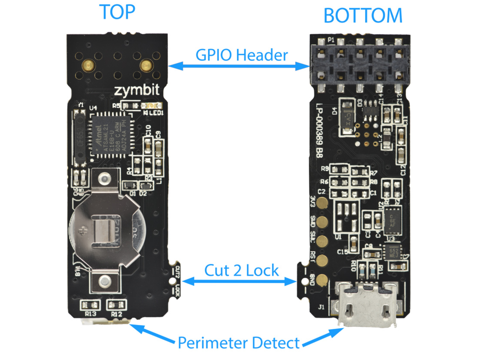
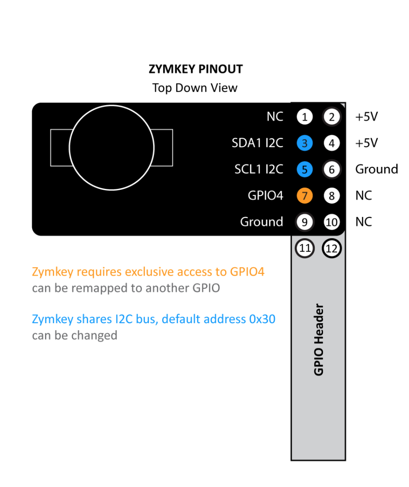
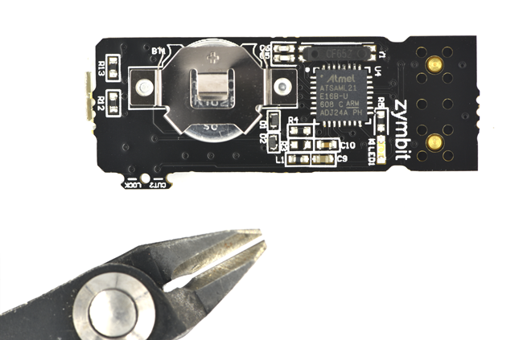
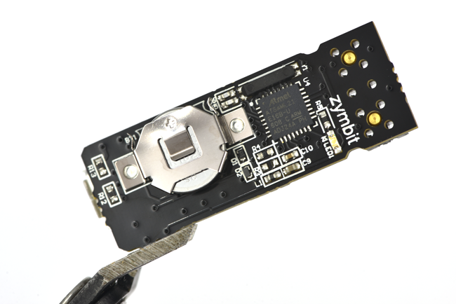

ZYMKEY4i is the fourth generation of the Zymbit security module designed specifically to work with Raspberry Pi and NVIDIA Jetson. It connects to the GPIO header of the SBC and uses the I2C bus and GPIO-4 to communicate with the SBC CPU via an encrypted channel.

## Summary of Setup Steps

<table>
    <thead>
        <tr>
            <th></th>
            <th><strong>Step Description</strong></th>
            <th><strong>Notes and/ or Checkpoint</strong></th>
        </tr>
    </thead>
    <tbody>
        <tr>
            <td>0</td>
            <td><strong>Hardware &amp; Connections</strong></td>
            <td>What plugs into where.</td>
        </tr>
        <tr>
            <td>1</td>
            <td><strong>Battery Install</strong></td>
            <td>The battery is required to maintain the Real Time Clock and the perimeter detect circuits when the host power is removed. See <a href="https://docs.zymbit.com/quickstart/faq/zymkey4/#q-should-i-use-an-external-battery-on-my-zymkey-or-hsm">this chart</a> for more information.</td>
        </tr>
        <tr>
            <td>2</td>
            <td><strong>Hardware Install</strong></td>
            <td>Blue LED will blink rapidly to indicate Zymkey is connected correctly but not yet configured.</td>
        </tr>
        <tr>
            <td>3</td>
            <td><strong>Configure I2C Bus</strong></td>
            <td>The I2C Bus must be enabled. For Raspbian OS, the I2C Bus is disabled by default. For Ubuntu, the I2C Bus is enabled by default.</td>
        </tr>
        <tr>
            <td>4</td>
            <td><strong>Software Install &amp; API</strong></td>
            <td>Blue LED will blink once every three seconds to indicate Zymkey is connected and configured.</td>
        </tr>
        <tr>
            <td>5</td>
            <td><strong>Developer Mode</strong></td>
            <td>DEVELOPER MODE- bindings are temporary, Zymkey can be moved to different hosts and SD Cards.</td>
        </tr>
        <tr>
            <td>6</td>
            <td><strong>Production Mode</strong></td>
            <td>PRODUCTION MODE- binding is permanent! Zymkey can NOT be moved to different hosts or SD Cards. Transition to Production Mode by cutting Lock Tab.</td>
        </tr>
    </tbody>
</table>

---

## Scope

In this Getting Started Guide we describe how to install your Zymkey 4i to a Raspberry Pi or Jetson Nano/ Xavier running Rasbian or Ubuntu. The installation process is the same for both of these Linux distributions.

**[Learn about Linux OS support for Zymkey.](https://community.zymbit.com/c/operating-system/23)**

---

## 0. Hardware & Connectors

---

## 1. Battery Installation (Recommended) {.include-toc}

Your Zymkey 4i  can be fitted with a **3V CR1025  coincell** battery that is used to maintain operation of the real-time-clock (RTC) and tamper detect features in the event that main power (from the GPIO header) is lost.


Battery installation is highly recommended if your device is vulnerable to physical access!


If you choose not to fit a battery, then these important security features will not function in the event main power is removed.

Use a **high quality 3V CR1025** coincell battery such as the [Panasonic - CR-1025EL, LITHIUM MANGANESE DIOXIDE](https://www.mouser.com/datasheet/2/315/3635_fileversion-1627310.pdf).


Note the correct polarity with **+ve  facing upwards!**



---

## 2. Hardware Installation {.include-toc}

**Power down your Raspberry Pi or NVIDIA Jetson first!**


Installing your hardware correctly is important to avoid destroying your SBC or Zymkey. Be sure to follow the images below to ensure the first 10 GPIO pins are correctly aligned with the Zymkey header.

Note that the coin cell battery should be facing up.


Fit the Zymkey 4i with LED and battery holder facing upwards. Be sure the black connector is properly aligned with the first 10 GPIO pins and that pressed firmly down onto the header. If misaligned, this could cause damage to the Zymkey and/or your Raspberry Pi. Your Zymkey should fit relatively snug and maintain a tight interference fit around the pins.

Zymkey occupies 10 pins on the GPIO header. It can also be used with other GPIO devices attached, or other i2c devices attached. See options later for correct address range and use of IO pins.


The default configuration uses GPIO4. This can be reconfigured to use another GPIO of your choice.



The default I2C address for Zymkey is 0x30. If this conflicts with another device in your system, you can reconfigure the Zymkey to use another address of your choice.


---

**Option (RPi):** Using Zymkey with another Pi Plate fitted.

### Power On, Confirm Operation {#power-on-confirm-operation}

Finally, power up the device and you will see a blue LED blinking rapidly and consistently (5 blinks per second)

---

#### Zymkey operational, but not configured {#zymkey-operational-but-not-configured}
(If the blue LED blinks erratically, or not at all, then there is an installation error and you should check your connections.)

---

### Power Quality {#power-quality}


Power quality matters to the reliable and secure operation of your system and Zymkey.


---

## 3. Configure the I2C Bus

### For Raspberry Pi {#i2c-rpi}

For Raspbian Operating Systems you must configure the state of the I2C bus to &quot;ON&quot;.

For Ubuntu Operating Systems, the I2C bus is automatically configured and you may skip this step.

For Raspbian OS:

1. Log in to your SBC and run `sudo raspi-config`
1. Select Interfacing Options -&gt; I2C -&gt; Would you like the ARM I2C interface to be enabled? select  (Yes), enter, enter
1. Arrow Right to Finish

Your I2C bus is now configured and ready to talk to the Zymkey. Next install the Zymkey interface software (ZKIFC) onto your Pi.

The default I2C address for Zymkey is 0x30.


The default mode for the cpu scaling governor is ondemand. There have been some issues with the interaction between the zymkey and the I2C bus, when the governor is set to ondemand. We highly recommend to switching the governor to performance to get the most out of the zymkey.




How to set cpu governor to performance.


### For NVIDIA Jetson Nano/Xavier {#i2c-jetson}

For the Jetson the Operating System - Tegra - is based on Ubuntu. The I2C bus is enabled by default. There are no additional steps required.

The default I2C address for Zymkey is 0x30.

Next install the Zymkey interface software (ZKIFC) onto your SBC.

---

## 4. Software Package Installation & API

Login to your host device.

NOTE: Your Zymkey will require a number of packages to be installed from the Raspberry Pi/ Canonical and Zymbit apt repositories. The following setup script will be installing a number of files and software packages on your system:

* Zymbit .service files located in the `/etc/systemd/system` directory
* pip

Make sure curl is installed (typically not included with Tegra [Ubuntu 18.04] by default):

`sudo apt install curl`

Download and install the necessary Zymbit services onto your device.

`curl -G https://s3.amazonaws.com/zk-sw-repo/install_zk_sw.sh | sudo bash`

(Grab a cup of coffee because this will take between 4 and 20 minutes.)

### Binding, Device ID, and Authentication {#binding-device-id-and-authentication-}

Good security begins with assigning each device a unique and unalterable identity (Device ID), that is used to authenticate subsequent interactions with the device.

Zymkey generates a unique Device ID by measuring certain attributes of the specific host Raspberry Pi/ Jetson (Measurement), and then combining that Measurement with the unique ID of a specific Zymkey. The combination process uses a cryptographic function and this process is generally termed &quot;binding&quot;. On completion of a binding process, then Zymkey is said to be &quot;bound&quot; to the Pi.

Zymkey supports two operating modes:

1. Developer Mode: bindings are temporary, zymkey can be moved to different Pi/ Jetson hosts and SD Cards.
1. Production Mode: binding is permanent!  zymkey  can **NOT** be moved to different Pi/ Jetson hosts or SD cards.

---

## 5. Developer Mode (temporary binding)

When the software installation has completed, reboot your device. After the reboot has completed, the Pi/ Jetson will perform an operation that will temporarily bind the Zymkey to your SBC. Once the Zymkey is bound to the SBC, the Zymkey&#39;s blue LED should blink slowly - once every 3 seconds - to indicate that the binding is complete.

#### Zymkey operational, temporary binding to host (Zymkey in Developer Mode) {#zymkey-operational-temporary-binding-to-host-zymkey-in-developer-mode-}

At this point, your Zymkey is now in Developer Mode, the binding is temporary and the Zymkey can be moved to another Pi/ Jetson and the binding process repeated.

---

## 6. Production Mode (permanent binding)

When you have completed all your development work and you are ready to deploy your system into the field we recommend that you permanently bind your Zymkey to a &#39;specific host device and SD card &#39;.

**WARNING: THIS BINDING PROCESS IS PERMANENT AND CANNOT BE REVERSED. PAY ATTENTION TO  THE FOLLOWING:**

* Your specific Zymkey will be locked to the specific host device and it is impossible to move or bind your Zymkey to another device. There are no factory resets, masterkeys or other forms of recovery.
* If you are using the perimeter_detect features, then the sequence in which you arm, disarm is very important. Be sure to follow the process steps below.
* Once you have locked your Zymkey into production mode, zymbit cannot guarantee its operation if you subsequently do a major distribution upgrade (e.g. Raspbian Jessie to Stretch).** [Contact Zymbit for more information.](https://www.zymbit.com/contact-us/)
* If you decide that you are not ready for permanent binding then leave it in developer mode, but beware this makes it easier for a bad actor to replace the host with a rogue hardware.

### **Moving from Developer Mode to Production Mode** {#-moving-from-developer-mode-to-production-mode-}

#### With Zymkey in Developer Mode (Lock Tab in Place) {#with-zymkey-in-developer-mode-lock-tab-in-place-}

Do not cut the Lock Tab yet!

* Install the battery on Zymkey.
* Place Zymkey onto the GPIO header (with power down on the device).
* Turn on the SBC.
* Install and bind the Zymkey and SBC.
* Set Perimeter Event Actions to “none” or “notify only”.
* Create your LUKS encrypted volume.
* Install your applications into your encrypted volume.
* Confirm your system and applications work fully as you intend.

#### When you are ready to move Zymkey to Production Mode, {#when-you-are-ready-to-move-zymkey-to-production-mode-}

Do not cut the Lock Tab yet!

* Turn off the power to the SBC..
* Do not remove the battery..
* Remove the Zymkey from the SBC.
* Now Cut the Lock Tab.
* Replace the Zymkey onto the SBC and turn on power to the SBC.
* Close your perimeter circuit(s) (enclosure lid).
* Clear Perimeter Detect Events.
* Get Perimeter Detect Info to confirm prior events are cleared and the perimeter is closed..
* If the Perimeter Detect Event returns clear, then you can ‘arm your system’ as you require by setting  Set Perimeter Event Actions to “none”, “notify” or “selfdestruct”.
* **Your system is now armed.**.

### Manual Cut-2-Lock {#manual-cut-2-lock}

**IMPORTANT:** first power down your device and Zymkey. Removing the Cut-2-Lock tab can be done in situ, or by removing the Zymkey from the SBC. ***Also insure that your perimeter detect actions are not set to self-destruct mode.*** Follow the steps outlined above, and refer to the programming api documents for more information on the operation of Perimeter Detect Events.

#### Cut using sharp diagonal cutter pliers {#cut-using-sharp-diagonal-cutter-pliers}

---

#### Cut along guide notches {#cut-along-guide-notches}

---

#### Finished cut should be flush to edge. {#finished-cut-should-be-flush-to-edge-}

#### Once you have successfully cut the lock tab and have rebooted your system, the blink pattern will change to 3 rapid blinks once every 3 seconds to indicate that Zymkey has bound to the host in production mode. {#once-you-have-successfully-cut-the-lock-tab-and-have-rebooted-your-system-the-blink-pattern-will-change-to-3-rapid-blinks-once-every-3-seconds-to-indicate-that-zymkey-has-bound-to-the-host-in-production-mode-}

---

## Additional Resources

### Troubleshooting {#troubleshooting}

* [Zymkey Troubleshooting FAQ](https://docs.zymbit.com/quickstart/faq/zymkey4/#troubleshooting)
* [Community Forum](https://community.zymbit.com/)

### Perimeter Detect {#perimeter-detect}

Refer to [Using Perimeter Detect](https://docs.zymbit.com/tutorials/perimeter-detect/zymkey4).

### API Documentation {#api-documentation}

API&#39;s are available for Python, C, C++ [Go to API Documents &gt;](https://docs.zymbit.com/quickstart/api)

### Application Examples {#application-examples}

The quickest way to get started is to see the various methods at work by running these scripts:

* `python /usr/local/share/zymkey/examples/zk_app_utils_test.py`
* `python /usr/local/share/zymkey/examples/zk_crypto_test.py`

More Resources:

* [LUKS filesystem encryption](https://docs.zymbit.com/tutorials/encrypt-rfs/zymkey4)
* [Encrypting &amp; decrypting sensor data on disk](https://docs.zymbit.com/tutorials/sensor-data/)
* [Real Time Clock](https://docs.zymbit.com/reference/real-time-clock/)
