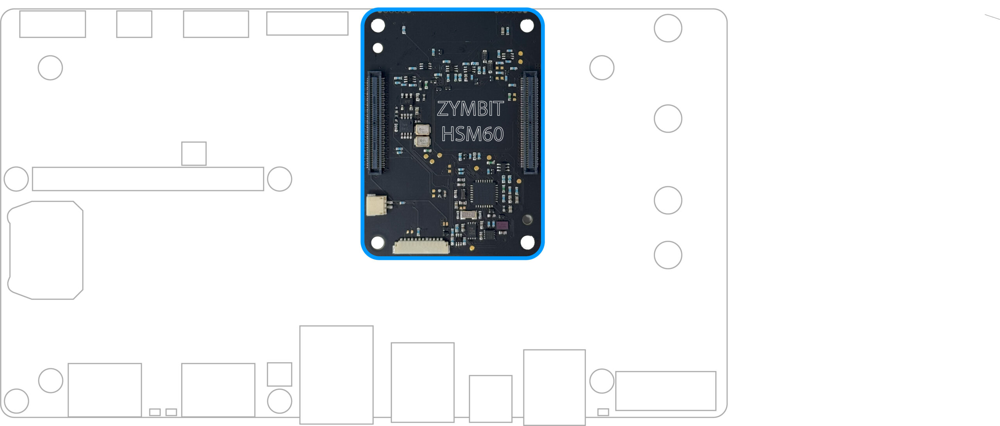
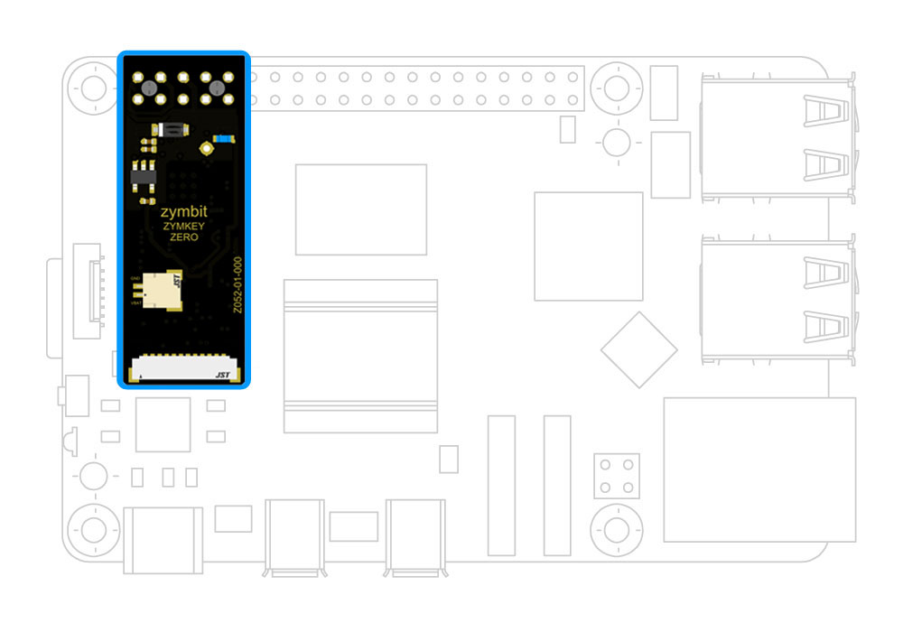

Seamless Security for Raspberry Pi Compute Modules. Easy to integrate interposer module with hardware root of trust.

## Overview

### Easy to integrate interposer module

- 640 key slots with BIP, SLIP wallet support
- Always-encrypted host interface
- Last gasp key-destruction on power loss
- Seamless integration with Bootware

### Hardware root of trust

- File system encryption
- Secure key generation & storage
- Data encryption & signing
- Perimeter tamper sensors
- Measured system identity & authentication
- Real time clock

---

## Specifications

| Category | Details |
|----------|---------|
| Private/public key pairs | 512 |
| Foreign public key pairs | 128 |
| Wallet functions | BIP 32 - hierarchical deterministic wallet, BIP 39 - master seed mnemonic generator, SLIP 39 - with Shamir's secret sharing, BIP 44 - multi-account support |
| Cryptographic Services | ECC KOBLITZ P-256 (secp256k1), ED25519, X25519, ECDH (FIPS SP800-56A), TRNG (NIST SP800-22, NIST SP800/90B, NIST SP800/90C pending), ECC NIST P-256 (secp256r1), ECDSA (FIPS186-3), AES-256 (FIPS 197) |
| Tamper Sensors | 2 x perimeter breach detection circuits, accelerometer shock & orientation sensor, main power monitor, battery power monitor, battery removal monitor |
| Software API | Python, C++, C |
| Host Interface | Always encrypted channel with ephemeral ECC keys, I2C default address (user changeable), GPIO4 (user changeable) |
| Physical Format | Raspberry Pi CM interposer module |
| Dimensions | 55.0 x 40.0 x 5.6 mm (2.16 x 1.57 x 1.57 inches) |
| Board Connectors | Motherboard connector x2: Hirose Receptacle DF40HC(3.0)-100DS-0.4V(51). Compute Module connector x2: Hirose Header DF40C-100DP-0.4V(51). Perimeter: 12pin JST 0.8mm receptacle (mates with JST 12SUR-32S). Battery: 2pin JST 0.8mm receptacle (mates with JST 2SUR-32S) |
| Production mode lock | Software API command |
| Measured system identity & authentication | Multiple system factors including RPi host, HSM60 |
| Data encryption & signing | Encrypt root file system with dm-crypt (LUKS key manager hook), encrypt data blobs with "zblock" function, encrypt data in flight with OpenSSL integration |
| Real time clock | 36-60 months operation, application dependent, 5ppm accuracy |
| Backup battery | Used for RTC and perimeter circuits. Requires JST connected coin cell, RPi 5 RTC battery, or similar (not included) |
| Backup battery monitor | Yes |
| Last gasp battery removal detection | Yes |
| OEM custom features | Contact Zymbit |
| Example cipher suites | AWS-IOT: TLS_ECDHE_ECDSA_AES256_SHA, MS-AZURE: TLS_ECDHE_ECDSA_AES_128_GCM_SHA256_P256 |
| Accessories & related products | Backup battery, perimeter cables |
| Warranty | 18 months |
| Compatibility | Pi CM5, CM4 |

---

## Documentation

##### [Using Product](/getting-started/zymkey4/quickstart/)

- Getting started
- Software APIs
- Tutorials
- FAQ & troubleshooting

##### Conformity Documents

- EU Declaration of Conformity
- FCC Declaration of Conformity
- RoHS/Reach Declaration of Conformity
- California Prop 65 Declaration of Conformity

##### CAD Files

- Mechanical dimensions
- Step model

##### [Manufacturing Tools](https://www.zymbit.com/manufacturing-tools/)

- Secure high speed encryption appliance
- Programming and provisioning
