All-in-one secure Linux compute module for developers of IoT devices and infrastructure. The hardened Raspberry Pi compute module for zero-trust environments.

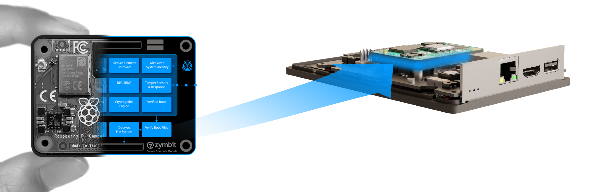

## Overview

### Open for developers. Hardened for life on the edge.

Enjoy all the freedoms of the Raspberry Pi developer ecosystem with the protection of Zymbit verified hardware and tools.

- Raspberry Pi CM4 compute
- Secure boot
- Encrypted file system
- Hardware cryptographic engine
- Fully encapsulated, tamper resilient
- Standard and custom images

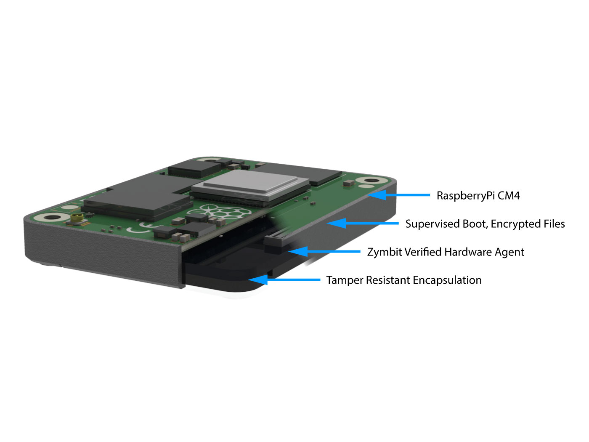

### Hardware secured compute for critical applications

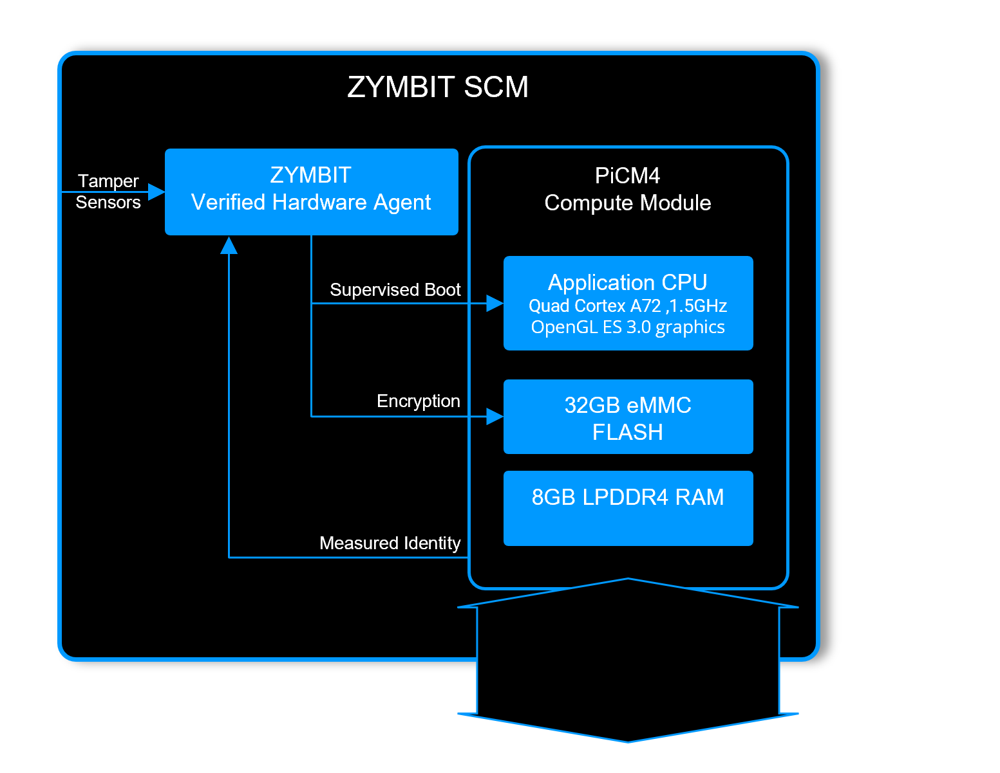

### Zymbit Verified Hardware

Each SCM includes a PiCM4 compute module that is protected by a Zymbit Verified Hardware Agent. The agent runs autonomously from the CPU and provides independent verification of boot, file system access and overall system integrity.

Verified highlights:

- [Secure boot on Raspberry Pi](/tutorials/supervised-boot/)
- Measured system identity
- File system encryption
- [Physical tamper sensors](/tutorials/perimeter-detect/scm/)

### Secure encapsulated hardware stack

The SCM hardware is fully assembled and encapsulated by Zymbit, ready for provisioning and customer applications.

- Reduced attack surface, increased security
- All connections hidden
- External battery, under module option
- Internal last-gasp destruction mode

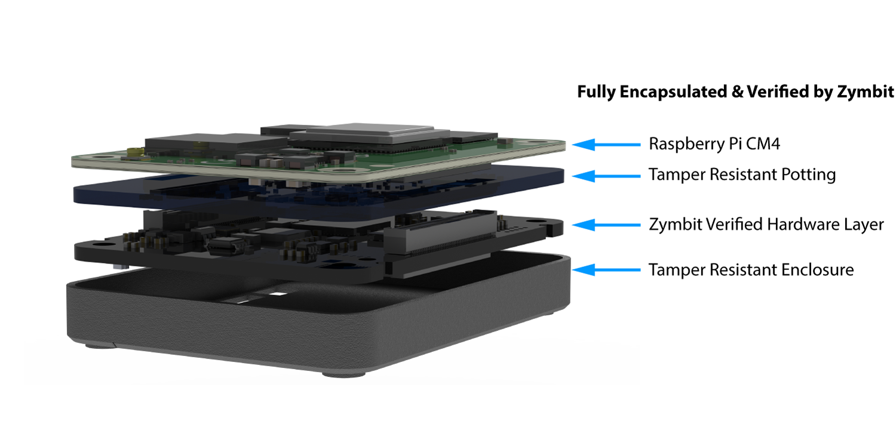

### Full spec compute module

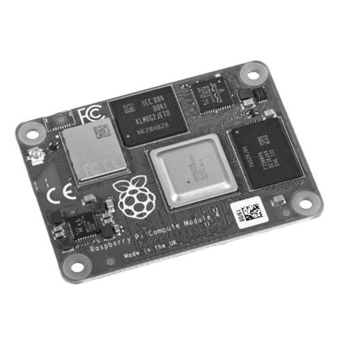

SCM includes the powerful PiCM4 Linux compute modules.

- Broadcom BCM2711 quad-core Cortex-A72 (ARM v8) 64-bit SoC @ 1.5GHz
- H.265 (HEVC) (up to 4Kp60 decode), H.264 (up to 1080p60 decode, 1080p30 encode)
- OpenGL ES 3.1, Vulkan 1.0
- Up to 8GB LPDDR4-3200 SDRAM
- Up to 32GB eMMC Flash memory

Comprehensive peripherals support:

- Gigabit Ethernet, IEEE 1588 precision time protocol
- Optional 2.4 GHz and 5.0 GHz IEEE 802.11ac wireless, Bluetooth 5.0, BLE
- 28 x user GPIO configurable for SPI, I2C, UART, ADC, DAC, PWM, I2S
- 2 x HDMI 2.0 ports (up to 4kp60 supported)
- 1 x MIPI DSI Serial Display
- 1 x MIPI CSI-2 Serial Camera
- 1 x PCIe 1-lane Host, Gen 2 (5Gbps)

### Python, C, C++ APIs

As developers ourselves, we try to build APIs that allow you to benefit from the power of cryptography, without needing to understand the underlying math. Zymbit wallet functions are designed to provide access to powerful features like generating a wallet master seed, child keys and managing wallet recovery from mnemonic phrases and shared secrets.

[Learn more](/api/)

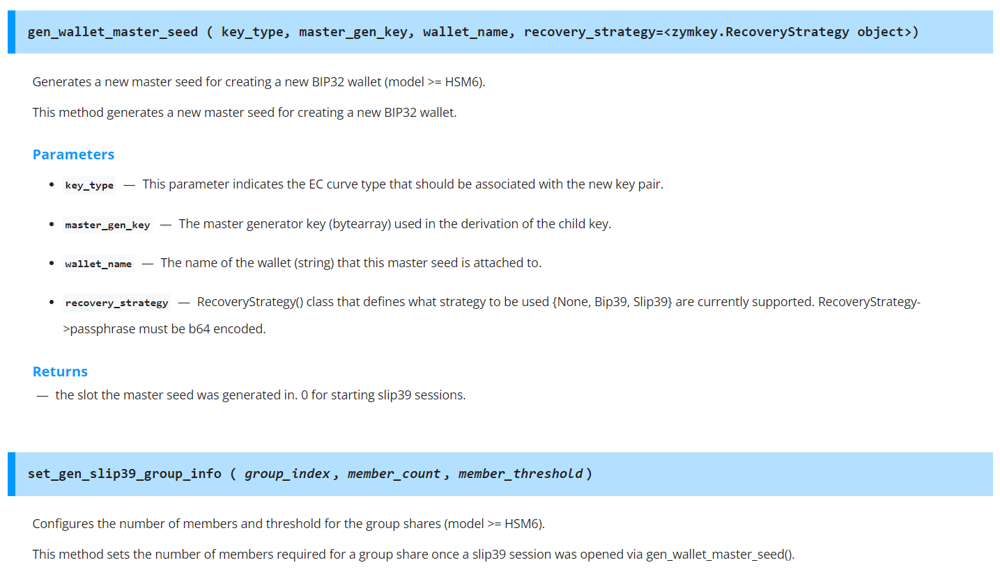

### Cryptographic engine & services

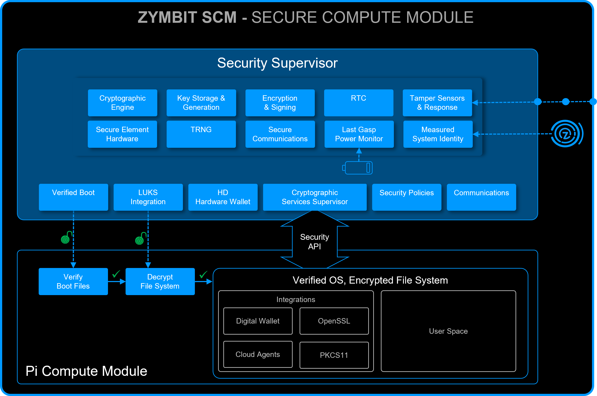

The Secure Compute Module provides a wide choice of cryptographic services and types that are easily accessed through the Zymbit API.

Services:

- Key generation and storage
- Encryption, signing and hash functions
- True random number generator (TRNG)

Cypher suite:

- ECC KOBLITZ P-256 (secp256k1)
- ED25519, X25519
- ECDH (FIPS SP800-56A)
- TRNG (NIST SP800-22)
- ECC NIST P-256 (secp256r1)
- ECDSA (FIPS186-3)
- AES-256 (FIPS 197)

### Developer tools

Dev Kit includes:

- Zymbit Secure Compute Module (Integrated Pi CM4)
- Motherboard for SCM
- Perimeter Detect breakout cable
- External battery breakout
- 12V power supply
- USB drive with SSH keys necessary for SSH login

[Buy now](https://store.zymbit.com/collections/developer-pilot-kits)

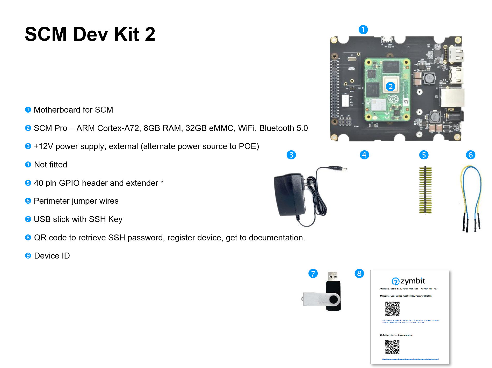

### Optional HD hardware wallet

A Hierarchical Deterministic (HD) wallet is a reliable and secure way to manage hundreds of keys, embedded in a single device.

HD wallets use proven de-facto standard algorithms developed for blockchain and crypto applications. Zymbit's HSM6 product implements standard protocols -- BIP32/39/44 and SLIP39 -- in a compact, easy to integrate module that's programmable through secure APIs.

Tutorials on using HD wallet:

- [Send Web3 Ethereum transactions](/tutorials/digital-wallet/zymbit-wallet-python-sdk/)
- [Wallet recovery with SLIP39 Shamir's secret sharing](/tutorials/digital-wallet/slip39-example/)
- [Read-only oversight wallet](/tutorials/digital-wallet/oversight-example/)

[Learn more](/tutorials/digital-wallet/wallet-example/)

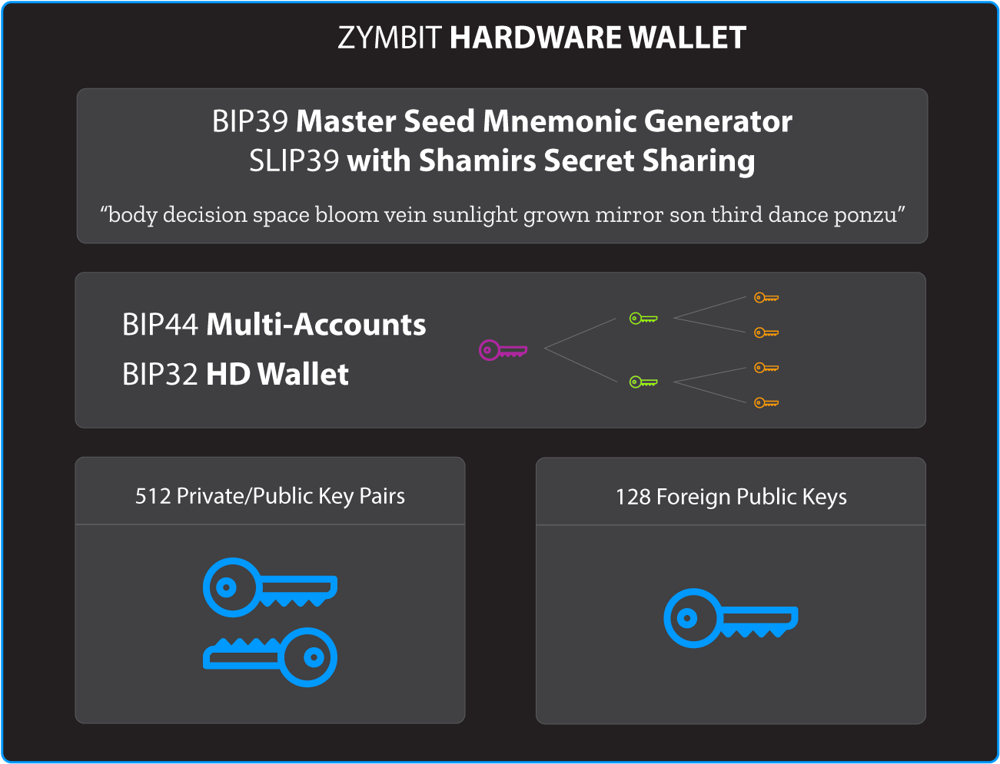

### Footprint compatible with CM4

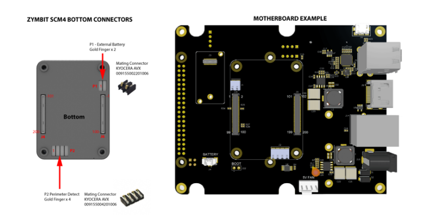

Ready to embed into your custom design:

- PCB footprint, schematic symbol, 3D models
- Altium Designer & CircuitStudio
- KiCAD
- Mechanical drawings
- [CAD documents](/reference/cad/scm/)

### Pre-configured the way you want

To simplify your life, the SCM can be shipped with a choice of pre-configured OS, application software and security policies that align with your product development stage.

#### Develop

- Optimized for maximum development flexibility
- Standard OS builds & tools
- Partially encrypted file system
- Relaxed security policies, open ports

#### Secure

- Defined security policies enabled
- Optimized OS build
- Fully encrypted file system
- Supervised boot configured
- Finalize configuration with [Security Sanitization Guide and Scripts](https://github.com/zymbit-applications/zk-scripts)

#### Deploy

- Customer-specific configurations loaded, tested, deployed
- Standard Zymbit curated configurations available

### Manufacturing tools and support

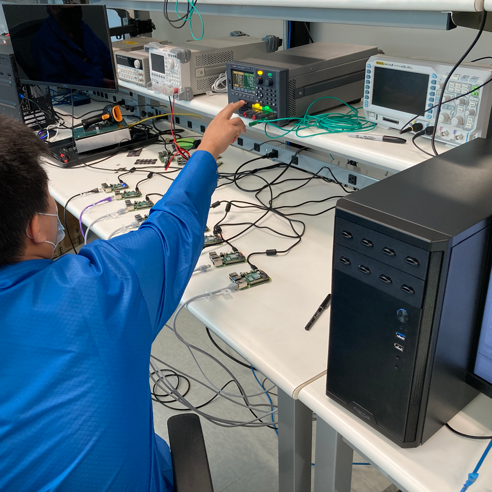

Zymbit manufacturing tools and services help you transition your SCM based design to volume manufacturing quickly and securely.

---

## Specifications

| Category | Details |
|----------|---------|
| Security highlights | Secure boot on Raspberry Pi, file system encryption, key generation, storage and management in secure hardware, cryptographic engine |
| Compute resources | Broadcom BCM2711 quad-core Cortex-A72 (ARM v8) 64-bit SoC @ 1.5GHz, H.265 (HEVC) (up to 4Kp60 decode), H.264 (up to 1080p60 decode, 1080p30 encode), OpenGL ES 3.1, Vulkan 1.0, up to 8GB LPDDR4-3200 SDRAM, up to 32GB eMMC Flash memory |
| Compute interfaces | Gigabit Ethernet (IEEE 1588), 2.4/5.0 GHz IEEE 802.11ac wireless, Bluetooth 5.0/BLE, 28 x user GPIO (SPI, I2C, UART, ADC, DAC, PWM, I2S), 2 x HDMI 2.0 (up to 4kp60), 1 x MIPI DSI, 1 x MIPI CSI-2, 1 x PCIe 1-lane Gen 2 (5Gbps), 1 x USB 2.0 (highspeed) |
| Private/public key pairs | 512 |
| Foreign public keys | 128 |
| Wallet functions | BIP 32 - hierarchical deterministic wallet, BIP 39 - master seed mnemonic generator, SLIP 39 - with Shamir's secret sharing, BIP 44 - multi-account support |
| Cryptographic services | ECC KOBLITZ P-256 (secp256k1), ED25519, X25519, ECDH (FIPS SP800-56A), TRNG (NIST SP800-22), ECC NIST P-256 (secp256r1), ECDSA (FIPS186-3), AES-256 (FIPS 197) |
| Tamper sensors | 2 x perimeter breach detection circuits, accelerometer shock & orientation sensor, main power monitor, battery power monitor, battery removal monitor |
| Software API | Python, C++, C |
| Physical format | Encapsulated module |
| Dimensions | 57.2 x 42.5 x 9.5 mm (2.25 x 1.67 x 0.37 inches) |
| Connectors | Module main: 2x Hirose Header DF40C-100DP-0.4V. Mating main: 2x Hirose Receptacle DF40C-100DS-0.4V (1.5mm clearance). Mating main extended: 2x Hirose Receptacle DF40HC(3.0)-100DS-0.4V (3.0mm clearance, required if CR2412 battery fitted under module). Mating external battery: 1x KYOCERA AVX 009155002201006. Mating perimeter/LED: 1x KYOCERA AVX 009155004201006 |
| Production mode lock | Software API command |
| Measured system identity & authentication | Standard factors include RPi host, Zymbit HSM, eMMC memory |
| Data encryption & signing | Encrypt root file system with dm-crypt (LUKS key manager hook), encrypt data blobs with "zblock" function, encrypt data in flight with OpenSSL integration |
| Real time clock | 36-60 months operation with external CR2032, application dependent, 5ppm accuracy |
| Backup battery | Used for RTC and perimeter circuits. Under-module battery connector pads to any 3V source on motherboard. Optional under module battery holder for CR2412 coin cell (requires motherboard connector height 3.0mm) |
| Backup battery monitor | Yes |
| Last gasp battery removal detection | Yes |
| OEM custom features | Contact Zymbit |
| Example cipher suites | AWS-IOT: TLS_ECDHE_ECDSA_AES256_SHA, MS-AZURE: TLS_ECDHE_ECDSA_AES_128_GCM_SHA256_P256 |
| Accessories & related products | [Developer Kit](https://store.zymbit.com/products/copy-of-secure-compute-module-developer-kit-2) |
| Warranty | 18 months |

---

## Documentation

##### [Using Product](/getting-started/scm/)

- Getting started
- Software APIs -- python, C, C++
- Tutorials
- FAQ & troubleshooting

##### [Conformity Documents](/reference/conformity/scm/)

- EU Declaration of Conformity
- FCC Declaration of Conformity
- RoHS/Reach Declaration of Conformity
- California Prop 65 Declaration of Conformity

##### [CAD Files](/reference/cad/scm/)

- Mechanical dimensions
- Step model

##### [Manufacturing Tools](https://www.zymbit.com/manufacturing-tools/)

- Secure high speed encryption appliance
- Programming and provisioning
