Enterprise grade compute hardware that's secure and easily customized.

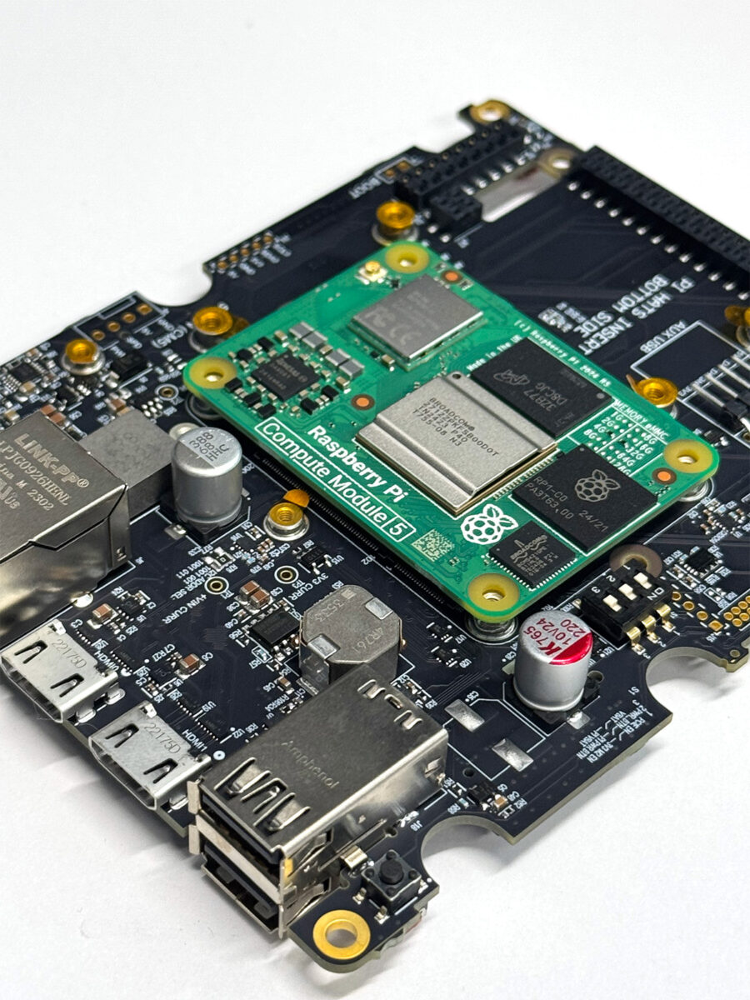

- Quad-core Cortex-A76, 64-bit SoC @ 2.4GHz
- Secure compute module, Linux OS
- Fully enclosed, tamper responsive
- Hardware security supervisor
- Motherboard, extensive IO
- Accessories, Enclosure
- Pre-configured security and software

## Overview

### The secure modular compute platform

Engineered for a lifetime of reliable operation in zero trust environments.

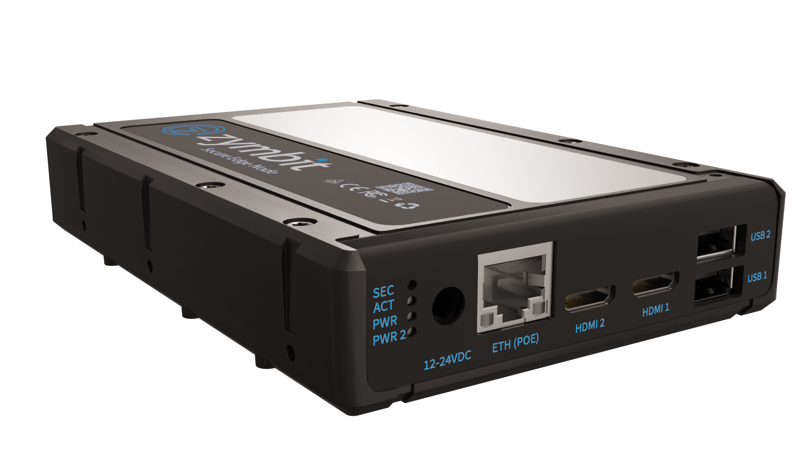

### Secure Compute Module

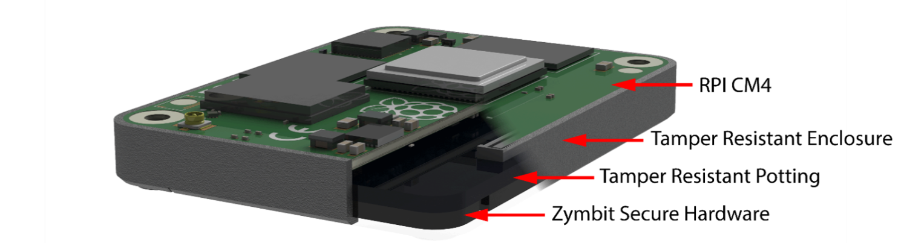

- Broadcom BCM2712 quad-core Cortex-A76 (ARM v8) 64-bit SoC @ 2.4GHz
- Hardware secured compute module
- Verified boot, encrypted file system
- Dedicated cryptographic engine
- Optional hardware HD wallet
- Fully encapsulated security hardware

### Professional base board, IO & power

#### Secure Side (fixed functionality)

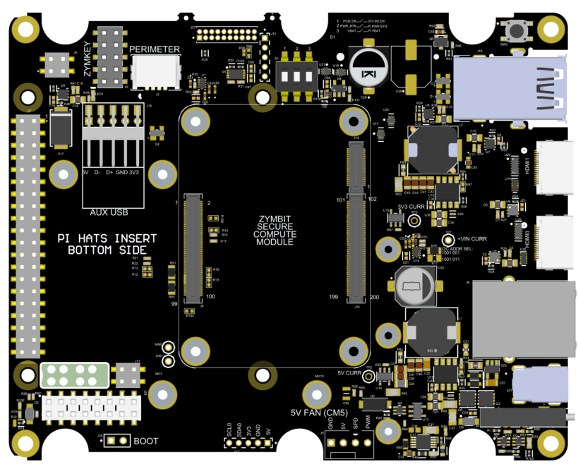

- Choice of Compute and Security Supervisor (Zymbit Secure Compute Module or Pi CM4 + ZYMKEY)
- 2x USB 2.0 Type A, 2x HDMI mini, 1G Ethernet
- 55W protected power supply -- 12 to 24 VDC input
- Optional ZYMKEY4 security module, Optional fan

#### User Side (designed to be easily customized)

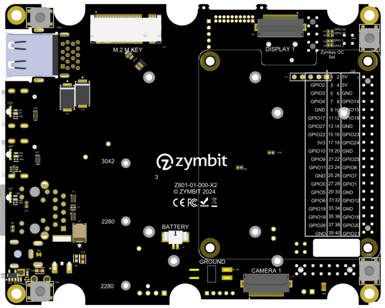

- M.2 M-Key supports PCIE NVME storage up to 4TB
- GPIO header, 2x MIPI CSI Camera (DSI Display Out OEM option)
- Auxiliary backup battery, PoE++ 802.bt 55W optional module
- Integrated tamper switches and aux circuits

### Accessories

#### POE power module

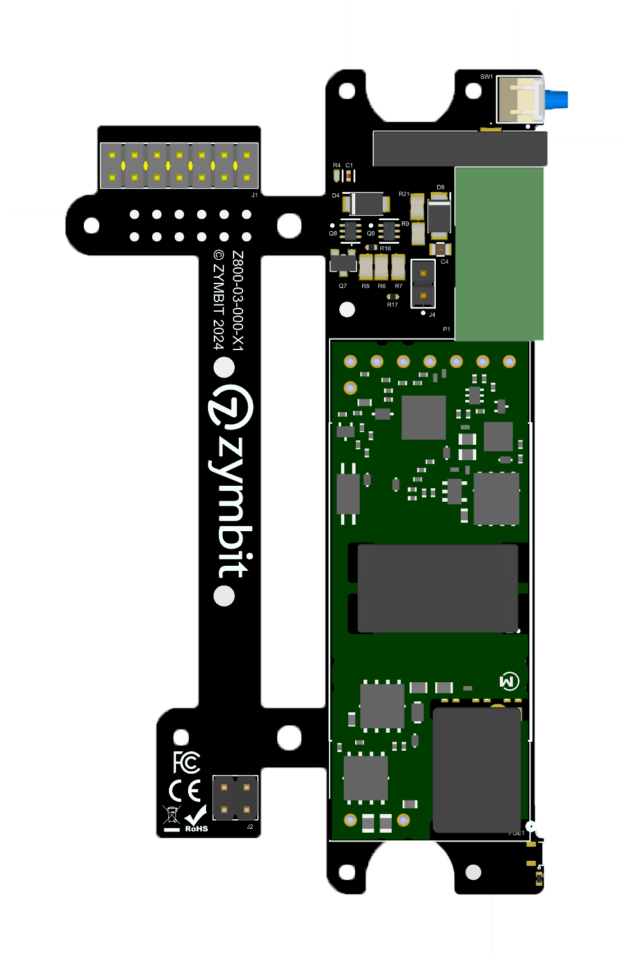

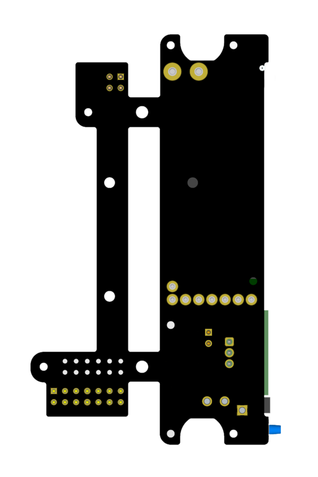

- PoE++ 802.bt 55W
- LED status indicators

#### Third party accessories

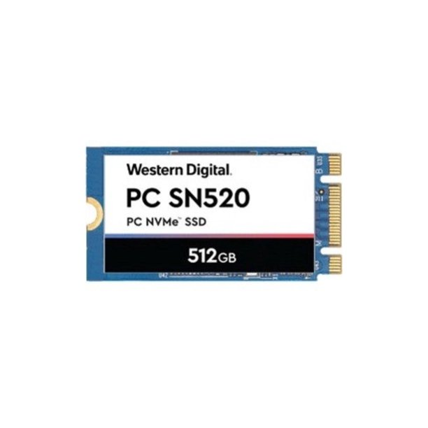 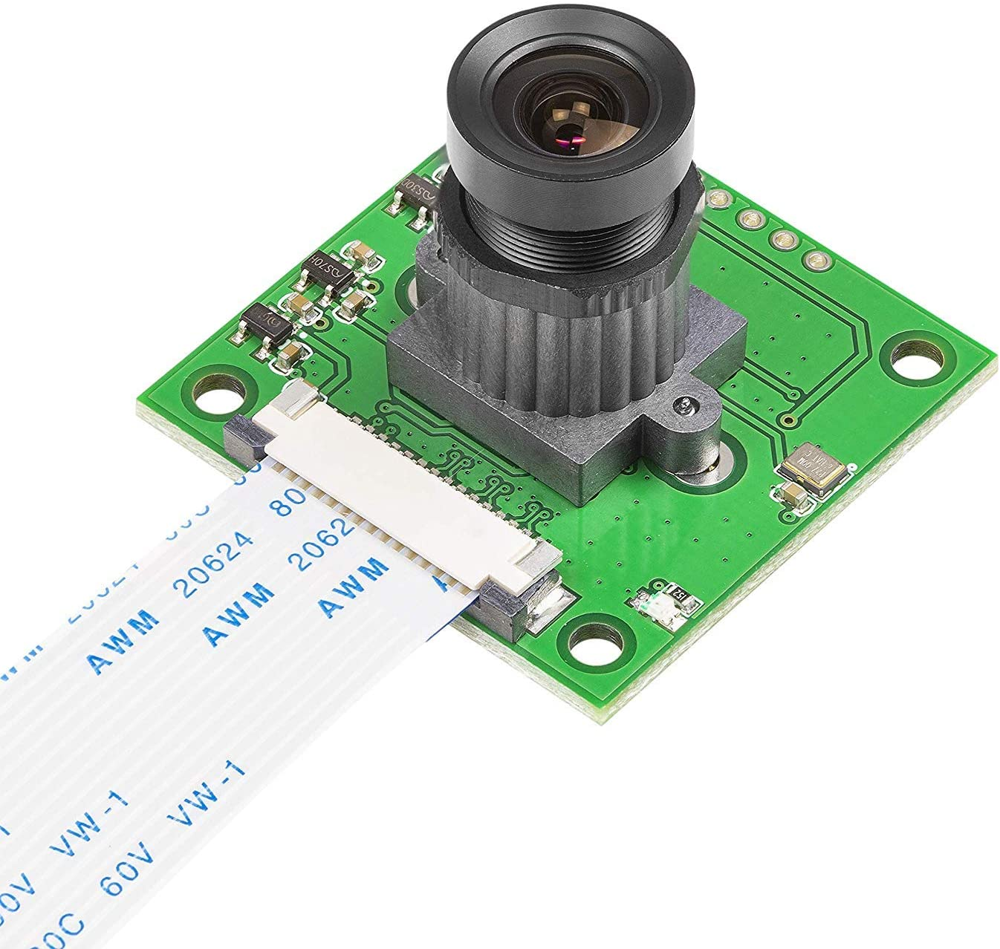 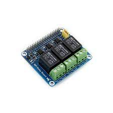

- M.2 storage
- Cameras
- Industrial IO
- Displays

### Tough expandable enclosure -- Standard Type D35

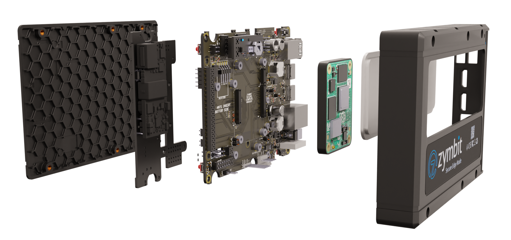

- Rugged plastic and metal construction
- Tamper switch compatible, Integrated heatsink
- Customizable front connector plate, Stackable
- 26.7 x 100.3 x 148 mm (1.05 x 3.96 x 5.80 inches)
- Fits into standard 3.5" drive bay caddy
- Optional SATA power connector, Optional POE module

### Pre-configured the way you want

To simplify your life, the SEN 500 can be shipped with a choice of pre-configured OS, application software and security policies that align with your product development stage.

#### Develop

- Optimized for maximum development flexibility
- Standard OS builds & tools
- Partially encrypted file system
- Relaxed security policies, open ports

#### Secure

- Defined security policies enabled
- Optimized OS build
- Fully encrypted file system
- Supervised boot configured
- Finalize configuration with [Security Sanitization Guide and Scripts](https://github.com/zymbit-applications/zk-scripts)

#### Deploy

- Customer-specific configurations loaded, tested, deployed
- Standard Zymbit curated configurations available

---

## Specifications

| Category | Details |
|----------|---------|
| Highlights | Secure edge compute node with Linux CPU, powerful RPi5 compute module quad core A76, integrated Zymbit hardware security module, extensive security and key management features, Bootware and Tamperware support |
| Compute Resources | Pi Compute Module 5, Broadcom BCM2712 quad-core Cortex-A76 (ARM v8) 64-bit SoC @ 2.4GHz, up to 16GB LPDDR4-4267 SDRAM with ECC, up to 64GB eMMC Flash memory, 4Kp60 HEVC decoder, OpenGL ES 3.1 graphics, Vulkan 1.2 |
| Secure Enclosure | Tamper responsive, multiple tamper sensors. D35 size envelope, fits into standard 3.5" drive bay caddy |
| Dimensions | 26.7 x 100.3 x 148 mm (1.05 x 3.96 x 5.80 inches) |
| Weight | 8.2 oz / 230 g (12VDC standard), 9.2 oz / 260 g (POE option) |
| Power | Standard: 12-24VDC +-20%, 5A-2A input, heavy duty barrel jack (2.1mm ID x 5.5mm OD x 11.0mm). Optional: PoE++ 802.3bt, 51W max per node, 30W available for add-on devices |
| External Interfaces | 2x mini HDMI, 2x USB 2.0 Type A, 1x Gigabit Ethernet (IEEE 1588, optional POE) |
| External Indicators | SCM Power (red), SCM Activity (green), SCM Status (blue), User Defined (RGB) |
| Internal Interfaces | 1x AUX USB 2.0 header, 2x CSI Camera (1x DSI Display OEM only), 1x 40-pin GPIO header, 1x M.2 M-Key, 1x battery connector for HSM (Molex 51021-0200-B, 1.25mm pitch), 1x battery connector for Pi RTC, 1x Auxiliary HSM connector 12pin JST, 1x 5V fan with tacho and PWM (optional) |
| Operating System | Linux, Raspberry Pi OS 64bit (other Debian for OEM) |
| Software API | Python, C++, C |
| Bootware Support | Bootware Core, Enterprise and OEM |
| Hardware Security Module | Zymbit Hardware Security Supervisor, cryptographically and physically bonded to Compute Module |
| Measured system identity | Standard factors include RPi host, Zymbit HSM, eMMC memory |
| Tamper Sensors | 2x perimeter breach detection circuits, accelerometer, main/battery power monitors, battery removal monitor |
| Data encryption & signing | dm-crypt with LUKS, zblock function, OpenSSL integration |
| Cryptographic Services | ECC KOBLITZ P-256, ED25519, X25519, ECDH, TRNG, ECC NIST P-256, ECDSA, AES-256 |
| Example cipher suites | AWS-IOT: TLS_ECDHE_ECDSA_AES256_SHA, MS-AZURE: TLS_ECDHE_ECDSA_AES_128_GCM_SHA256_P256 |
| Private/public key pairs | 512 |
| Foreign public keys | 128 |
| Wallet Functions | BIP 32, BIP 39, SLIP 39, BIP 44 |
| Real time clock | 36-60 months with external CR2032, 5ppm accuracy |
| Backup battery | Used for RTC and perimeter circuits |
| Backup battery monitor | Yes |
| Last gasp | Yes |
| Environmental | Standard: 0C-60C non-condensing. Optional: -20C to 70C |
| Warranty | Standard: 18 months. Extended: up to 5 years |
| Accessories | Prototyping Kit |
| OEM custom features | Contact Zymbit |

---

## Dev Kits

Kits for developers and pilot deployments.

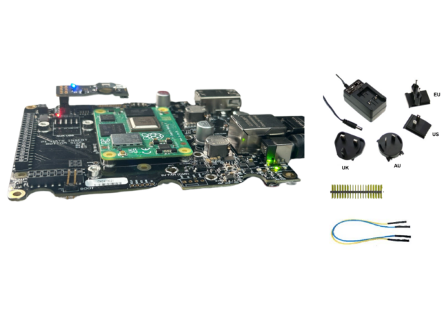

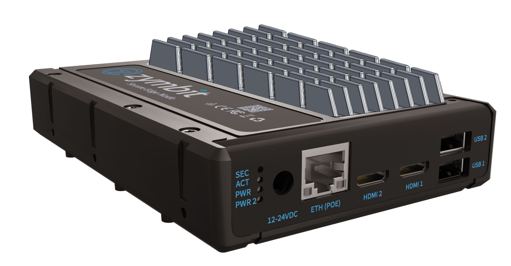

[Buy Now](https://store.zymbit.com/collections/developer-pilot-kits)

---

## Documentation

##### [Using Product](/getting-started/sen/)

- Getting started
- Software APIs -- python, C, C++
- Tutorials
- FAQ & troubleshooting

##### [Conformity Documents](/reference/conformity/scm/)

- EU Declaration of Conformity
- FCC Declaration of Conformity
- RoHS/Reach Declaration of Conformity
- California Prop 65 Declaration of Conformity

##### [CAD Files](/reference/cad/scm/)

- Mechanical dimensions
- Step model

##### [Manufacturing Tools](https://www.zymbit.com/manufacturing-tools/)

- Secure high speed encryption appliance
- Programming and provisioning
