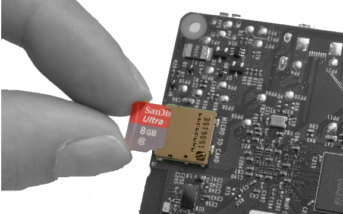
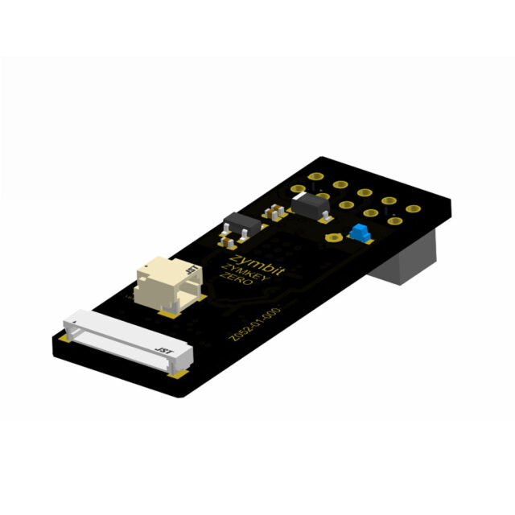
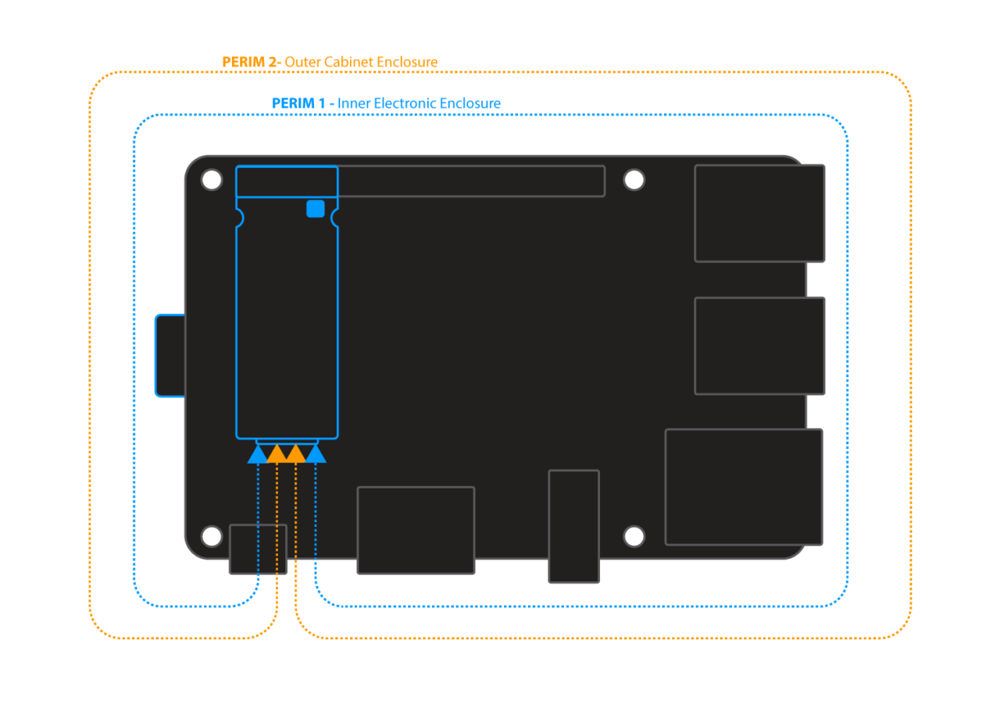
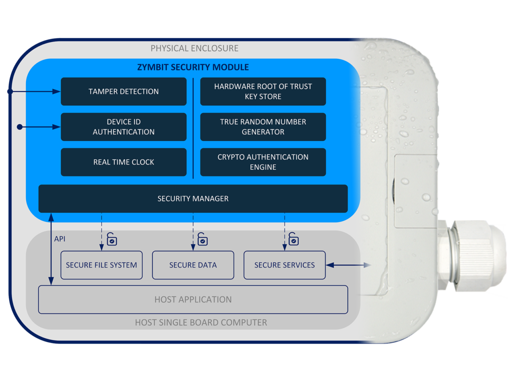
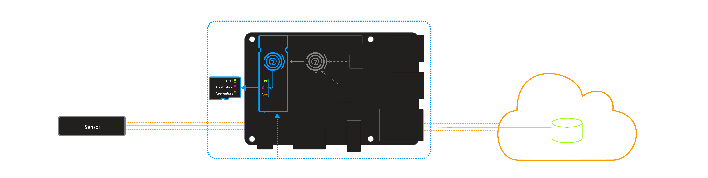

The essential hardware security module for Raspberry Pi. 640 key slots, easy to integrate plug-in module with seamless Bootware integration.

## Overview

### SD card protection made easy

Essential security for Raspberry Pi. Removing an SD card and copying contents is easy, especially for unattended devices deployed outside the security of a physical building. ZYMKEY provides essential physical and digital security features to protect against such real world exploits.

Features:

- File system encryption
- Key storage & generation
- Cryptographic engine
- Measured system identity
- Physical tamper sensors
- Data encryption & signing
- Ultra low power
- Real time clock

### Easy to integrate module

- Plugs on to GPIO headers of Raspberry Pi
- Uses GPIO4, I2C, +5V, GND (can be remapped)
- APIs in Python, C++, C

### File system encryption

- Encrypt root file system with dm-crypt
- Protect data, applications and credentials
- ZYMKEY integrates seamlessly with LUKS key manager
- Step-by-step guide with prewritten scripts that streamline the process

### Perimeter tamper detect

- Two independent perimeter circuits provide layered protection
- User configured policies and actions
- Notify or destroy keys on perimeter-breach event
- Continuous operation with onboard battery

### Layered security with hardware root of trust

Zymbit security modules provide multiple layers of physical and digital protection for your digital assets, managed through a simple API.

- Hardware root of trust
- Secure key generation & storage
- File system encryption
- Data encryption & signing
- Perimeter tamper sensors
- Measured system identity & authentication
- Real time clock

### Easy integration with AWS

TLS Client Certificate Authentication:

- Generate Zymkey secured client certs
- Bring Your Own Certificate or use AWS
- Attach custom policies
- Secure connect client authenticated TLS

Just In Time Client Registration:

- Simplifies large scale fleet deployments
- Lambda function client registration

---

## Specifications

| Category | Details |
|----------|---------|
| Private/public key pairs | 512 |
| Foreign public keys | 128 |
| Cryptographic services | ECC KOBLITZ P-256 (secp256k1), ED25519, X25519, ECDH (FIPS SP800-56A), TRNG (NIST SP800-22), ECC NIST P-256 (secp256r1), ECDSA (FIPS186-3), AES-256 (FIPS 197) |
| Wallet functions | BIP 32 - hierarchical deterministic wallet, BIP 39 - master seed mnemonic generator, SLIP 39 - with Shamir's secret sharing, BIP 44 - multi-account support |
| Tamper sensors | 2 x perimeter breach detection circuits, main power monitor |
| Software API | Python, C++, C |
| Physical format | Plug in mini-hat (pins 1-10) |
| Dimensions | 39.0 x 14.0 x 5.3 mm (1.53 x 0.55 x 0.21 inches) |
| Board connectors | GPIO: 5x2pin header 0.1inch. Perimeter: 12pin JST 0.8mm receptacle (mates with JST 12SUR-32S). Battery: 2pin JST 0.8mm receptacle (mates with JST 2SUR-32S) |
| Host interface | Always encrypted channel with ephemeral ECC keys, I2C default address (user changeable), GPIO4 (user changeable) |
| Production mode lock | Software API command |
| Measured system identity & authentication | Standard factors include RPi host, SD card, Zymkey |
| Data encryption & signing | Encrypt root file system with dm-crypt (LUKS key manager hook), encrypt data blobs with "zblock" function, encrypt data in flight with OpenSSL integration |
| Real time clock | 24-36 month operation, application dependent, 5ppm accuracy |
| Backup battery | Used for RTC and perimeter circuits. Requires JST connected coin cell, RPi 5 RTC battery, or similar (not included) |
| Backup battery monitor | Yes |
| Last gasp battery removal detection | No |
| OEM custom features | Contact Zymbit |
| Example cipher suites | AWS-IOT: TLS_ECDHE_ECDSA_AES256_SHA, MS-AZURE: TLS_ECDHE_ECDSA_AES_128_GCM_SHA256_P256 |
| Accessories & related products | Backup battery, perimeter cables |
| Warranty | 18 months |
| Compatibility | Pi Zero, 4, 5, CM4, CM5 |

---

## Documentation

##### [Using Product](/getting-started/zymkey4/quickstart/)

- Getting started
- Software APIs
- Tutorials
- FAQ & troubleshooting

##### Conformity Documents

- EU Declaration of Conformity
- FCC Declaration of Conformity
- RoHS/Reach Declaration of Conformity
- California Prop 65 Declaration of Conformity

##### CAD Files

- Mechanical dimensions
- Step model

##### [Manufacturing Tools](https://www.zymbit.com/manufacturing-tools/)

- Secure high speed encryption appliance
- Programming and provisioning
