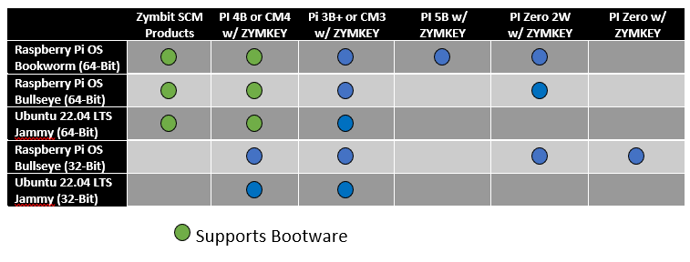

-----

### **Release Notes - Latest Release 1/13/2023 (RC-23.01)**

We updated the common Zymbit software release common to all products: ZYMKEY4, HSM4, HSM6, and the new SCM-based product line. Existing customers can do an update/upgrade to get the latest code.

```bash
sudo apt-get update
sudo apt-get upgrade -y
sudo pip3 install zku --upgrade
```

#### Zymbit Host Side Code Versions (view with `dpkg -l | grep -i zym`):
* libzk 1.1-22
* libzymkeyssl 1.0-11
* zkapputilslib 1.1-25
* zkbootrtc 1.1-15
* zkifc 1.2-36
* zkpkcs11 1.0-3
* zksaapps 1.0-16
* zku 1.0.33

#### Changes
* Added support for Raspberry OS Bullseye 64-bit and Ubuntu 22.04 Jammy 32-bit and 64-bit
* Common code base supports across all products including SCM. See SCM release notes for details on SCM features.
* Fixed: #120 get_public_key() with a very large number crashes zkifc
* Fixed: #123 zk_pkcs11: Doesn't work with 64-bit OS
* Fixed: #113 LED resets to default pattern after 5-10 minutes
* Fixed: #110 Fixed memory leak in zkifc which eventually could lead to zkifc crashing
* API functions that include Bip or Slip have been renamed to BIP and SLIP. See API docs for new syntax


-----

### **Issues and Solutions**

#### Expired GPG Key Preventing Access to Repository

The Zymbit GPG key expired and was renewed on September 30, 2024. New installations should not have any problems. `apt-get update` may complain that the GPG key has expired. To update your local key, do the following:

```bash
curl -L https://zk-sw-repo.s3.amazonaws.com/apt-zymkey-pubkey.gpg | sudo gpg --dearmor --yes -o /usr/share/keyrings/zymbit.gpg
```

For those of you that are on older installations, make sure the `signed-by` option is included in the `/etc/apt/sources.list.d/zymbit.list`,  

This parameter - `[signed-by=/usr/share/keyrings/zymbit.gpg]`

The following will check and fix for you,

```bash
sudo sed -i 's/^deb https/deb [signed-by=\/usr\/share\/keyrings\/zymbit.gpg] https/' /etc/apt/sources.list.d/zymbit.list
```

#### Wake-Pin Issues for upgrades to Kernel 6.6 and later

The installation script takes care of the following for you. If you are doing a new installation, you should not have to worry about the following. If you already installed the Zymbit software and then upgraded the kernel to something beyond 6.6, please note the following.

Raspberry PI OS Bookworm updated the kernel to version 6.6.y in March 2024. The kernel no longer overrides an upstream kernel decision to force the base number of the main GPIO controller to be global GPIO 0. If the WAKE_PIN number is not set, the ZYMKEY will not bind. You will see 5 flashes per second continuously.For RPI4, RPI5, and CM4 platforms, you will need to set the WAKE_PIN in the following manner:

Determine the numbering for GPIO4 by examining /sys/kernel/debug/gpio for the number associated with GPIO4, then set an environment variable in the Zymbit environment variable file:

```bash
sudo su
wake_pin=`grep GPIO4 /sys/kernel/debug/gpio | sed -r 's/[^0-9]*([0-9]*).*/\1/'`
echo "wake_pin=$wake_pin"   # sanity check value is set
echo "ZK_GPIO_WAKE_PIN=$wake_pin" > /var/lib/zymbit/zkenv.conf
systemctl restart zkifc
```
As of 6.6.20, the numbering is:
RPI4=516
RPI5=575
CM4=516
CM5=573


#### CPU Scaling Governor
We have seen some issues with the scaling cpu governor on the raspberry pi interfere with the i2c bus. This sometimes causes the zymkey to be put into a odd state or return failures from operations that get optimized out by the governor. The raspberry pi sets the **scaling governor** to be "**ondemand**" by default. We recommend switching this mode to "**performance**" to get the best out of the zymkey. Details:


How to set cpu governor to performance.


#### Unattended-upgrades
When encrypting your rootfs, we highly recommend turning off unattended-upgrades prior to the encryption process. In some cases primarily with Ubuntu, during an update/upgrade after encryption, the `update-initramfs` process may fail and leave the system unable to boot.

To mitigate this issue, remove the service unattended-upgrades:

Check `/etc/apt/apt.conf.d/20auto-upgrades`. Make sure the following lines are set to 0,

```
APT::Periodic::Update-Package-Lists "0";
APT::Periodic::Unattended-Upgrade "0";
```

Stop and remove the unattended-upgrade service:

```
sudo systemctl stop unattended-upgrades
sudo systemctl disable unattended-upgrades
sudo apt-get remove --purge -y unattended-upgrades
```
#### Running a 32-bit version of Operating Sustem

As of March 2023, Raspberry PI OS 32-bit images install the 64-bit kernel along with the 32-bit root filesystem. This does not allow our installation script to work. In order to properly install on an 32-bit system, edit `/boot/config.txt` and add the following line to the bottom of the file, then reboot.

`arm_64bit=0`


### **Products**

##### Q: Where can I learn about and/or pre-order future products?

<details>

<summary>Expand for Answer</summary>

<br>

A: Sign up for our new product email updates at the bottom of [Zymbit's homepage](https://www.zymbit.com/).

-----

</details>

##### Q: What are the differences between Zymbit's Products?

<details>

<summary>Expand for Answer</summary>

<br>

A: See the [Product Comparison Matrix](https://www.zymbit.com/security-modules/#compare-modules) for the differences between Zymkey, HSM4, and HSM6. Please [reach out](https://www.zymbit.com/contact-us/) with any further questions.

-----

</details>

##### Q: How much power do Zymbit products consume?

<details>

<summary>Expand for Answer</summary>

<br>

*   Zymkey-RPi (3.3V): idle approx. 1mA; max active < 25mA with LED off, < 35mA with LED on.
*   Zymkey-USB (5V): idle approx. 1.5mA; max active < 40mA with LEDs off, < 60mA with LEDs on.

See [Power Quality]( https://docs.zymbit.com/reference/power-quality/) for more information.

-----

</details>

##### Q: What is the expected battery life for Zymbit Products?

<details>

<summary>Expand for Answer</summary>

<br>


-----

</details>

### **Compatibility**

##### Q: Which operating systems does Zymbit support?

<details>

<summary>Expand for Answer</summary>

<br>



-----

</details>

##### Q: Which SBCs are compatible with Zymbit Products?

<details>

<summary>Expand for Answer</summary>

<br>

*  Electrically, the Zymkey-I2C will interface to any single board computer using I2C. Check compatibility with your particular Linux distribution.
*  Raspberry Pi 3, 3B+, 4, Zero
*  RPi Compute Module 3, 4

-----

</details>

##### Q: What curves are supported for Zymbit products?

<details>

<summary>Expand for Answer</summary>

<br>

Zymkey and HSM4: NIST P-256 and secp256r1

SCM and HSM6: NIST P-256, secp256r1, secp256k1, X25519, ED25519

All Products: Only EC curves are supported. No RSA support is provided in hardware. RSA support is provided via hardware lock/unlock of PKCS11 store on host.

-----

</details>

##### Q: Do Zymbit Products work with Arduino?

<details>

<summary>Expand for Answer</summary>

<br>

A: We have no plans to release an Arduino shield version. While we love Arduinos and use them all the time, they generally don’t have enough resources to handle cryptographic operations at this level.


-----

</details>

##### Q: Do Zymbit Products work with BeagleBone?

<details>

<summary>Expand for Answer</summary>

<br>

A: Zymbit does not officially support the BeagleBoard platform at this time.

-----

</details>
