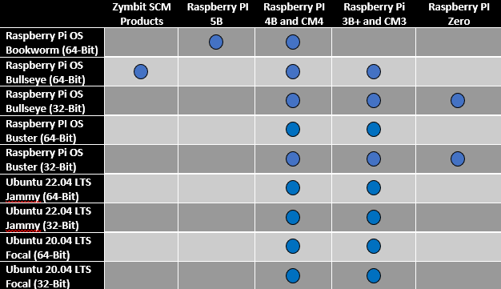

-----
### **Current Release Information**
December 21, 2021 

#### Firmware: 
 - HSM6 updated to 06.01.23. Firmware is not field upgradeable
 - HSM4: 04.01.07, no change 
 - ZYMKEY4: 04.01.06e, no change

#### Zymbit Host Side Code:
 - 1.1-21
 - 1.0.10
 - 1.1-22
 - 1.1-14
 - zkifc 1.2-32 (updated)
 - zkpkcs 1.0-2
 - 1.0.14
 - zku 1.0.29 (updated)

### New Features
#### RaspberryPI OS Buster
Support for RaspberryPI OS Bullseye (32 bit). All Zymbit modules.

#### HD Wallet Edwards Curve Support
HSM6: HD Wallet added ED25519 (edwards curve) support, as well as a "Cardano" specific variant.

#### HD Wallet - Oversight Wallet
HSM6: Includes new feature of Oversight Wallet. (Need brief description)

#### HD Wallet - HD Wallet Shamir's Secret Sharing
HSM6: Includes HD Wallet SLIP39 recovery, Shamir's Secret Sharing, of up to 14 groups, each capable of 14 members. (reference link)

-----

### **Known Issues**

#### CPU Scaling Governor
We have seen some issues with the scaling cpu governor on the raspberry pi interfere with the i2c bus. This sometimes causes the zymkey to be put into a odd state or return failures from operations that get optimized out by the governor. The raspberry pi sets the **scaling governor** to be "**ondemand**" by default. We recommend switching this mode to "**performance**" to get the best out of the zymkey. Details:


How to set cpu governor to performance.


#### Unattended-upgrades
When encrypting your rootfs, we highly recommend turning off unattended-upgrades prior to the encryption process. In some cases primarily with Ubuntu 20.04, during an update/upgrade after encryption, the `update-initramfs` process may fail and leave the system unable to boot.

To mitigate this issue, remove the service unattended-upgrades:

`systemctl stop unattended-upgrades`

`systemctl disable unattended-upgrades`

### **Products**

##### Q: Where can I learn about and/or pre-order future products?

Expand for Answer

 

A: Sign up for our new product email updates at the bottom of [Zymbit's homepage](https://www.zymbit.com/).

-----

##### Q: What are the differences between Zymbit's Products?

Expand for Answer

 

A: See the [Product Comparison Matrix](https://www.zymbit.com/security-modules/#compare-modules) for the differences between Zymkey, HSM4, and HSM6. Please [reach out](https://www.zymbit.com/contact-us/) with any further questions.

-----

##### Q: How much power do Zymbit products consume?

Expand for Answer

 

*   Zymkey-RPi (3.3V): idle approx. 1mA; max active < 25mA with LED off, < 35mA with LED on.
*   Zymkey-USB (5V): idle approx. 1.5mA; max active < 40mA with LEDs off, < 60mA with LEDs on.

See [Power Quality]( https://docs.zymbit.com/reference/power-quality/) for more information.

-----

### **Compatibility**

##### Q: Which operating systems does Zymbit support?
 

Expand for Answer

 

 

-----

##### Q: Which SBCs are compatible with Zymbit Products?

Expand for Answer

 

*  Electrically, the Zymkey-I2C will interface to any single board computer using I2C. Check compatibility with your particular Linux distribution.
*  Raspberry Pi 3, 3B+, 4, Zero
*  RPi Compute Module 3, 4
*  NVIDIA Jetson Nano, Xavier NX

-----

##### Q: Do Zymbit Products work with Arduino?

Expand for Answer

 

A: We have no plans to release an Arduino shield version. While we love Arduinos and use them all the time, they generally don’t have enough resources to handle cryptographic operations at this level.

-----

##### Q: Do Zymbit Products work with BeagleBone?

Expand for Answer

 

A: Zymbit does not officially support the BeagleBoard platform at this time.

-----

