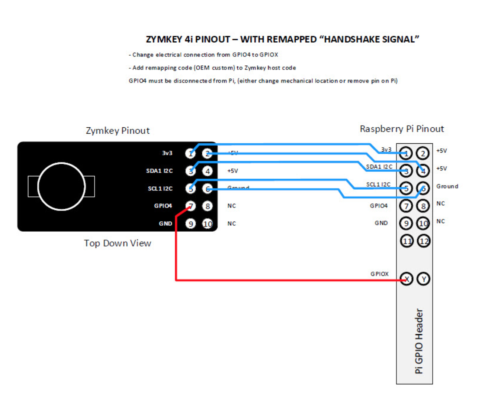

## Remapping GPIO4 Pin

Zymbit security modules use GPIO4 for a 'handshake signal' to coordinate the I2C communications they use to talk to the host Pi. This applies to:

* Zymkey4
* Zymkey5
* HSM4
* HSM6
* HSM60

There is a logical (software), electrical and mechanical connection with GPIO4. If you need to use an alternative GPIO pin, here are the steps you need to take reconfigure your system:

The software change is the same on every module. The electrical and mechanical steps below show Zymkey4; the other modules use the same handshake but differ in form factor and pinout, so check the pinout for yours before rewiring.

### Software Configuration

To remap the GPIO_4 pin used by Zymbit from GPIO4 to GPIO_X:
1.	Locate the directory  '/var/lib/zymbit'
2.	Locate the configuration file name 'zkenv.conf' - if non exists then create text file 'zkenv.conf'
3.	Into the file 'zkenv.conf'  insert the line `ZK_GPIO_WAKE_PIN=X`,  where X is your GPIO pin of choice.
4.	'In the RaspberryPi file named  'config.txt' you will also need to explicity set GPIO_X  to an input .  (Note that this is the RaspberryPi config file, which is different to the Zymbit conf file)
5.	Finish

### Electrical Configuration
* Electrically reconnect Zymkey4 pins per the diagram below.

### Mechanical Configuration

* Move your Zymkey4 so it does not mechanically or electrically interfere with other devices connected to pins 1 thru 10.
