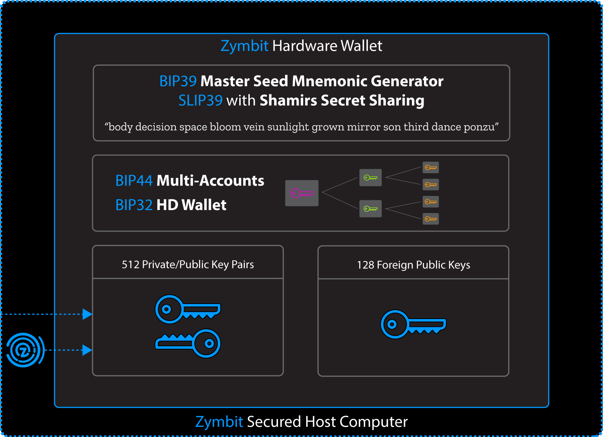

Updated: 2022-04-18

## What is a Hardware Wallet?

Zymbit's Hardware Wallet conforms to [BIP32](https://github.com/bitcoin/BIPs/blob/master/BIP-0032.mediawiki), [BIP39](https://github.com/bitcoin/BIPs/blob/master/BIP-0039.mediawiki), [BIP44](https://github.com/bitcoin/BIPs/blob/master/BIP-0044.mediawiki) documents for Hierarchical Deterministic (HD) wallets. An HD wallet derives all new addresses/keys from a master seed, thus creating a hierarchical wallet structure. BIP32 is the first seed standard for HD wallets, while BIP39 is a standard that converts a mnemonic sentence (a sentence of random words) into a 512 bit seed used for Master Seed recovery. BIP44 allows for multiple accounts in the form of children derivations from the master seed.

A Hardware Wallet, or cold storage wallet, allows you to connect online and access your digital assets, and then safely store the referenced asset in the hardware wallet. The asset does not need to be stored on online servers or platforms. The private keys of the Hardware wallet remain on the device and are never exposed.

A Software Wallet, also known as a Soft Wallet or Desktop Wallet locally stores your keys on your desktop or in some other online location. The disadvantage of a Soft Wallet is that the presence of the keys online makes them far more susceptible to attacks.

## What is the Zymbit Embedded Hardware Wallet?

Zymbit Embedded Hardware Wallet functionality is available in Zymbit products, HSM6 and SCM. These products are designed to easily integrate into IoT and blockchain appliances that manage large numbers of keys and/or participate in blockchain and crypto transactions.

The core features of Zymbit Embedded Hardware Wallets are:
 * BIP32 – Hierarchical Deterministic Wallet
 * BIP39 – Master Seed Mnemonic Code Generator
 * BIP44 – Multi-Account Hierarchy Support
 * SLIP39 – Shamirs Secret Sharing [See example](../../../tutorials/digital-wallet/slip39-example/)
 * [APIs](../../../api/) for secure easy integration with host computer (Python, C, C++)
 * Dedicated secure hardware with tamper protection and response.




## Why use a Hardware Wallet?

To make secure crypto transactions, a user needs to have a public/private key pair. The public key is an address used for receiving incoming goods, while the private key is used for sending those goods. Losing this key pair will be disastrous, as this will effectively give someone access to the assets in that key pair. This is why for additional security it's best practice to change addresses (keys) for every transaction. HD wallets automatically derive new addresses to use, thus eliminating the problem for the user to generate hundreds of keys on their own.

## Managing your Hardware Wallet and Security Awareness

The master seed is where all new key pairs will be derived from. Each new child key pair is created based off a existing parent key pair in the wallet. If a child key pair ever becomes 'compromised', it can't be tracked up the parent nodes. However this does warrant security awareness, that it will compromise all children key pairs derived from the stolen key pair.


For security reasons, the user is expected to keep track of all the key pairs via either the node address on the wallet or the
slot it was allocated to on the Zymbit module. It's better to lose a *branch* than a whole *tree*, so keep your master seed
safe and locked away!


### Prerequisites

* Zymbit Modules that support this feature:
    * [HSM6](https://www.zymbit.com/hsm6/)
    * [SCM ](https://www.zymbit.com/secure-compute-platform/)

* Follow the [Getting Started guide](../../../getting-started/) first, installing all Zymbit Core Software.

* All code snippets written in this article are written using python3. For more Zymbit API documentation (Python/C/C++) visit: [API Documentation](../../../api/)

## Using the Zymbit Hardware Wallet:

Example code snippet to show how to use the Zymbit wallet API

```python
#!/usr/bin/python3

import zymkey

# Create a master seed and return the BIP39 mnemonic
master_key_generator = bytearray("3xampleM@sterK3Y", 'utf-8')
wallet_name = "MyExampleWallet"

# Use the BIP39 recovery strategy to tell zymkey to return a mnemonic. Takes a base 64 encoded string for a BIP39 passphrase. Can be empty string.
use_BIP39_recovery = zymkey.RecoveryStrategyBIP39()
master_slot, BIP39_mnemonic = zymkey.client.gen_wallet_master_seed("secp256k1", master_key_generator, wallet_name, use_BIP39_recovery)
print("Master Slot:%s\nBIP39 mnemonic (write this down!):\n%s" % (master_slot, BIP39_mnemonic))

# Generate a child key from the master seed
child_slot = zymkey.client.gen_wallet_child_key(master_slot, 3, True)
child_pub_key = zymkey.client.get_public_key(child_slot)

print("Child Slot:%s\nChild Public Key:%s" % (child_slot, child_pub_key))

# Get node address of the child key slot
node_addr = zymkey.client.get_wallet_node_addr(child_slot)
print("Node index:'%s' Wallet Name:'%s' Master Slot:'%s'" % (node_addr[0], node_addr[1], node_addr[2]))

# Get the key slot of the child key using our previous master key slot and wallet name
key_slot = zymkey.client.get_wallet_key_slot(node_addr[0],wallet_name, master_slot)
print("Key Slot:%s" % (key_slot,))

# Remove the master seed
zymkey.client.remove_key(master_slot)

# Restore the master seed with our previous written down BIP39 mnemonic!
restored_seed_slot = zymkey.client.restore_wallet_master_seed("secp256k1", bytearray("3xampleM@sterK3Y", 'utf-8'), wallet_name, use_BIP39_recovery, BIP39_mnemonic)
print("Restored slot:%s" % (restored_seed_slot,))

# Clean up the example slots
zymkey.client.remove_key(master_slot)
zymkey.client.remove_key(child_slot)

```

### Creating a master seed (new wallet)

The Zymbit module with wallet support can have multiple master seeds be stored in its key store, allowing for management of a variety of keyrings to work with. Master seeds and its derivations are additionally backed by EC curve cryptography for an extra layer of encryption/security. The ec curves currently supported are nistp256, secp256r1, secp256k1. The master_key_generator is used to generate the BIP32 master seed, can be empty string. The RecoveryStrategy parameter dictates what recovery algorithm to return when generating the master seed. If the base RecoveryStrategy is used or none is specified, then no mnemonic will be returned. Current supported recovery strategies are none, BIP39. This example generates a master seed with the RecoveryStrategyBIP39. The BIP39 mnemonic is a 24 word string that can be used to restore or recreate a previous generated master seed. Note that a wallet name is also unique! There can not be multiple wallets with the same name.


Make sure to write the BIP39 mnemonic and store it somewhere safe! The master seed is the key to its kingdom. Don't give it out to just anybody!


The function `gen_wallet_master_seed` returns the allocated master seed slot and the BIP39 mnemonic if the bool flag is set True

```python
# Create a master seed and return the BIP39 mnemonic
master_key_generator = bytearray("3xampleM@sterK3Y", 'utf-8')
wallet_name = "MyExampleWallet"
# Use the BIP39 recovery strategy to tell zymkey to return a mnemonic. Takes a base 64 encoded string for a BIP39 passphrase. Can be empty string.
use_BIP39_recovery = zymkey.RecoveryStrategyBIP39()
master_slot, BIP39_mnemonic = zymkey.client.gen_wallet_master_seed("secp256k1", master_key_generator, wallet_name, use_BIP39_recovery)
print("Master Slot:%s\nBIP39 mnemonic (write this down!):\n%s" % (master_slot, BIP39_mnemonic))
```

### Generating a child Key

Child key pairs are generated from **both** the slot and index of another key pair. BIP32 has two possible derivations **hardened** and **non-hardened**. Non-hardened key pairs can be linked back to its parent key pair with just its public key.  Hardened key pairs cannot be linked back to its parent key. So for best security practices, it's advised to generate hardened key pairs wherever possible.

The function `gen_wallet_child_key` returns allocated slot on success.

```python
# Generate a child key from the master seed
child_slot = zymkey.client.gen_wallet_child_key(master_slot, 3, True)
child_pub_key = zymkey.client.get_public_key(child_slot)

print("Child Slot:%s\nChild Public Key:%s" % (child_slot, child_pub_key))
```

**Node Address:**
The index parameter in the above example will add a new number 3 to the node address string in the wallet. Apostrophes after the number denote hardened keys. Below is an example node address string.

`m / 3' / 1' / 0' / 1 / 28`

### Get a node address from a key slot

If the user knows the key slot, they can get the node index and wallet name with this function.

The function `get_wallet_node_addr(int slot)` returns an array [node index string, wallet name, master seed slot number].

```python
# Get node address of the child key slot
node_addr = zymkey.client.get_wallet_node_addr(child_slot)
print("Node address:'%s' Wallet Name:'%s' Master Slot:'%s'" % (node_addr[0], node_addr[1], node_addr[2]))

```

### Get a key slot from a wallet node address

If the user knows the wallet node index string and either the master seed slot or the wallet name it belongs to,
they can get the key slot with this function. Both master seed slot and wallet name are optional arguments,
but if neither are filled, then it will throw an exception.

The function `get_wallet_key_slot(string node_index, string wallet_name, int master_slot)` returns the key slot on success.

```python
# Get the key slot of the child key using our previous master key slot and wallet name
key_slot = zymkey.client.get_wallet_key_slot(node_addr[0],"MyExampleWallet", master_slot)
print("Key Slot:%s" % (key_slot,))

```

## Restore a wallet master seed from a BIP39 mnemonic

With the BIP39 mnemonic sentence, BIP39 passphrase, master generatorkey, and wallet name of a previously generated master seed, a user can restore a lost master seed or make a copy of the master seed on a different device.


Keep in mind that this only restores the master seed. The children nodes will have to be manually generated again.


The function `restore_wallet_master_seed` returns the allocated key slot on success.

```python
# Remove the master seed
zymkey.client.remove_key(master_slot)

# Restore the master seed with our previous written down BIP39 mnemonic!
use_BIP39_recovery = zymkey.RecoveryStrategyBIP39()
restored_seed_slot = zymkey.client.restore_wallet_master_seed("secp256k1", bytearray("3xampleM@sterK3Y", 'utf-8'), "MyExampleWallet", use_BIP39_recovery, BIP39_mnemonic)
print("Restored slot:%s" % (restored_seed_slot,))
```

### Troubleshooting
[Troubleshooting](../../../troubleshooting/)
[Community](https://community.zymbit.com/)

