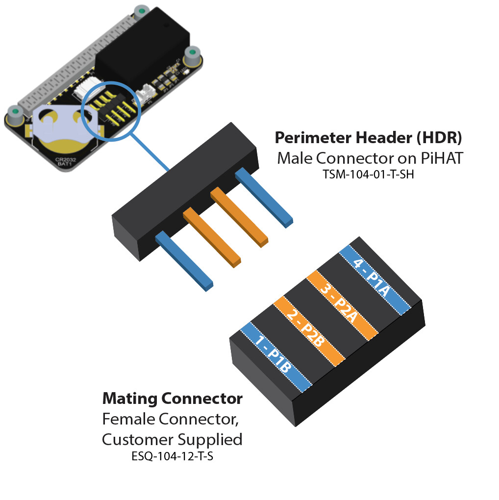

## Scope

This describes the perimeter detect feature on HSM6. 

 

Perimeter Detect provides two additional layers of physical security that can be used to detect when the perimeter of your device is breached. This is an important feature when devices are deployed in the field, unattended  or in high risk environments. 

HSM6 includes two independent Perimeter Loops that can be configured to meet different applications.


When a Perimeter Loop is breached, HSM6 can be configured (at time of binding) to respond with different "Actions", depending upon your security policy. 


### Connecting Perimeter Loop Circuits

HSM6 HAT provides four pin header and FPC connectors to interface to perimeter circuits 1 and 2. This is convenient for rapid prototyping and small scale production situations.


 

(For high volume applications, different connector types are available.  [Contact Zymbit](https://www.zymbit.com/contact-us/) for more details.)


### Electrical Circuit

Each perimeter loop should be connected with a 30 AWG wire or thicker and nominal length of 2 feet. For longer lengths contact Zymbit. The wire should be electrically insulated for all applications. A shielded cable may be necessary for electrically noisy or industrial applications. 

Custom flex PCBs and rigid PCBs may also be used to complete a perimeter loop circuit.


### Perimeter Breach Response Actions
Prior to permanently binding your HSM6 to a specific host device, it can be configured through the API to respond to a perimeter breach event in one of three ways. After permanent binding is completed, the selected configuration is locked and immutable. 

##### Response Choices

A)  Do nothing (disable)
B)  Notify host when perimeter breach occurs
C)  Destroy all key material (this essentially destroys any encrypted data or file system)

### Test Perimeter Detect 
**Developer Mode only**

To quickly test your perimeter detect setup, here are two samples of code using the Python and C API's. Both programs will wait for ten seconds to detect any perimeter breaches. So before running this script, connect the circuits using either the FPC or Pin headers and during the ten second pause in the script, breach the perimeter by unplugging the circuit wires from the Hat. The wait function should immediately exit and the script will finish.

Please specify the channel (0 or 1) you are testing in either set_perimeter_event_actions or zkSetPerimeterEventAction. Currently the channel is set to 0. In the API, perimeter circuit 2 (as shown in the above images) is defined as channel 1 and perimeter circuit 1 is defined as channel 0.

<details>

<summary>For Python</summary>

<br>


```
import zymkey

zymkey.client.clear_perimeter_detect_info()
zymkey.client.set_perimeter_event_actions(0, action_notify=True, action_self_destruct=False)

zymkey.client.wait_for_perimeter_event(timeout_ms=10000)
perim_status_str = ""
idx = 0
plst = zymkey.client.get_perimeter_detect_info()

for p in plst:
  if p:
     perim_status_str += "Channel %d breach timestamp = %d\n" % (idx, p)
  idx += 1
print("Perimeter breach detected!\n" + perim_status_str)
```
</details>


<details>

<summary>For C</summary>

<br>

```
#include <stdio.h>
#include "zk_app_utils.h"

void check_code(int code, char* location)
{
  if (code < 0)
  {
    printf("FAILURE: %s - %d\n", location, code);
  }
  else if (code >= 0)
  {
    printf("SUCCESS: %s - %d\n", location, code);
  }
}

int main()
{
  zkCTX zk_ctx;
  int status = zkOpen(&zk_ctx);
  check_code(status, "zkOpen");

  status = zkClearPerimeterDetectEvents(zk_ctx);
  check_code(status, "zkClearPerimeterDetectEvents");

  status = zkSetPerimeterEventAction(zk_ctx, 0, ZK_PERIMETER_EVENT_ACTION_NOTIFY);
  check_code(status, "zkSetPerimeterEventAction");

  int p_code = zkWaitForPerimeterEvent(zk_ctx, 10000);
  check_code(p_code, "zkWaitForPerimeterEvent");

  uint32_t* timestamps_sec;
  int num_timestamps;
  status = zkGetPerimeterDetectInfo(zk_ctx, &timestamps_sec, &num_timestamps);
  check_code(status, "zkGetPerimeterDetectInfo");

  //There was a perimeter event/breach.
  if (p_code == 0)
  {
    printf("Perimeter breach detected!\n");
    for(int i=0; i<num_timestamps; i++)
    {
      printf("Channel %d breach timestamp = %d\n", i, timestamps_sec[i]);
    }
    printf("\n");
  }

  status = zkClose(zk_ctx);
  check_code(status, "zkClose");
  return 0;
}
```
</details>


To compile
```
gcc -I /usr/include/zymkey/ -l zk_app_utils <Your Program>
```
If the perimeter is not breached, zkWaitForPerimeterEvent will return a failure code indicating a timeout occurred and no breach was detected.
```
SUCCESS: zkOpen - 0
SUCCESS: zkSetPerimeterEventAction - 0
FAILURE: zkWaitForPerimeterEvent - -110
SUCCESS: zkGetPerimeterDetectInfo - 0
SUCCESS: zkClearPerimeterDetectEvents - 0
SUCCESS: zkClose - 0
```
----------
### Perimeter Detect Circuit Examples
For best practices and examples of how to physically configure perimeter circuits: 
[Learn more>](https://docs.zymbit.com/tutorials/perimeter-detect/examples)

### Additional Self Destruct Policies

HSM6 has two additional self destruct policies, independent of Perimeter Detect-- temperature and voltage level monitoring. For more information, visit [Python documentation](https://docs.zymbit.com/api/python_api/#setbatteryvoltageaction-45bcda8a) or [C documentation](https://docs.zymbit.com/api/c_api/#int--zkSetBatteryVoltageAction-f90f5fd1).


<h2 id="troubleshooting">TROUBLESHOOTING</h2>
<ul>
<li><a href="https://docs.zymbit.com/quickstart/faq/hsm6/#troubleshooting">HSM6 Troubleshooting FAQ</a></li>
<li><a href="https://community.zymbit.com/">Community Forum</a></li>
</ul>
