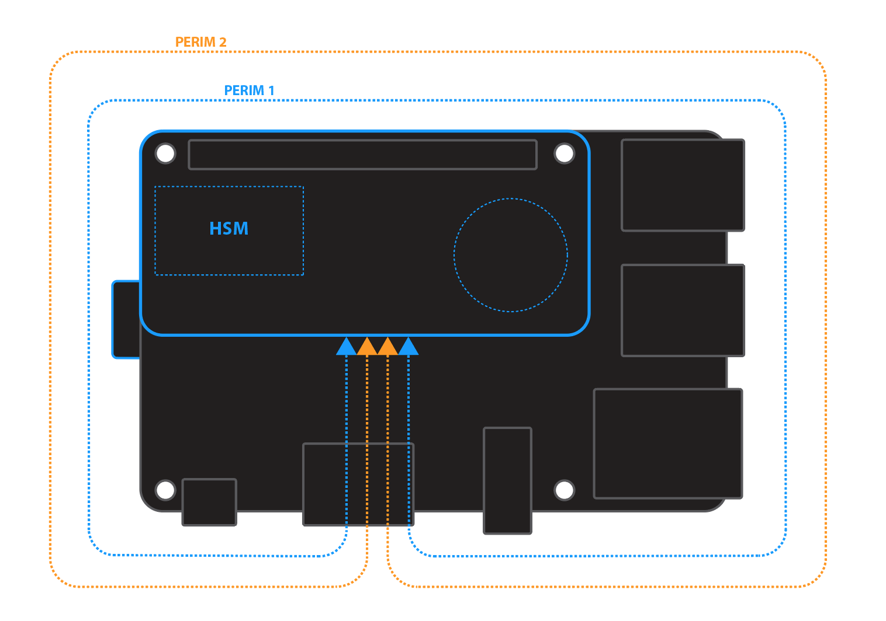
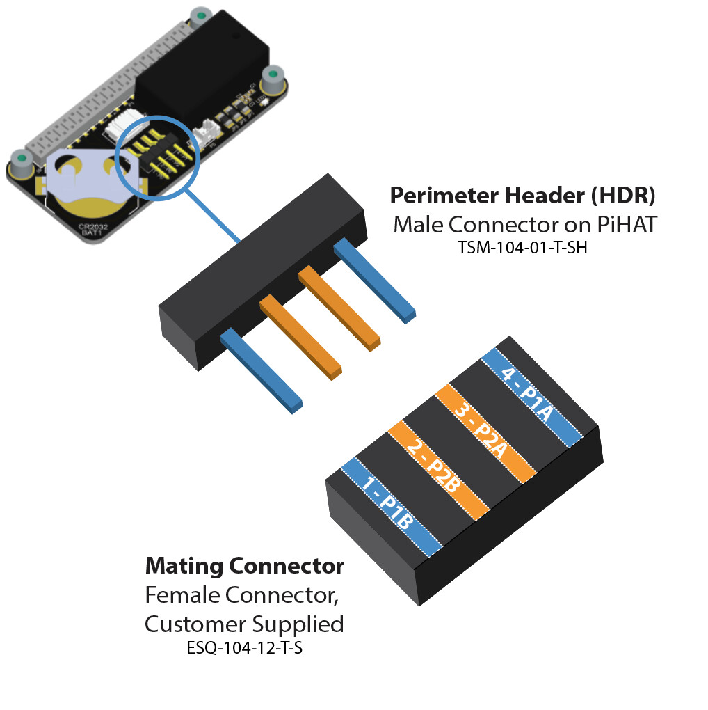

## Scope

This describes the perimeter detect feature on SCM. 

<!--  -->

Perimeter Detect provides two additional layers of physical security that can be used to detect when the perimeter of your device is breached. This is an important feature when devices are deployed in the field, unattended  or in high risk environments. 

SCM includes two independent Perimeter Loops that can be configured to meet different applications.


When a Perimeter Loop is breached, SCM can be configured (at time of binding) to respond with different "Actions", depending upon your security policy. 


### Connecting Perimeter Loop Circuits

SCM Alpha provides four pin connector to interface to perimeter circuits 1 and 2, as well as a Perimeter Detect Cable attached for demo purposes. <!-- This is convenient for rapid prototyping and small scale production situations. -->


<!--  -->

(For high volume applications, different connector types are available.  [Contact Zymbit](https://www.zymbit.com/contact-us/) for more details.)


### Electrical Circuit

Each perimeter loop should be connected with a 30 AWG wire or thicker and nominal length of 2 feet. For longer lengths contact Zymbit. The wire should be electrically insulated for all applications. A shielded cable may be necessary for electrically noisy or industrial applications. 

Custom flex PCBs and rigid PCBs may also be used to complete a perimeter loop circuit.


### Perimeter Breach Response Actions
Prior to permanently binding your SCM to a specific host device, it can be configured through the API to respond to a perimeter breach event in one of three ways. After permanent binding is completed, the selected configuration is locked and immutable. 

##### Response Choices

A)  Do nothing (disable)  
B)  Notify host when perimeter breach occurs (default as shipped for SCM Alpha)  
C)  Destroy all key material (this essentially destroys any encrypted data or file system.  

> Note: For SCM Alpha, complete destruction of the keys is disabled, even in Production Mode. Self-destruction is simulated by flashing a 6 flash sequenced 3 times, then recovering)  

### Test Perimeter Detect 
**Developer Mode only**

To quickly test your perimeter detect setup, here is sample code using the Python API. The program will wait for ten seconds to detect any perimeter breaches. Before running this script, connect the circuits using either the FPC or Pin headers and during the ten second pause in the script, breach the perimeter by unplugging the circuit wires. The wait function should immediately exit and the script will finish.

Please specify the channel (0 or 1) you are testing in either set_perimeter_event_actions or zkSetPerimeterEventAction. In the API, perimeter circuit 2 (as shown in the above images) is defined as channel 1 and perimeter circuit 1 is defined as channel 0. As noted, for SCM Alpha, channel 0 and channel 1 have already been set to action_notify=True. NOTE: For Alpha, setting the Perimeter Event Action restarts `zkifc` which can lead to problems. For Alpha, please power cycle after changing the Perimeter Event settings.

Example for monitoring Perimeter Events
<details>

<summary>For Python</summary>

```
#!/usr/bin/python3

import zymkey
from datetime import datetime
import time

# Get any existing events, including while powered down with battery in place
print("Checking for existing events.")
plst = zymkey.client.get_perimeter_detect_info()
print("Perimeter 1 Timestamp: " + str(datetime.fromtimestamp(plst[0])) + "  [" + str(plst[0]) + "]")
print("Perimeter 2 Timestamp: " + str(datetime.fromtimestamp(plst[1])) + "  [" + str(plst[1]) + "]")

# Clear the events
print("Clearing perimeter detect info...")
zymkey.client.clear_perimeter_detect_info()
time.sleep(2)

# Loop waiting for events while up and running
#while True:
while input('Enter or (q)uit: ') != 'q':
    try:
        print("Waiting 10 secs for an event")
        zymkey.client.wait_for_perimeter_event(timeout_ms=10000)
        plst = zymkey.client.get_perimeter_detect_info()
        print("Perimeter event detected!")
        print("Perimeter 1 Timestamp: " + str(datetime.fromtimestamp(plst[0])) + "  [" + str(plst[0]) + "]")
        print("Perimeter 2 Timestamp: " + str(datetime.fromtimestamp(plst[1])) + "  [" + str(plst[1]) + "]")
        print("Clearing perimeter detect info...")
        zymkey.client.clear_perimeter_detect_info()
        time.sleep(2)
    except zymkey.exceptions.ZymkeyTimeoutError:
        print("No perimeter event detected. (Timed out)")

```
</details>

----------

### Perimeter Detect Circuit Examples

For best practices and examples of how to physically configure perimeter circuits: 
[Learn more>](../examples)

### Additional Self Destruct Policies

SCM has two additional self destruct policies, independent of Perimeter Detect-- temperature and voltage level monitoring. For more information, visit [Python documentation](https://docs.zymbit.com/api/python_api/#setbatteryvoltageaction-45bcda8a) or [C documentation](https://docs.zymbit.com/api/c_api/#int--zkSetBatteryVoltageAction-f90f5fd1).

## Troubleshooting
[Troubleshooting](../../../troubleshooting/)  
[Community](https://community.zymbit.com/)

