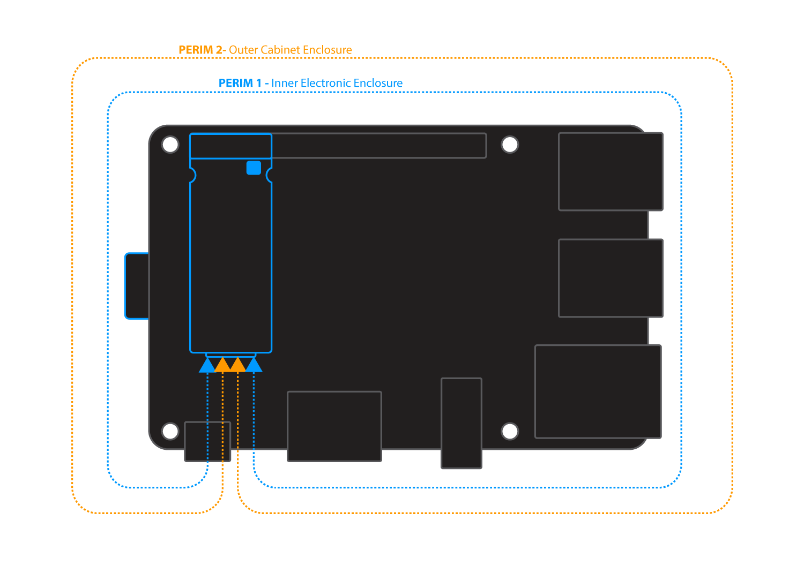

## Scope

This section explains the perimeter detect feature on Zymkey5 and how to use it in your software application with a simple two wire loop physical configuration.

For alternative physical configurations and best practices: [Learn more >](https://docs.zymbit.com/tutorials/perimeter-detect/examples)



Perimeter Detect provides two additional layers of physical security that can be used to detect when the perimeter of your device is breached. This is an important feature when devices are deployed in the field, unattended  or in high risk environments.

Zymkey5 includes two independent Perimeter Loops that can be configured to meet different applications.

When a Perimeter Loop is breached, Zymkey5 can be configured (at time of binding) to respond with different "Actions", depending upon your security policy.


### Connecting Perimeter Loop Circuits

Zymkey5 does not use the micro USB perimeter connector found on Zymkey4. The perimeter circuits are brought out on the 12 pin auxiliary connector, a JST SM12B-SURS-TF that mates with a 12SUR-32S housing. Premade cable harnesses will fit it, and Zymbit makes a breakout board that labels each pin by function.

Three pins carry the tamper loops:

| Pin | Name | Purpose |
| --- | --- | --- |
| 3 | PERIM_0 | Tamper detection transmit |
| 1 | PERIM_1 | Tamper detection loop 1 receive |
| 5 | PERIM_2 | Tamper detection loop 2 receive |

Connect PERIM_0 to PERIM_1 to complete loop 1, and to PERIM_2 to complete loop 2. You can wire either loop, or both.

{}
Do not connect the tamper loop pins to any other voltage source or to system ground. When the host is powered off and a battery is fitted, the loop runs from the coin cell, so avoid anything that leaks current through it and do not drive LEDs from the loop.
{}

The Zymkey5 perimeter circuit is not the same as the Zymkey4 one. It drives a high entropy encoded pulse train and measures circuit delay, so it detects tampering that a simple continuity loop would miss.

For the full 12 pin auxiliary connector pinout, the breakout board layout, and the pin 1 location diagrams, see the [Zymkey5 connector reference](/reference/cad/zymkey5/).

### Electrical Circuit

Each perimeter loop should be connected with a 30 AWG wire or thicker and nominal length of 2 feet. For longer lengths contact Zymbit. The wire should be electrically insulated for all applications. A shielded cable may be necessary for electrically noisy or industrial applications.

Custom flex PCBs and rigid PCBs may also be used to complete a perimeter loop circuit.


### Perimeter Breach Response Actions
Prior to permanently binding your Zymkey to a specific host device, it can be configured through the API to respond to a perimeter breach event in one of three ways. After permanent binding is completed, the selected configuration is locked and immutable.

##### Response Choices

A)  Do nothing (disable)
B)  Notify host when perimeter breach occurs
C)  Destroy all key material (this essentially destroys any encrypted data or file system)

Refer to API documentation for more details.

### Test Perimeter Detect

**Developer Mode only**

To quickly test your perimeter detect setup, here are two samples of code using the Python and C API's. Both programs will wait for one second to detect any perimeter breaches.

Please specify the channel (0 or 1) you are testing in either set_perimeter_event_actions or zkSetPerimeterEventAction. Currently the channel is set to 0. In the API, perimeter circuit 2 (as shown in the above images) is defined as channel 1 and perimeter circuit 1 is defined as channel 0.

<details>

<summary>For Python:</summary>

<br>

```python
import zymkey

zymkey.client.set_perimeter_event_actions(0, action_notify=True, action_self_destruct=False)

try:
  zymkey.client.wait_for_perimeter_event(timeout_ms=1000)
  perim_status_str = ""
  idx = 0
  plst = zymkey.client.get_perimeter_detect_info()

  for p in plst:
    if p:
       perim_status_str += "Channel %d breach timestamp = %d\n" % (idx, p)
    idx += 1
  print("Perimeter breach detected!\n" + perim_status_str)

except zymkey.exceptions.ZymkeyTimeoutError:
  print("No perimeter breach detected.")

zymkey.client.clear_perimeter_detect_info()
```
</details>

<details>

<summary>For C:</summary>

<br>

```c
#include <stdio.h>
#include "zk_app_utils.h"

void check_code(int code, char* location)
{
  if (code < 0)
  {
    printf("FAILURE: %s - %d\n", location, code);
  }
  else if (code >= 0)
  {
    printf("SUCCESS: %s - %d\n", location, code);
  }
}

int main()
{
  zkCTX zk_ctx;
  int status = zkOpen(&zk_ctx);
  check_code(status, "zkOpen");

  status = zkSetPerimeterEventAction(zk_ctx, 0, ZK_PERIMETER_EVENT_ACTION_NOTIFY);
  check_code(status, "zkSetPerimeterEventAction");

  int p_code = zkWaitForPerimeterEvent(zk_ctx, 1000);
  check_code(p_code, "zkWaitForPerimeterEvent");

  uint32_t* timestamps_sec;
  int num_timestamps;
  status = zkGetPerimeterDetectInfo(zk_ctx, &timestamps_sec, &num_timestamps);
  check_code(status, "zkGetPerimeterDetectInfo");

  //There was a perimeter event/breach.
  if (p_code == 0)
  {
    printf("Perimeter breach detected!\n");
    for(int i=0; i<num_timestamps; i++)
    {
      printf("Channel %d breach timestamp = %d\n", i, timestamps_sec[i]);
    }
    printf("\n");
  }

  status = zkClearPerimeterDetectEvents(zk_ctx);
  check_code(status, "zkClearPerimeterDetectEvents");

  status = zkClose(zk_ctx);
  check_code(status, "zkClose");
  return 0;
}
```
</details>


To compile
```bash
gcc -I /usr/include/zymkey/ -l zk_app_utils <Your Program>
```
If the perimeter is not breached, zkWaitForPerimeterEvent will return a failure code indicating a timeout occurred and no breach was detected.
```bash
SUCCESS: zkOpen - 0
SUCCESS: zkSetPerimeterEventAction - 0
FAILURE: zkWaitForPerimeterEvent - -110
SUCCESS: zkGetPerimeterDetectInfo - 0
SUCCESS: zkClearPerimeterDetectEvents - 0
SUCCESS: zkClose - 0
```
----------
### Perimeter Detect Circuit Examples
For best practices and examples of how to physically configure perimeter circuits:
[Learn more>](https://docs.zymbit.com/tutorials/perimeter-detect/examples)

## Troubleshooting
[Troubleshooting](https://docs.zymbit.com/troubleshooting/)
[Community](https://community.zymbit.com/)

